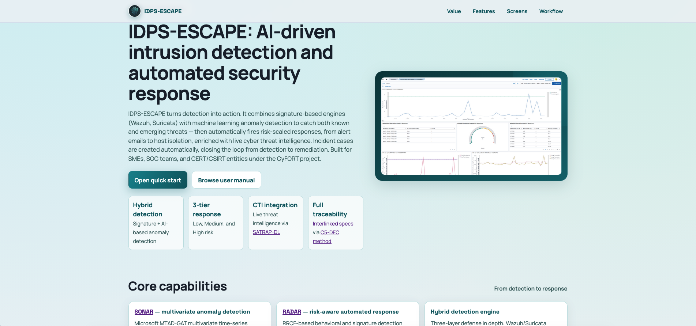

# IDPS-ESCAPE

IDPS-ESCAPE (Intrusion Detection and Prevention System - Enhanced Security through a Cooperative Anomaly Prediction Engine) is a sub-project of [CyFORT](https://abstractionslab.com/index.php/research-and-development/cyfort/) implementing a **MAPE-K**-based (Monitor, Analyze, Plan, Execute, Knowledge) Security Orchestration, Automation, and Response (**SOAR**) system. Developed in the context of [IPCEI-CIS](https://ec.europa.eu/commission/presscorner/detail/en/ip_23_6246), it targets SMEs, CERT/CSIRT entities, SOC managers, system administrators, security engineers and cloud deployments.


**Core components:**
- [**RADAR**](/radar/README.md) - Risk-aware detection and automated response with Ansible-based deployment
- [**SONAR**](/sonar/README.md) - Production-grade multivariate anomaly detection powered by deep learning
- [**ADBox**](/docs/manual/adbox_docs/adbox.md) - Legacy research framework

**Built on:** [Ansible](https://github.com/ansible/ansible), [OpenSearch](https://opensearch.org/), [Wazuh](https://wazuh.com/), [SATRAP-DL](https://github.com/AbstractionsLab/satrap-dl), [PyFlowintel](https://github.com/AbstractionsLab/PyFlowintel), [Flowintel](https://github.com/flowintel/flowintel), [MISP](https://www.misp-project.org/), [Suricata](https://suricata.io/)

We adopt a **hybrid detection approach** for defense-in-depth against known and emerging threats, combining signature-based engines (Wazuh, Suricata) and machine learning (ML) algorithms for ML-based anomaly detection (AD) through SONAR and RADAR relying on [MTAD-GAT](https://arxiv.org/pdf/2009.02040) (attention mechanism and deep learning) and [RRCF](https://proceedings.mlr.press/v48/guha16.pdf) (random forest) for streaming data, respectively.

This repository contains complete [documentation](./docs/manual/README.md), user manual, **[interlinked technical specifications](https://abstractionslab.github.io/idps-escape/traceability/index.html)** for traceability, and validation test results, all based on the [C5-DEC](https://abstractionslab.github.io/c5dec/website/product-presentation.html) method.

For a visual user-oriented tour of IDPS-ESCAPE, visit the **[product presentation page](https://abstractionslab.github.io/idps-escape/website/product-presentation.html)**.



## Table of contents

- [IDPS-ESCAPE suite](#idps-escape-suite)
- [Quick start](#quick-start)
- [Documentation](#documentation)
- [Development](#development)
- [Testing](#testing)
- [Roadmap](#roadmap)
- [Disclaimer](#disclaimer)
- [License](#license)
- [Contact](#contact)

## IDPS-ESCAPE suite

### RADAR - Risk-aware AD-based Automated Response

[**RADAR**](/radar/README.md) provides hybrid detection and intelligent automated response with [Ansible-based Infrastructure-as-Code](#fully-automated-deployment-with-ansible) deployment:

- **Hybrid detection**: Signature-based (Wazuh, Suricata) + ML-based anomaly detection (RRCF)
- **Risk-aware actions**: Tiered response (low/medium/high risk) with host isolation, process control, network rules, alert escalation, and incident case creation
- **Automatic case creation**: Incident case creation via integration with the DECIPHER subsystem of SATRAP-DL and Flowintel
- **Flexible deployment**: Local/remote manager and agent configurations
- **Production scenarios**: GeoIP detection, log volume monitoring, suspicious login
- **Experimental scenarios**: Insider threat, DDoS, C2 malware (require adaptation)

See [RADAR README](/docs/manual/radar_docs/README.md), [scenarios](/radar/scenarios/README.md), [adversarial ML guidance](/docs/manual/radar_docs/adversarial-ml-guidance.md) and [developer README](/radar/README.md).

### SONAR - SIEM-Oriented Neural Anomaly Recognition via multivariate AD

[**SONAR**](/sonar/README.md) provides production-grade anomaly detection:

- **Microsoft MVAD engine**: Battle-tested multivariate time-series detection
- **Debug mode**: Offline testing with synthetic data (no infrastructure required)
- **Scenario-based**: YAML configuration for repeatable workflows
- **RADAR integration**: Data shipping to Wazuh for automated response
- **Flexible modes**: Real-time, batch, and historical analysis

See [SONAR README](/docs/manual/sonar_docs/README.md), [scenario guide](/docs/manual/sonar_docs/scenario-guide.md), [architecture](/docs/manual/sonar_docs/architecture.md) and [developer README](/sonar/README.md).

### Fully automated deployment with Ansible

RADAR ships [complete Ansible IaC](/radar/README.md) for reproducible, production-ready deployments — covering the Wazuh Manager, Wazuh Agents, and the full RADAR stack. See the [pipeline documentation](/docs/manual/radar_docs/radar-manager-ansible-playbook.md) for details.

### ADBox (Legacy)

> **⚠️ Legacy System**: ADBox uses MTAD-GAT for research purposes only. **Use SONAR for all production deployments.**

[ADBox](/docs/manual/adbox_docs/adbox.md) is maintained for research continuity with PyTorch-based Graph Attention Networks. See the [ADBox manual](/docs/manual/adbox_docs/adbox.md) for legacy documentation.

## Documentation

See our [user manual](./docs/manual/README.md) for comprehensive documentation on [RADAR](/radar/README.md), [SONAR](/sonar/README.md), and [ADBox](/docs/manual/adbox_docs/adbox.md). Visit our [traceability page](https://abstractionslab.github.io/idps-escape/traceability/index.html) for interlinked requirements, technical specifications such as architecture diagrams, and test reports ([TRP](https://abstractionslab.github.io/idps-escape/docs/traceability/TRP.html)).

## Quick start

### Decision tree

- **Want full automated response?** Bootstrap [complete RADAR stack](#full-stack-automated-deployment-radar)
- **Need production anomaly detection?** Deploy [SONAR with Wazuh](#production-deployment-with-sonar)
- **Just exploring?** Start with [SONAR debug mode](#evaluating-sonar-5-minutes) (no infrastructure needed)

### Full stack automated deployment (RADAR)

**Prerequisites:**

0. System requirements: Ensure your environment meets the [resource and network requirements](#requirements) specified below
1. Create `radar/.env` with credentials (see [env.example](/radar/env.example)):
   - OpenSearch URL, username, password, SSL certificates
   - Wazuh API credentials and manager address
   - SMTP settings for email alerts
   - FlowIntel API key (optional, for incident case creation)
   - Webhook URL (default: `http://<manager-ip>:8080/notify`)
2. Configure `radar/inventory.yaml` for remote endpoints (if using `--agent remote` or `--manager remote`)

```bash
# Bootstrap entire stack with Ansible
cd radar
sudo ./build-radar.sh suspicious_login --agent remote --manager local --manager_exists false
```

See the [RADAR getting started](/docs/manual/radar_docs/radar-getting-started.md) page for full details.

Screenshots from a Suspicious Login scenario run:


### SONAR usage

SONAR provides scenario-based anomaly detection with flexible execution modes:

```bash
# Install and connect to Wazuh
poetry install --only sonar

# Check Wazuh connection
poetry run sonar check

# Run complete scenario (train + detect)
poetry run sonar scenario --use-case sonar/scenarios/brute_force_detection.yaml

# Debug mode (offline testing with synthetic data)
poetry run sonar scenario --use-case sonar/scenarios/example_scenario.yaml --debug

# Production mode with data shipping to RADAR
poetry run sonar scenario --use-case sonar/scenarios/my_scenario.yaml --ship
```

See the [SONAR documentation](/docs/manual/sonar_docs/README.md) for details. 

**Data shipping for Wazuh and RADAR integration:**

What `--ship` does:

- Creates dedicated data streams in Wazuh Indexer for scenario-specific anomalies
- Enables custom dashboard creation in Wazuh
- Enables real-time monitoring and RADAR automated response integration
- Installs index templates for proper field typing and validation
- Required for production SONAR→RADAR workflows

See the [data shipping guide](/docs/manual/sonar_docs/data-shipping-guide.md) for configuration details and the [dashboard tutorial](/docs/manual/adbox_docs/dashboard_tutorial.md) for visualization and instructions explaining how to build such a dashboard (same process for SONAR and ADBox).


### Evaluating SONAR (5 minutes)

No infrastructure required — debug mode runs the full train → detect → report workflow offline with synthetic data:

```bash
poetry install --with sonar
poetry run sonar scenario --use-case sonar/scenarios/example_scenario.yaml --debug
```

### Requirements

#### Resource requirements by component

| Component | RAM | Storage | CPU |
|-----------|-----|---------|-----|
| **Wazuh Manager** | 8 GB minimum | ~15 GB | 4 cores |
| **SONAR** | 4 GB | ~2 GB (models) | 2 cores |
| **RADAR** | 2 GB | ~1 GB | 2 cores |
| **Wazuh Agents** | 512 MB each | ~500 MB each | 1 core |
| **Full Stack** | 16 GB+ | ~26 GB total | 8+ cores |

See [deployment guide](./deployment/README.md) for network requirements and multi-node setups.

### Docker deployment

**Build and run with convenience scripts:**

```bash
# Build images
./build.sh all              # All components
./build.sh sonar            # SONAR only

# Run SONAR
./sonar.sh check            # Check Wazuh connection
./sonar.sh scenario --use-case sonar/scenarios/example_scenario.yaml --debug

# Run ADBox (legacy)
./adbox.sh -u 1

# Run with custom arguments
./adbox.sh <your-adbox-arguments>
```

**Note**: Docker-based execution requires building the images first with `build.sh`.

## Development

```bash
# Install dependencies
poetry install --with sonar,radar,adbox,test

# Run tests
poetry run pytest tests/sonartests/  # SONAR
poetry run pytest tests/             # All
./radar/test.sh                      # RADAR

# SONAR CLI
poetry run sonar check
poetry run sonar scenario --use-case sonar/scenarios/example.yaml --debug

# Docker builds
./build.sh all
```

See [SONAR README](/sonar/README.md) and [RADAR README](/radar/README.md) for component-specific development guides.

## Testing

See our test report (TRP) in the list of published documents on the [technical specifications traceability page](https://abstractionslab.github.io/idps-escape/traceability/index.html) detailing the validation test campaign results. Unit tests are available in the `tests` folder.

## Roadmap

- Web-based management interface for our Ansible-based RADAR deployment solution
- Support for automatic Wazuh multi-node RADAR deployment
- New detection and response scenarios via hybrid correlation (signatures + RRCF + SONAR anomalies)
- Automatic model retraining in SONAR (schedule-based, drift-triggered)
- Automated SONAR-RADAR integration

## Disclaimer

Provided for evaluation and testing. While SONAR and RADAR have been deployed in controlled environments, conduct thorough security assessments before production use. **Use at your own risk.**

## License

Copyright © itrust Abstractions Lab and itrust consulting. Licensed under [GNU AGPL v3.0](LICENSE). See [AUTHORS](/AUTHORS) for contributors.

## Acknowledgment

Co-funded by the Ministry of the Economy of Luxembourg in the context of the CyFORT project.

## Contact

Abstractions Lab: info@abstractionslab.lu