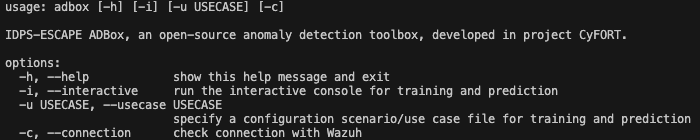

# IDPS-ESCAPE

IDPS-ESCAPE, short for Intrusion Detection and Prevention Systems for Evading Supply Chain Attacks and Post-compromise Effects, is a sub-project of the [CyFORT](https://abstractionslab.com/index.php/research-and-development/cyfort/) project, which in turn stands for Cloud Cybersecurity Fortress of Open Resources and Tools for Resilience. CyFORT is carried out in the context of the [IPCEI-CIS](https://ec.europa.eu/commission/presscorner/detail/en/ip_23_6246) project, with further details available [here](https://www.bmwk.de/Redaktion/EN/Artikel/Industry/ipcei-cis.html).


IDPS-ESCAPE is aimed at closely capturing the notion of MAPE-K (Monitor, Analyze, Plan, Execute and Knowledge) from autonomic computing applied to cybersecurity, which translates into providing a comprehensive package fulfilling the roles of a Security Orchestration, Automation, and Response (SOAR) system, a Security Information and Event Management (SIEM), and an Intrusion Detection and Prevention System (IDPS), with a central subsystem dealing with anomaly detection (AD) based on state-of-the-art advances in machine learning (ML). We call this AD subsystem "**ADBox**", which comes with out-of-the-box integration with well-known open-source solutions such as [OpenSearch](https://opensearch.org/) for search and analytics, [Wazuh](https://wazuh.com/) as our SIEM\&XDR of choice, in turn connected to [MISP](https://www.misp-project.org/) for enriching alerts, and to [Suricata](https://suricata.io/), acting both as our network-based IDPS of choice, as well as a network-level data acquisition source.

Our extensible **ADBox** framework and implementation also include a Multivariate Time-series Anomaly Detection (MTAD) algorithm relying on Graph Attention Networks (GAT).

This repository contains the source code and full documentation (requirements, technical specifications, schematics, user manual, test case specifications and test reports) of IDPS-ESCAPE, based on the [C5-DEC](https://github.com/AbstractionsLab/c5dec) method and software also developed in CyFORT, which relies on storing, interlinking and processing all software development life cycle (SDLC) artifacts in a unified manner; see our [traceability web page](https://abstractionslab.github.io/idps-escape/docs/traceability/index.html) providing the technical specifications of IDPS-ESCAPE.

## Table of contents

- [Overview](#overview)
- [Features](#features)
- [User manual](#user-manual)
- [Technical specifications](#documentation-and-technical-specifications)
- [Getting started](#getting-started)
- [Usage](#usage)
- [Use case scenario example](#example-of-a-use-case-scenario)
- [Disclaimer](#disclaimer-use-of-alphaexperimental-software)
- [Roadmap](#roadmap)
- [License](#license)
- [Contact](#contact)

## Overview

IDPS-ESCAPE, part of the CyFORT suite of open-source cybersecurity software solutions, addresses various aspects of cybersecurity as an ensemble, targeting different user groups, ranging from public to private and from CIRT/CSIRT to system administrators.
The design of IDPS-ESCAPE is targeted to cloud-native deployments, with an eye on CERT/CSIRT-operated monitoring systems.

Moreover, IDPS-ESCAPE is being developed in parallel with another CyFORT sub-project, namely SATRAP-DL, aimed at enhancing cyber threat intelligence (CTI) analysts' work using semi-automated reasoning over CTI. Ultimately, IDPS-ESCAPE is planned to include, among other things, mechanisms for coping with and addressing supply chain and adversarial machine learning attacks.
 
Currently, for the alpha release, the main bulk of this repository is dedicated to a novel open-source and extensively documented anomaly detection (AD) framework, called **ADBox**.
The ADBox implementation provides a modular and extensible software framework for efficiently integrating ML and AD algorithms and it already comes with a Multivariate Time-series Anomaly Detection (MTAD) algorithm relying on Graph Attention Networks (GAT). 

In addition to providing security practitioners such as SOC operators or CTI analysts with anomaly detection over Wazuh indices (alerts, archives, statistics, etc.) in multiple modes (batch, real-time and historical), it can also be used to simplify and refine the work of security practitioners across several dimensions, e.g.,

- rule management, 
- events correlation, 
- alert-to-incident derivation, and, 
- alert/response policy tuning and mappings to KBs such as MITRE ATT&CK. 

ADBox can also be used as a software library to deploy various ML based AD algorithms in different environments, while allowing for a high degree of tailoring thanks to its modular and extensible design. An environment-driven customization can not only contribute to reducing false positives, but it can also help detect suspicious behavior with arguably limited information, or to otherwise provide an investigation entry point dealing with adversarial patterns for which prior signatures or indicators of compromise may not be readily available.

As a consequence, ADBox provides a stepping stone towards settling various controversial statements and at times questionable findings and claims from the academic literature and those made by practitioners in the industry: plug the latest implementation of an ML-based AD algorithm into ADBox, integrate with real-world security tools such as Wazuh, to assess and (in)validate such claims.

The current version of the IDPS-ESCAPE stack consists of 
- a combined setup integrating state-of-the-art open source _signature-based network and host_ IDPS and SIEM\&XDR, along with
- ADBox, a custom-designed and implemented _anomaly detection_ subsystem based on machine learning.

Although the IDPS, SIEM and ADBox subsystems can be deployed independently, we recommend a fully integrated deployment. We provide automation scripts and guides for an easy deployment of such setups.

## Features

### Design

- Free/libre and open source;
- Cross platform: works on GNU/Linux, MacOS and Windows;
- Extensible due to a modular design and architecture;
- Based on open data formats such as Markdown, YAML, XML, JSON, CSV and HTML;
- Integrated with well-known open-source security solutions such as [OpenSearch](https://opensearch.org/), [Wazuh](https://wazuh.com/), [Suricata](https://suricata.io/);
- Thanks to building on top of Wazuh, an easy integration with other well-known [third-party solutions](https://documentation.wazuh.com/current/getting-started/use-cases/threat-hunting.html) such as [MISP](https://www.misp-project.org/) using existing mechanisms.

### ADBox

ADBox is a custom-designed and implemented _anomaly detection_ subsystem, with its key features summarized as follows:

- A data ingestion module capable of fetching data from Wazuh and OpenSearch via a REST API;
- A data transformation module for preprocessing, data type conversions and data aggregation;
- A configuration management module for controlling backend configurations via dedicated files and loading such data into memory, (e.g., Wazuh, ML training parameters, etc.);
- A data management module for centralizing data storage and retrieval and managing created and stored detectors, with dedicated features for saving trained ML models and their associated parameterization data, both used by detectors;
- An integration of a machine learning package providing a [PyTorch-based implementation](https://github.com/ML4ITS/mtad-gat-pytorch) of the [MTAD-GAT algorithm](https://arxiv.org/pdf/2009.02040);
- A dedicated anomaly detection engine (called AD Engine), aimed at orchestrating and generalizing common AD tasks and capturing them via an abstract and extensible design and implementation (currently under active development);
- A driver module providing the entry point to the ADBox and currently using a CLI to interact with the user;
- A set of AD use case scenario definitions encoded as YAML files, which can be directly used by the user, but they can also easily form the basis for creating new ones, tailored to the user's preferences for adjusting the training part as well as the prediction part of the ML-based algorithm and pipeline.

### Front-end

- A command-line interface (**CLI**) for efficient user interactions and automation via scripting integration, currently available via the driver module (under active development);
- A dedicated Jupyter notebook for analysis and post-processing, providing a prepared playbook with tailored plotting and operating directly on top of anomaly prediction data produced by the ADBox backend;

### Network and host monitoring

To achieve comprehensive monitoring capabilities, we combine well-established open-source solutions, namely [Wazuh](https://wazuh.com/), a cybersecurity platform that integrates SIEM and XDR capabilities and [Suricata](https://suricata.io/), an open-source Network Intrusion Detection System (NIDS). We provide deployment solutions that allow centralized monitoring for coping with limited resources (network agents relaying traffic data to a central node for processing) as well as running monitoring instances on each node and only grouping the obtained monitoring data in a centralized node for analysis.

See our [Instructions for IDPS and SIEM integrated deployment](./deployment/README.md) page for further details.

## User manual

Please see the [Instructions for IDPS and SIEM integrated deployment](./deployment/README.md) and the [ADBox user manual](./docs/manual/overview.md) page to learn more about the installation, setup requirements, overall usage and specific modules of the ADBox. 

## Documentation and technical specifications

You can visit our [traceability page](https://abstractionslab.github.io/idps-escape/docs/traceability/index.html) to view the technical specifications of IDPS-ESCAPE.

## Getting Started

### IDPS and SIEM integrated deployment

Note that if you already have a running instance of Wazuh, and do not wish to integrate Suricata, you can simply skip to the [ADBox installation section](#adbox-installation).

A complete and installation of the signature-based intrusion detection and the SIEM subsystems of IDPS-ESCAPE can be done using the following guides:

1. Suricata, to enable network monitoring capabilities:

      a.  [installation in a containerized environment](./deployment/suricata/suricata_installation.md#installation-and-configuration-of-suricata)
      
      b.  [configuration to local network](./deployment/suricata/suricata_installation.md#suricata-configuration-file)
1. Wazuh central components installation, for SIEM \& XDR:

    a. [installation of Dashboard, Manager and Indexer in a containerized environment ](./deployment/wazuh/wazuh_installation.md)

    b. [configuration to local system](./deployment/wazuh/wazuh_installation.md#next-steps)

1. [Installation of a Wazuh agent](./deployment/wazuh/wazuh_agents.md) to enable host monitoring capabilities.

    a. Possibly, deployment of additional agents on other remote hosts (system *endpoints*), same as above.
  
    b. Possibly, [enable remote traffic monitoring](./deployment/remote_monitoring/remote_monitoring.md).

1. Follow [integration procedure of Suricata and Wazuh](./deployment/integration.md).

 Details of the above steps and scripts are provided in the [Guide for IDPS and SIEM integrated deployment](./deployment/README.md).

 This integration guarantees:
 
 - joint monitoring of host and network events, and
 - centralized storage.

All the data ending up in the central SIEM \& XDR can now be fed to ADBox for training ML models and anomaly detection, providing a holistic view of the system(s) under monitoring.

### ADBox installation

ADBox can be deployed using the following methods:
  
- [Deployment using Docker and our shell scripts](./docs/manual/installation.md#installing-adbox-via-docker-and-shell-script) (**recommended for end-users**);

- [Deployment in a development containerized environment in VS Code](./docs/manual/installation.md#installing-adbox-in-a-development-containerized-environment-in-vs-code) (**recommended for developers**);

Below we describe the deployment using Docker and shell scripts. For other installation methods, please see the [installation](./docs/manual/installation.md) page of the user manual.

#### Installing ADBox via Docker and shell scripts

The easiest and recommended way to deploy and run ADBox is described in this section and can be achieved using our Docker definition file and build/execution scripts, which can be found in the repository. The instructions below work on GNU/Linux, MacOS and Windows Subsystem for Linux (WSL). ADBox is run as a service in a Docker container.

##### Requirements

The following pieces of software are necessary for setting up the ADBox as a service in a Docker container.

- A local installation of [Docker Engine](https://docs.docker.com/engine/install/), with the Docker service running prior to launching ADBox.

##### Installation

1. Simply clone the repository or download a ZIP archive of the project 

    ```sh
    git clone https://github.com/AbstractionsLab/idps-escape.git
    ```

2. Unzip the archive, switch to the extracted directory (`cd foldername`) via a terminal running a shell (e.g., bash, zsh) and make the two shell scripts executable: `chmod +x script-name.sh`. Then, change working directory to the cloned folder containing all the files along with the Dockerfile and build the image by running our build script: `./build-adbox.sh`;

3. Finally, launch ADBox by executing `./adbox.sh`, which runs the default mode if no arguments are provided to the command-line interface (CLI); running `./adbox.sh -h` displays the CLI help menu describing the available commands.



### Usage

Please note that you can set the parameters (IP, port, username and password) for connecting to Wazuh via the [Wazuh credentials JSON file](./siem_mtad_gat/assets/secrets/wazuh_credentials.json).

The ADBox driver/CLI currently provides four options:

1. Running ADBox using the `-u` flag following by the ID of a use case YAML file (stored under `siem_mtad_gat/assets/drivers`), e.g., `./adbox.sh -u 2` to start a complete training and prediction pipeline determined by an AD [use case](./docs/manual/use_case.md) scenario, in this case `uc_2.yaml`.

1. Running ADBox using the `-i` flag, i.e., `./adbox.sh -i` running the interactive console (**the console currently contains a known bug for prediction-only jobs (i.e., no training and using a trained model), please use option 1**).

1. Running ADBox without any arguments: it runs a training and prediction pipeline using default configurations.

1. Running ADBox using the `-c` flag, i.e., `./adbox.sh -c` to check your connection with Wazuh, which is recommended to ensure a successful channel can be established before executing AD workflows. Otherwise, in the absence of a functional connection, ADBox automatically falls back to local default configuration files and prepared sample training and prediction data.

#### Verifying connection with Wazuh

Before running ADBox training and prediction scenarios, you can verify whether a connection between ADBox and an instance of Wazuh can be established successfully using the `-c` flag:

```sh
./adbox.sh -c
```

You can set/modify the parameters (IP, port, username and password) for connecting to Wazuh via the [Wazuh credentials JSON file](./siem_mtad_gat/assets/secrets/wazuh_credentials.json).

#### Executing a use case from a YAML file

The ADBox takes inputs from a YAML file stored in the `/siem_mtad_gat/assets/drivers/` folder. By default, the folder contains several YAML-encoded use cases, which can be used for training models and running predictions.

A training and detection use case can be run by providing the `-u` flag along with an integer to the script.

```sh
./adbox.sh -u {number}
```

For example, to run use case 1, execute the script as follows:

```sh
./adbox.sh -u 1
```

With this input, the ADBox will take the inputs specified in the `uc_1.yaml` file.

The folder containing the YAML files also contains a `driver.yaml` file that provides a template for writing your own custom YAML files.

For example, one can run a new [use case](./docs/manual/use_case.md), by specifying different input parameters in a new YAML file, called `uc_6.yaml` and then run the adbox as follows:

```sh
./adbox.sh -u 6
```

All the outputs produced as a result of running use cases are stored in `./siem_mtad_gat/assets/detector_models/{detector_id}/prediction_{current_date}/predict_output.json`.

#### Interacting with a console (has bugs in alpha version):

```sh
./adbox.sh -i
```

Running the script using the `-i` flag will open an interactive console which will ask for user inputs.

The output of the all the detections performed through the console are stored in `./siem_mtad_gat/assets/detector_models/{detector_id}/prediction_{current_date}/predict_output.json` file.


#### Executing as default:

```sh
./adbox.sh
```

In this mode, the ADBox will train a detector using the default arguments and then also perform detection based on default arguments, with the detector trained using the previously mentioned default arguments. To know more about the input arguments used in default mode, visit the [user manual](./docs/manual/overview.md) page.

The output of the default detection is also stored in `./siem_mtad_gat/assets/detector_models/{detector_id}/prediction` folder.

## Example of a use case scenario

In this section, we present an example illustrating the usage of ADBox, adopting the end user point of view.

### My system

I have deployed all the components as explained in the [guide for IDPS and SIEM integrated deployment](./deployment/guide_sids.md) and the
[ADBox user manual installation page](./docs/manual/installation.md). Moreover, I have enabled [Linux resource monitoring](./docs/manual/linux_resource.md).

### My use case

I want a detector which correlates resource usage and rules statistics. Once created, I want this detector to keep running on new data.

Therefore, I prepare a dedicated [use case file](./use_case.md).

Namely,

- I have to identify the features of the [multivariate time-series](./docs/manual/time_series.md) that I want to perform detection on. To do so, I analyze the event logs of my system.

- For every feature, I choose a suitable aggregation method for the *granularity* I wish to use. 

- For example, I would like a new point every 30 seconds (**lowest advised granularity**). Every point has 3 dimensions representing the average CPU percent usage, average memory percent usage and the total `firedtimes` rule statistics parameter.

I have to decide:

- how I wish to handle missing values,
- the detector name,
- the data that is to be used to train my detector,
- the detection interval (window size), and
- the number of epochs for training.

For example, I want anomalies to be flagged over intervals of 3 minutes, so the window size should be 8. Then, I also want to use all my data of the current month that is already available to train the detector.

For the prediction, I want almost real-time results but I would like to fetch data in batches. For example, I want to get points every 6 minutes, then in batches of 12 points.

I encode this in [`siem_mtad_gat/assets/drivers/uc-9.yaml`](../../siem_mtad_gat/assets/drivers/uc_9.yaml)

```YAML
training:
  aggregation: true
  aggregation_config:
    features:
      data.cpu_usage_%:
      - average
      data.memory_usage_%:
      - average
      rule.firedtimes:
      - count
    fill_na_method: Zero
    granularity: 30s
    padding_value: 0
  categorical_features: false
  columns:
  - data.cpu_usage_%
  - data.memory_usage_%
  - rule.firedtimes
  display_name: detector_example_3min
  index_date: '2024-08-*'
  train_config:
    epochs: 8
    window_size: 6

prediction: 
    run_mode: BATCH
    batch_size: 12
```
#### Running the pipeline

I run ADBox

```sh
./adbox.sh -u 9
```

and stop it after a few hours.

This produces a detector with id `2d36a80a-c47a-4eb4-bb3e-5b2bfb90dc9` and the associated folder [`siem_mtad_gat/assets/detector_models/2d36a80a-c47a-4eb4-bb3e-5b2bfb90dc9`](./siem_mtad_gat/assets/detector_models/2d36a80a-c47a-4eb4-bb3e-5b2bfb90dc95/).

```sh
2d36a80a-c47a-4eb4-bb3e-5b2bfb90dc9
├── input
│   ├── detector_input_parameters.json
│   └── training_config.json
├── prediction
│   ├── uc-9_predicted_anomalies_data-1_2024-08-30_10-24-15.json
│   └── uc-9_predicted_data-1_2024-08-30_10-24-15.json
└── training
    ├── losses_train_data.json
    ├── model.pt
    ├── scaler.pkl
    ├── spot
    │   ├── spot_feature-0.pkl
    │   ├── spot_feature-1.pkl
    │   ├── spot_feature-2.pkl
    │   └── spot_feature-global.pkl
    ├── test_output.pkl
    ├── train_losses.png
    ├── train_output.pkl
    └── validation_losses.png

4 directories, 15 files
```

### Detection analysis

Using the [ADBox Result Visualizer Notebook](./siem_mtad_gat/frontend/viznotebook/result_visualizer.ipynb), I can plot the results and analyze them. Here, I collect a few observations.

#### Training

The training losses are rather good for 8 epochs, while the same cannot be said about the validation losses. I could try the same setting, while training the detector for more epochs.


#### Prediction

I ran the batch prediction from `2024-08-30T10:18:04Z` to `2024-08-30T13:05:30Z` UTC time.

**Global overview**


During this time period, 5 anomalous windows were flagged, 4 consecutive and 1 alone. Let's call them A1 and A2, respectively.


**Feature overview**

Looking at the feature statistics, we can see these two anomalies expressing two different cases:

- anomalies in A1 can be also considered anomalies at the feature level.
- the anomaly in A2 is anomalous **only** at a global level. 


**Wazuh Dashboard**

Looking at the Wazuh Dashboard, we can observe a high number of events in proximity of A1:


### Mapping anomalies to real events

We traced the two anomalies to two real events that had happened in the corresponding detections intervals:

- A1 matches with the running of `apt update` and `apt upgrade` on the host machine.
- A2 matches with a reboot.

### Remarks

In both cases, the actions that (most probably) generated the anomalies had been carried out by a system administrator. In case not, while A1 would have been noticed by looking at single features and/or Wazuh; A2 would have not been as obvious to track.

## Disclaimer: Use of alpha/experimental Software

This software is currently in its alpha or experimental phase and is provided for testing and evaluation purposes only. It may contain errors, bugs, or other issues that could result in security vulnerabilities, data loss, or other unpredictable outcomes. As such, **this software is not intended for use in production environments** or for handling sensitive, confidential, or critical information.

In particular, given the nature of security-related software, it is crucial to understand that the algorithms, protocols, and implementations within this software may not have undergone thorough security audits or peer review. **Do not rely on this software for critical system functions.**.

The developers, contributors, and affiliated organizations **disclaim all warranties, express or implied,** including but not limited to the implied warranties of fitness for a particular purpose. **No guarantee is made regarding the correctness, completeness, or security** of the software, and you assume full responsibility for any risks associated with its use.

By using this software, you acknowledge that you understand the risks and agree to use it **at your own risk.** You are strongly encouraged to conduct your own security assessments and tests before deploying this software in any environment.

## Roadmap

Some of the currently planned items include:

- automated unit/integration/system test suites providing coverage for critical parts of the software;
- a GUI frontend integrated into Wazuh or OpenSearch;
- tailoring the underlying ADBox algorithms to specific SOC operations.

For details on our roadmap and features planned for future releases, please see the [Wiki](https://github.com/AbstractionsLab/idps-escape/wiki) section of this repository.

## License

Copyright (c) itrust Abstractions Lab and itrust consulting. All rights reserved.

Licensed under the [GNU Affero General Public License (AGPL) v3.0](LICENSE) license.

## Acknowledgment

The creation of the IDPS-ESCAPE software tools and its knowledge base is co-funded by the Ministry of the Economy of Luxembourg, in the context of the CyFORT project.

## Contact

If you wish to learn more about the project, feel free to contact us at Abstractions Lab: info@abstractionslab.lu