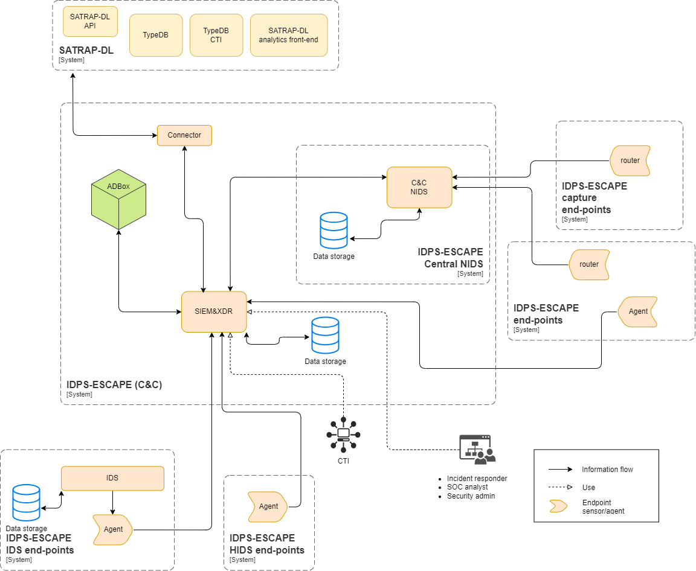

# Guide for IDPS and SIEM integrated deployment

IDPS-ESCAPE, short for Intrusion Detection and Prevention Systems for Evading Supply Chain Attacks and Post-compromise Effects, focuses on developing a sophisticated Security Information and Event Management (SIEM) system tailored for cloud-edge networks. This solution includes agents capable of seamless installation on systems earmarked for monitoring, along with a cutting-edge Intrusion Detection and Prevention System (IDPS) infused with machine learning capabilities. 

This folder explains the integration of Suricata, an open-source Intrusion Detection System (IDS) renowned for its robust network security capabilities, and Wazuh, a cybersecurity platform that integrates SIEM and XDR capabilities, which play a crucial role in enhancing the capabilities of the IDPS-ESCAPE solution and are the  building blocks for the IDPS-ESCAPE prototype.  

A complete and installation of the signature-based intrusion detection subsystem and SIEM of IDPS-ESCAPE comprise of the following steps

1. Suricata, to enable network monitoring capabilities:

      a.  [installation in a containerized environment](./suricata/suricata_installation.md#installation-and-configuration-of-suricata)
      
      b.  [configuration to local network](./suricata/suricata_installation.md#suricata-configuration-file)
1. Wazuh central components installation, for SIEM&XDR:

    a. [installation in containerized environment of Dashboard, Manager and Indexer](./wazuh/wazuh_installation.md)

    b. [configuration to local system](./wazuh/wazuh_installation.md#next-steps)

1. [Installation Wazuh agent](./wazuh/wazuh_agents.md) to enable host monitoring capabilities.
1. Possibly, deployment of additional agents on other remote hosts (system *endpoints*). Same as 3.
1. Possibly, [enable remote traffic monitoring](./remote_monitoring/remote_monitoring.md).
1. Follow [integration procedure of Suricata and Wazuh](integration.md).

## Deployment strategy

The procedure above describes the full deployment. Lighter options are possible, but we advice to deploy all the subsystems to achieve full potential.

