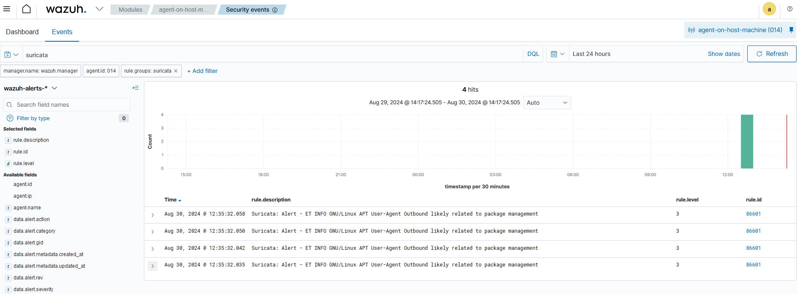

## Integration Procedure 
Once Suricata and Wazuh are installed, proceed with the integration process outlined in this readme file. This integration aims to enhance the capabilities of intrusion detection and threat hunting within the environment, facilitating centralized management and monitoring of security incidents and events across multiple hosts. 
 

### Requirements 
1. A running instance of the Suricata service
2. A running instance of the Wazuh distribution
3. An installation of a Wazuh agent


### Using Docker Volumes to integrate Suricata and Wazuh 

Docker volumes facilitate data sharing between containers, allowing multiple containers to access the same data simultaneously. By creating a volume on the host machine, we can store Suricata logs for the Wazuh agent to access. Through Docker volumes, we establish a connection between the Suricata container's log directory and a directory on the host machine where the Wazuh agent operates. To set up the volume for the log files, we update the run command with the -v argument, specifying the paths for data exchange between the containers and the host machine. The modified command incorporating the -v argument for volumes and the respective paths ensures seamless data communication between the Suricata container and the Wazuh agent. 

In fact, [Suricata deployment](./suricata/suricata_installation.md) creates the wanted volumes.

To enable the Wazuh agent to access Suricata log files, the configuration file of the Wazuh agent needs to be modified. The configuration file is present at `/var/ossec/etc/ossec.conf` on the machine where the agent was installed. Open the configuration file with any text editor and add the following lines at the end of the file, before the &lt;/ossec\_config&gt; closing tag with the path of the mounted volume.

```sh
<ossec_config>
  <localfile>
    <log_format>json</log_format>
    <location>/var/log/suricata/eve.json</location>
  </localfile>
</ossec_config>
```

Restart the agent and then the logs could be seen on the Wazuh dashboard.

```sh
sudo systemctl restart wazuh-agent 
```


## Test integration

To test the correct working of the integration, any online tool that generates some malicious traffic for testing purposes can be used, such as: 
[GitHub - 3CORESec/testmynids.org: A website and framework for testing NIDS detection](https://github.com/3CORESec/testmynids.org)  

If correctly integrated, Wazuh Dashboard should display the events. 
