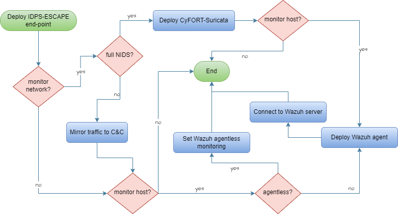
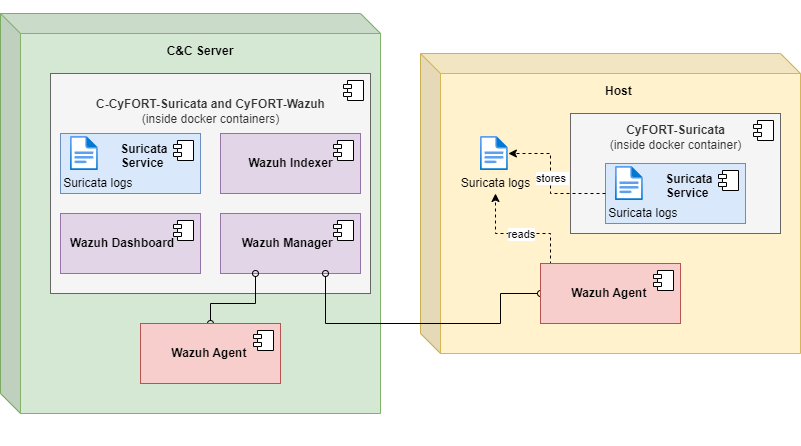
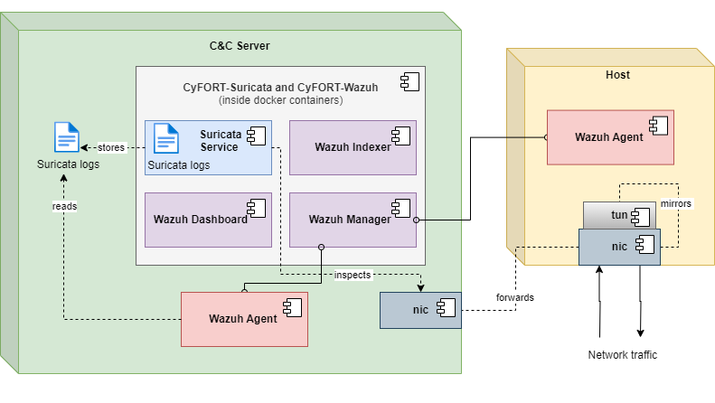

## Remote monitoring

The monitoring of remote end-points can be set up following multiple deployment paradigms.



Assuming the cental NIDS, HIDS and SIEM to be deployed and endpoint in the same network. We suggest the two most conservative options.

1. **Integrated Model**: The integrated model includes installing a dedicated Suricata service on each endpoint and configuring the Wazuh agent on the endpoint to listen to the Suricata logs for network activity and ship them to the Wazuh manager on the centralized monitoring machine. 
2. **Hybrid Model**: The hybrid model includes employing a mechanism on the monitored endpoint so that all the incoming and outgoing network traffic from it is mirrored to the centralized monitoring machine. The centralized monitoring machine already has the Suricata service running and a Wazuh agent listening to its logs for network activity in place. 
The Hybrid Model is lighter.

Notice that, dedicated Wazuh agents are installed on the endpoints that need to be monitored and enrolled with the _Wazuh Manager_ on the centralized monitoring machine. These Wazuh agents will be responsible for monitoring and reporting all the host based activities on the monitored endpoint. The process of installing the agents on any machine is same as above, but only differs for the WAZUH_MANAGER address. In such cases, the WAZUH_MANAGER address will be the IP address of the centralized monitoring machine. 

### Integrated Model 
1. [Install Suricata](./suricata/suricata_installation.md#installation-and-configuration-of-suricata)
1. [Install Wazuh agent](./wazuh/wazuh_agents.md) using address of cental manager.
1. Follow [integration procedure](integration.md) with local paths.



### Hybrid Model 

1. [Install Wazuh agent](./wazuh/wazuh_agents.md) using address of cental manager. 

1. Mirror traffic to central machine to be monitored by central Suricata. Namely, create GRE tunnel from the endpoint to the central monitoring machine running the script [idps-escape-port-mirroring.sh](idps-escape-port-mirroring.sh). The script takes six parameters described below, for simplicity we call `CCserver` which is hosting the Suricata and Wazuh services and their integration, and `end-point` which is the machine in the network that need to be monitored. 


1.  `source_interface`: The network interface on the source endpoint(`end-point`) from which the traffic will be mirrored. For example,`enp9s0`.
    
    To find the default  capture interface, the following command can be used. 
	```sh 
	ip -p -j route show default 
	``` 

5.  `source_ip`: The IP address associated with the capture interface (`enp9s0`) on the source endpoint(`end-point`). For example, `192.168.5.8`. 

	 To determine the IP address associated with a specific network interface, you can use the `ifconfig` command followed by the name of the interface. 
	```sh
    ifconfig enp9s0 
    ``` 
    
6.  `destination_interface`: The network interface on the destination machine (`CCserver`) where the mirrored traffic will be sent. This interface should be the one where Suricata is configured. For example,   `enp7s0`, which is the capture interface of the destination.
    
7.  `destination_ip`: The IP address associated with the capture interface (`enp7s0`) on the destination machine (`CCserver`). For example,  `192.168.5.5`.
    
8.  `tunnel_ip`: An unused IP address in the network range that will be assigned to the tunnel interface. This IP address should be distinct from other IP addresses in the network. In this example, `192.168.5.10/24` is specified, indicating that the tunnel interface will have the IP address `192.168.5.10` with a subnet mask of `/24`.
    
9.  `tunnel_name`: A unique name assigned to the tunnel interface. This name is used to identify the tunnel interface on the local system. In this case, it's specified as `tun0`.

Then finally, the script can be executed as: 
```sh
./idps-escape-port-mirroring.sh source_interface=enp9s0 source_ip=192.168.5.8 destination_interface=enp7s0 destination_ip=192.168.5.5 tunnel_ip=192.168.5.10/24 tunnel_name=tun0
```
 This creates a GRE tunnel from the source to destination mirroring all incoming and outgoing network traffic to the destination machine. Any malicious activity on the source machine would now be seen through the Wazuh dashboard on the destination machine i.e., the centralized monitoring machine hosting the Suricata and Wazuh integration. 

