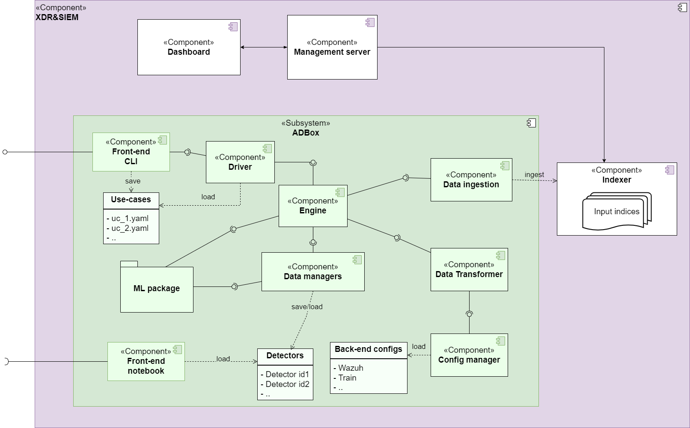

# IDPS-ESCAPE user manual

IDPS-ESCAPE is aimed at closely capturing the notion of MAPE-K (Monitor, Analyze, Plan, Execute and Knowledge) from autonomic computing applied to cybersecurity, which translates into providing a comprehensive package fulfilling the roles of a Security Orchestration, Automation, and Response (SOAR) system, a Security Information and Event Management (SIEM), and an Intrusion Detection and Prevention System (IDPS), with a central subsystem dealing with anomaly detection (AD) based on state-of-the-art advances in machine learning (ML). We call this AD subsystem "**ADBox**", which comes with out-of-the-box integration with well-known open-source solutions such as [OpenSearch](https://opensearch.org/) for search and analytics, [Wazuh](https://wazuh.com/) as our SIEM\&XDR of choice, in turn connected to [MISP](https://www.misp-project.org/) for enriching alerts, and to [Suricata](https://suricata.io/), acting both as our network-based IDPS of choice, as well as a network-level data acquisition source.

Our extensible **ADBox** framework and implementation also include a Multivariate Time-series Anomaly Detection (MTAD) algorithm relying on Graph Attention Networks (GAT).

# Signature-based network and host IDPS and SIEM

To achieve comprehensive monitoring capabilities, we combine Suricata, an open-source Network Intrusion Detection System (NIDS), and Wazuh, a cybersecurity platform that integrates SIEM and XDR capabilities.

See the [Instructions for IDPS and SIEM integrated deployment](../../deployment/README.md).

# ADBox

The two major missions of ADBox are to:

1. perform core time-series anomaly detection operations via ML;
2. manage the data flow from the indexer to the core machine learning algorithm, and back to the
SIEM.

## Table of contents

- [Installation](./installation.md)
- [Setup and prerequisites](./setup_and_prerequisites.md)
- [User guide](./user_guide.md)
- [Use case definition guide](./use_case.md)
- [Anomaly detection engine](./engine.md)
- [MTAD-GAT](./mtad_gat.md)
- [Detector](./detector_data_structure.md)
- [Front-end](./front_end.md)
- [Data transformation](./data_transformation.md)
- [Example](./example.md)
- [Glossary](./glossary.md)

## Overview

- **Install.** Instructions to install ADBox.
- **Setup and prerequisites.** List of configurations file and prerequisites to complete the deployment of ADBox and to be able to create and run detectors.
- **User guide**. 
- **Use case definition guide**. Via ADBox it is possible to create, use and maintain detectors which ingest data and analyze them. The user can simply define the parameters via *use case* configuration files and feed them to the ADBox entry point. This page contains the instructions for understanding and defining use case files.
- **Anomaly detection engine.** The anomaly detection engine is the core component of ADBox. In fact, for every available anomaly detection method it orchestrates the interaction between the bulk functions of every algorithm, the data ingestion, data storage, user output, etc. In other words, the Engine determines the sequence of actions to be performed to successfully go through the detection pipeline. This page also gives an overview of the train and predict pipelines.
- **MTAD-GAT.** ADBox incorporates machine learning algorithms for AD. Currently, the MTAD-GAT algorithm is supported. This page gives a high level overview.
- **Detector**. The *detectors* are the "objects" used to perform detection. This page explains this notion and provides an overview of the ADBox pipelines' outcomes.
- **Front-end.** Available front-end interfaces.
- **Data transformation.** The raw data ingested by ADBox from Wazuh, or any other source, must be cleaned and prepared to be fed to the machine learning model. This page provides an overview of the transformations, including the preprocessing.
- **Example**. An example of ADBox usage from use case definition up to output analysis. This example used data from HIDS and includes [Monitoring Linux resource usage](./linux_resource.md).
- **Glossary**. Summary of specific terminology used in this manual.

