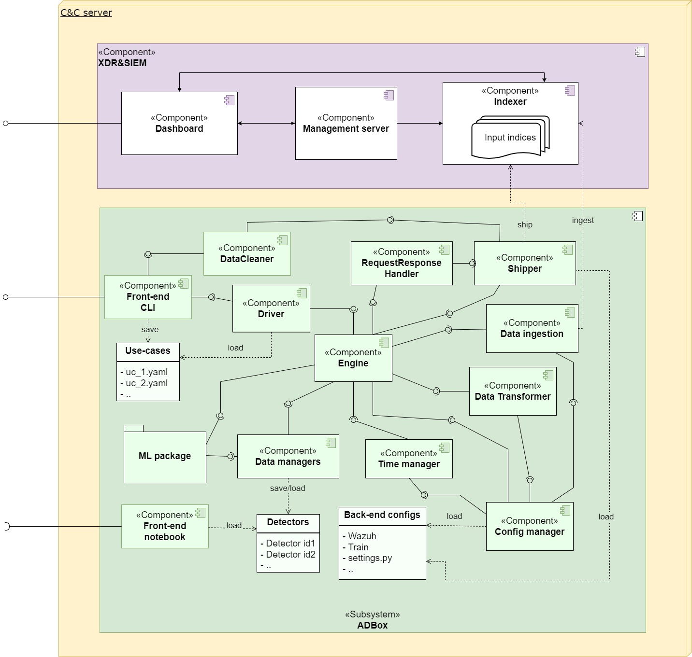

# IDPS-ESCAPE user manual

IDPS-ESCAPE is aimed at closely capturing the notion of MAPE-K (Monitor, Analyze, Plan, Execute and Knowledge) from autonomic computing applied to cybersecurity, which translates into providing a comprehensive package that implements a Security Orchestration, Automation, and Response (SOAR) system.

This resulting SOAR system combines following building blocks: a Security Information and Event Management (SIEM) system, an Intrusion Detection and Prevention System (IDPS), Cyber Threat Intelligence (CTI) tools, an anomaly detection (AD) subsystem, called [**ADBox**](/docs/manual/README.md), and a Risk-aware AD-based Active Response ([**RADAR**](/soar-radar/README.md)) subsystem providing AD scenario implementations, coupled with active response solutions and SOAR playbooks facilitating security orchestration.

We adopt a hybrid method aimed at robustness and resilience to adversarial interference involving three elements: (i) signature-based detection with (ii) AD based on deep learning models via MTAD-GAT, relying on state-of-the-art advances in artificial intelligence (AI) and machine learning (ML) such as the *attention mechanism* and (iii) a classical algorithm for AD on streams such as the Robust Random Cut Forest (RRCF) algorithm supporting categorical features.

## Signature-based network and host IDPS and SIEM

To achieve comprehensive monitoring capabilities, we combine Suricata, an open-source Network Intrusion Detection System (NIDS), and Wazuh, a cybersecurity platform that integrates SIEM and XDR capabilities.

See the [Instructions for IDPS and SIEM integrated deployment](../../deployment/README.md).

## ADBox and RADAR

The two major missions of ADBox are to:

1. perform core time-series anomaly detection operations via ML;
2. manage the data flow from the indexer to the core machine learning algorithm, and back to the SIEM.

The [RADAR](/soar-radar/README.md) subsystem provides solutions for completing the SOAR 
mission of IDPS-ESCAPE enabling security orchestration and automation driven by a 
Risk-informed AD-based active response (AR) paradigm.

## Table of contents

- [Install](/docs/manual/installation.md)
- [Setup and prerequisites](/docs/manual/setup_and_prerequisites.md)
- [Quick start](/docs/manual/quick_start.md)
- [Use case definition guide](/docs/manual/use_case.md)
- [Anomaly detection engine](/docs/manual/engine.md)
- [MTAD-GAT](/docs/manual/mtad_gat.md)
- [Detector](/docs/manual/detector_data_structure.md)
- [Front-end](/docs/manual/front_end.md)
- [Data transformation](/docs/manual/data_transformation.md)
- [Run modes](/docs/manual/runmodes.md)
- [Wazuh ADBox integration](/docs/manual/detector_data_stream.md)
- [Example](/docs/manual/example.md)
- [Detector dashboard tutorial](/docs/manual/dashboard_tutorial.md)
- [SOAR-RADAR](/soar-radar/README.md)
- [Integrations](/integrations/README.md)
- [Data cleaning](/docs/manual/data_cleaning.md)
- [Glossary](/docs/manual/glossary.md)

## Overview

- **Install.** Instructions to install ADBox.
- **Setup and prerequisites.** List of configuration files and prerequisites to complete the deployment of ADBox and to be able to create and run detectors.
- **Quick start**. A concise description of how to get started with AD scenario selection and training/prediction pipeline execution.
- **Use case definition guide**. Via ADBox it is possible to create, use and maintain detectors which ingest data and analyze them. The user can simply define the parameters via *use-case* configuration files and feed them to the ADBox entry point. This page contains the instructions for understanding and defining use-case files.
- **Anomaly detection engine.** The anomaly detection engine is the core component of ADBox. In fact, for every available anomaly detection method it orchestrates the interaction between the bulk functions of every algorithm, the data ingestion, data storage, user output, etc. In other words, the engine determines the sequence of actions to be performed to successfully go through the detection pipeline. This page also gives an overview of the training and prediction pipelines.
- **MTAD-GAT.** ADBox incorporates machine learning algorithms for AD. Currently, the MTAD-GAT algorithm is supported. This page gives a high-level overview.
- **Detector**. The *detectors* are the "objects" used to perform detection. This page explains this notion and provides an overview of the ADBox pipelines' outcomes.
- **Front-end.** Available front-end interfaces.
- **Data transformation.** The raw data ingested by ADBox from Wazuh, or any other source, must be cleaned and prepared to be fed to the machine learning model. This page provides an overview of the transformations, including the preprocessing.
- **Run mode**. A **run mode** is a flag to control the running of the prediction pipeline with respect to the time period of the data analyzed. This page explains the reasoning behind time management within ADBox and our implementation of run modes. ADBox supports one *offline* run mode, i.e., *historical*, and two *online* run modes, i.e., *batch* and *realtime*.
- **Wazuh ADBox integration**. A **detector data stream** is a Wazuh data stream index storing the prediction output. Via detector data streams we can interact with ADBox detection directly using the Wazuh Dashboard.
- **Example**. A simple example of ADBox usage from use-case definition to output analysis using a Jupyter notebook. This example uses data from HIDS and includes [Monitoring Linux resource usage](/docs/manual/linux_resource.md).
- **Detector dashboard tutorial**. A complete tutorial from use-case definition to building custom Wazuh Dashboard visualization.
- **RADAR (Risk-aware Anomaly Detection-based Active Response)**: a collection of modules that complete the Security Orchestration, Automation and Response ([**SOAR**](/soar-radar/README.md)) mission of IDPS-ESCAPE.
- **Integrations**: Artifacts (manuals, Docker compose files, configuration files, code and scripts) for integrating other tools with IDPS-ESCAPE, e.g., MISP, OpenCTI, OpenBAS, [SATRAP](https://github.com/AbstractionsLab/satrap-dl) and [OpenTRICK](https://github.com/itrust-consulting/OpenTRICK).
- **Data cleaning**. Tool for removing outdated detectors.
- **Glossary**. A summary of specific terminology used in this manual.

