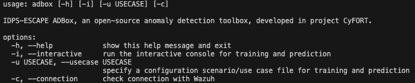
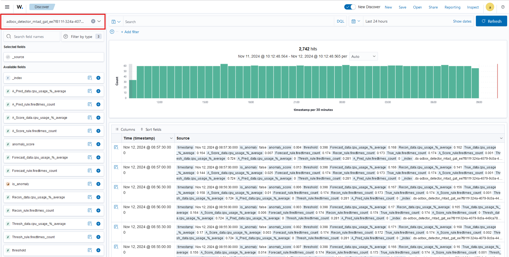
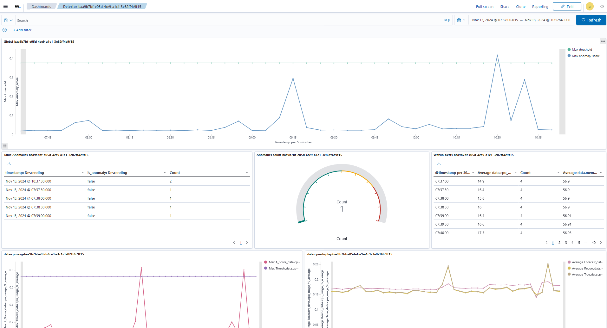

# ADBox installation and usage

> **⚠️ DEPRECATED - Use SONAR for production**: ADBox is maintained for research purposes only. Production deployments should use [SONAR](../sonar_docs/setup-guide.md) instead.

ADBox can be deployed using the following two methods:
  
- [Deployment using Docker and our shell scripts](#installing-adbox-via-docker-and-shell-scripts) (**recommended for end-users**);

- [Deployment in a development containerized environment in VS Code](#installing-adbox-in-a-development-containerized-environment-in-vs-code) (**recommended for developers**);

## Installing ADBox via Docker and shell scripts

The easiest and recommended way to deploy and run ADBox is described in this section and can be achieved using our Docker definition file and build/execution scripts, which can be found in the repository. The instructions below work on GNU/Linux, MacOS and Windows Subsystem for Linux (WSL). ADBox is run as a service in a Docker container.

### IDPS and SIEM integrated deployment

Note that if you already have a running instance of Wazuh, and do not wish to integrate Suricata, you can simply skip to the [ADBox installation section](#installation). A complete installation of the signature-based intrusion detection and the SIEM subsystems of IDPS-ESCAPE can be done using our dedicated [stack deployment guides](../getting-started-stack.md).

### Requirements

The following pieces of software are necessary for setting up the ADBox as a service in a Docker container.

- A local installation of [Docker Engine](https://docs.docker.com/engine/install/), with the Docker service running prior to launching ADBox.

### Installation

1. Simply clone the repository or download a ZIP archive of the project 

    ```sh
    git clone https://github.com/AbstractionsLab/idps-escape.git
    ```

2. Unzip the archive, switch to the extracted directory (`cd foldername`) via a terminal running a shell (e.g., bash, zsh) and make the two shell scripts executable: `chmod +x script-name.sh`. Then, change working directory to the cloned folder containing all the files along with the Dockerfile and build the image by running our build script: `./build-adbox.sh`;

3. Finally, launch ADBox by executing `./adbox.sh`, which runs the default mode if no arguments are provided to the command-line interface (CLI); running `./adbox.sh -h` displays the CLI help menu describing the available commands.



### Usage

Please note that you can set the parameters (IP, port, username and password) for connecting to Wazuh via the [Wazuh credentials JSON file](../../siem_mtad_gat/assets/secrets/wazuh_credentials.json).

The ADBox driver/CLI currently provides five options:

1. Running ADBox using the `-u` flag following by the ID of a use-case YAML file (stored under `siem_mtad_gat/assets/drivers`), e.g., `./adbox.sh -u 2` to start a complete training and prediction pipeline determined by an AD [use-case](./use_case.md) scenario, in this case `uc_2.yaml`.

1. Running ADBox using the `-i` flag, i.e., `./adbox.sh -i` running the interactive console (**the console currently contains a known bug for prediction-only jobs (i.e., no training and using a trained model), please use option 1**).

1. Running ADBox without any arguments: it runs a training and prediction pipeline using default configurations.

1. Running ADBox using the `-c` flag, i.e., `./adbox.sh -c` to check your connection with Wazuh, which is recommended to ensure a successful channel can be established before executing AD workflows. Otherwise, in the absence of a functional connection, ADBox automatically falls back to local default configuration files and prepared sample training and prediction data.

1. Running ADBox using the `-s` flag enables data shipping to Wazuh on top of the expected behavior. Namely, `./adbox.sh -s` installs the data shipping, while `./adbox.sh -u 2 -s` performd the same operations as  `./adbox.sh -u 2` and eventually integrate the data in Wazuh. We recommend to read the manual's page about [ADBox integration in Wazuh](./detector_data_stream.md) before the usage. 

#### Verifying connection with Wazuh

Before running ADBox training and prediction scenarios, you can verify whether a connection between ADBox and an instance of Wazuh can be established successfully using the `-c` flag:

```sh
./adbox.sh -c
```

You can set/modify the parameters (IP, port, username and password) for connecting to Wazuh via the [Wazuh credentials JSON file](../../siem_mtad_gat/assets/secrets/wazuh_credentials.json).


#### Executing a use-case from a YAML file

The ADBox takes inputs from a YAML file stored in the `/siem_mtad_gat/assets/drivers/` folder. By default, the folder contains several YAML-encoded use-cases, which can be used for training models and running predictions.

A training and detection use-case can be run by providing the `-u` flag along with an integer to the script.

```sh
./adbox.sh -u {number}
```

For example, to run use-case 1, execute the script as follows:

```sh
./adbox.sh -u 1
```

With this input, the ADBox will take the inputs specified in the `uc_1.yaml` file.

The folder containing the YAML files also contains a `driver.yaml` file that provides a template for writing your own custom YAML files.

For example, one can run a new [use-case](./use_case.md), by specifying different input parameters in a new YAML file, called `uc_6.yaml` and then run the adbox as follows:

```sh
./adbox.sh -u 6
```

All the outputs produced as a result of running use-cases are stored in `/siem_mtad_gat/assets/detector_models/{detector_id}/prediction_{current_date}/predict_output.json`.

#### Interacting with a console (has bugs in alpha version)

```sh
./adbox.sh -i
```

Running the script using the `-i` flag will open an interactive console which will ask for user inputs.

The output of the all the detections performed through the console are stored in `/siem_mtad_gat/assets/detector_models/{detector_id}/prediction_{current_date}/predict_output.json` file.


#### Executing as default

```sh
./adbox.sh
```

In this mode, the ADBox will train a detector using the default arguments and then also perform detection based on default arguments, with the detector trained using the previously mentioned default arguments. To know more about the input arguments used in default mode, visit the [user manual](../README.md) page.

The output of the default detection is also stored in `/siem_mtad_gat/assets/detector_models/{detector_id}/prediction` folder.

#### Shipping Data to Wazuh

Since IDPS-ESCAPE version `0.1.4`, it is possible to ship prediction outcomes to the Wazuh indexer and consult them directly using the Wazuh dashboard. We summarize the key points below, referring to the corresponding manual page [Wazuh-ADBox integration](/docs/manual/detector_data_stream).

#### Install ADBox-Wazuh shipping

Adding the "shipping flag" for the first time installs the ADBox's index templates and policies in the Wazuh indexer. We recommend reading the manual's page about [ADBox integration in Wazuh](/docs/manual/detector_data_stream.md) before using this option. 

```sh
./adbox.sh -s
```
#### Executing use cases and shipping to Wazuh

By adding the `-s` flag,

```sh
./adbox.sh -u 2 -s
```
the computed predictions are shipped to a custom data stream in the Wazuh indexer. We recommend reading the manual's page about [ADBox integration in Wazuh](/docs/manual/detector_data_stream.md) before using this option. 

The training and prediction pipelines are instructed via [use cases](/docs/manual/use_case.md). To enable the data shipping to the Wazuh indexer, it is sufficient to run ADBox with the flag `-s`:

```sh
$ ./build-adbox.sh
...
$ ./adbox.sh -u {number} -s
```

This way, ADBox:
- at *training time*,  creates a [**detector data stream**](/docs/manual/detector_data_stream.md#detector-data-streams) associated with the detector.
- at *prediction time*, adds the outcomes to the corresponding detector data stream.

A **detector stream** is a [data stream index](https://opensearch.org/docs/latest/im-plugin/data-streams/) of the Wazuh Indexer (i.e., its underlying OpenSearch  distribution).  

Following the [**integration procedure**](./detector_data_stream.md#integrate-in-wazuhs-dashboard) described in the manual it is possible to explore a detector's anomaly predictions via the Wazuh Discovery Dashboard.



With a customized Dashboard example provided below. You can find instructions for building such a dashboard in a [dedicated manual page](./dashboard_tutorial.md).


#### Video walkthrough of ADBox Detector dashboard creation in Wazuh

For an improved visualization, we explain in our [Detector Dashboard Tutorial](/docs/manual/dashboard_tutorial.md) how to construct a dedicated Detector Dashboard in the Wazuh Dashboard, combining multiple visualizations of global and feature-wise results, and related data from other Wazuh indices as well.

Combining Discover Dashboard and our Detector Dashboard we can monitor (in realtime) and investigate anomalies.


## Installing ADBox in a development containerized environment in VS Code 

### Requirements

The following pieces of software are necessary for setting up the ADBox containerized development environment.

* A local installation of [Docker Desktop](https://www.docker.com/products/docker-desktop/)

* [Visual Studio Code](https://code.visualstudio.com/) (VS Code)

* The [Dev Containers](https://marketplace.visualstudio.com/items?itemName=ms-vscode-remote.remote-containers) extension for VS Code by Microsoft

### Installation

1. Clone this repository:

```sh
git clone https://github.com/AbstractionsLab/idps-escape.git
```

2. Start the Docker service (Docker Desktop on MacOS or WSL), if not already running;

3. Open the project folder in VS Code;

4. Select the "Reopen in Container" option in the notification that pops up in VS Code. This will create and run the project inside a Docker container; alternatively, the same command for reopening the project in a container can be selected and invoked from the VS Code command palette;

5. Open a terminal in VS Code and run the following command in the GNU/Linux (Ubuntu) container to install all dependencies:

```sh
poetry install
```

Note that the local file system is automatically mapped to that of the Ubuntu container.

#### Executing adbox

Using the same flags as above run the ADBox entrypoint via:

```sh
poetry run adbox 
```

_**Hint:**_ to resolve warnings in the code related to missing imports, select the Python interpreter installed by poetry. This can be done by clicking on the light bulb that appears next to the warnings.