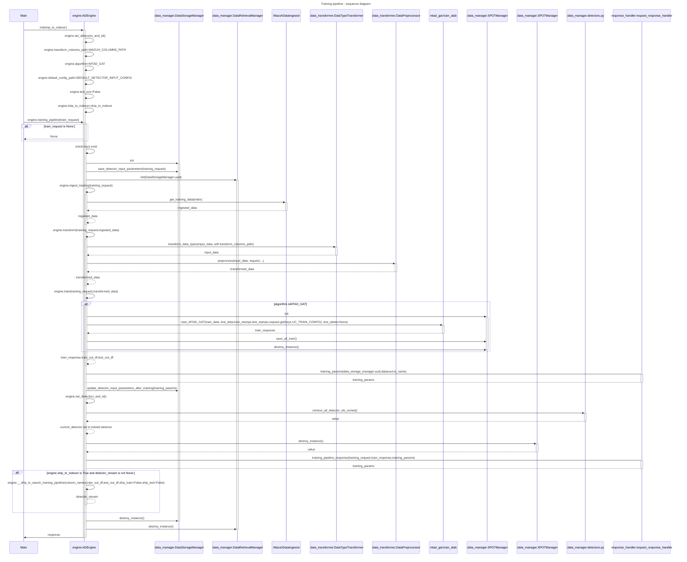

```mermaid
---
title: Training pipeline - sequence diagram
---
sequenceDiagram
    
    participant p0 as Main
    participant p1 as engine:ADEngine
    participant p10 as :data_manager.DataStorageManager
    participant p11 as :data_manager.DataRetrievalManager
    participant p3 as :WazuhDataIngestor
    participant p4 as :data_transformer.DataTypeTransformer
    participant p5 as :data_transformer.DataPreprocessor
    participant p6 as mtad_gat:train_alab
    participant p7 as :data_manager.SPOTManager
    participant p8 as :data_manager.SPOTManager
    participant p9 as :data_manager.detectors.py
    participant rr as response_handler:request_response_handler

      %init engine
      p0 ->> +p1 : init(ship_to_indexer)
        p1 ->> p1 : engine.set_detectors_and_id()
        p1 ->> p1 : engine.transform_columns_path=WAZUH_COLUMNS_PATH
        p1 ->> p1 : engine.algorithm=MTAD_GAT
        p1 ->> p1 : engine.default_config_path=DEFAULT_DETECTOR_INPUT_CONFIG
        p1 ->> p1 : engine.test_env=False
        p1 ->> p1 : engine.ship_to_indexer=ship_to_indexer

      p0 ->> +p1 : engine.training_pipeline(train_request)

        alt train_request is None:
          p1 -->> p0: None
        end


        p1 ->> p1 : check keys exist
      
        % init data managers
        p1 ->>+ p10: init 
        p1 ->> p10:  save_detector_input_parameters(training_request)
        p1 ->>+ p11: init(DataStorageManager.uuid)

        % ingest
        p1 ->>+ p1:  engine.ingest_training(training_request)
          p1 ->>+ p3:  get_training_data(index)
          p3 -->>- p1: : ingested_data
        p1 -->>- p1: : ingested_data

        %transform
        p1 ->>+ p1:  engine.transform(training_request,ingested_data)
          p1 ->>+ p4:  transform_data_types(input_data, self.transform_columns_path)
          p4 -->>- p1:  input_data
          p1 ->>+ p5:  preprocess(input_data, request,...)
          p5 -->>- p1: : transformed_data
        p1 -->>- p1: :  transformed_data

        % train
        p1 ->>+ p1:  engine.train(training_request,transformed_data)
          alt algorithm isMTAD_GAT
          %%% MTAD GAT
          p1 ->>+ p7: init
          p1 ->>+ p6:  train_MTAD_GAT(train_data, test_data,train_stamps,test_stamps,request.get(keys.UC_TRAIN_CONFIG), test_labels=None)
          p6 -->>- p1:  train_response
          p1 ->> p7:  save_all_train()
          p1 ->> p7:  destroy_instance()
          deactivate p7
          end
        p1 -->>- p1:   train_response,train_out_df,test_out_df

        % prepare response and update env
        p1 -> +rr: training_params(data_storage_manager.uuid,datasource_name)
        rr --> -p1: training_params
        p1 ->> p10:  update_detector_input_parameters_after_training(training_params)
        p1 ->> p1:  engine.set_detectors_and_id()
          p1 ->>+ p9:  retrieve_all_detector_ids_sorted()
          p9 -->>- p1:  value
          p1 -->> p1: current_detector set to trained detector 
          p1 ->>+ p8:  destroy_instance()
        p8 -->>- p1:  value
      
        p1 -> +rr: training_pipeline_response(training_request,train_response,training_params)
        rr --> -p1: training_params

        alt engine.ship_to_indexer is True and detector_stream is not None:
            p1 ->>+ p1: engine.__ship_to_wazuh_training_pipeline(column_names,train_out_df,test_out_df,ship_train=False,ship_test=False)
            p1 --> -p1: detector_stream
        end
     
        p1 ->> p10:  destroy_instance()
        deactivate p10
        p1 ->> p11:  destroy_instance()
        deactivate p11
      p1 ->> -p0: response
      deactivate p1
```  