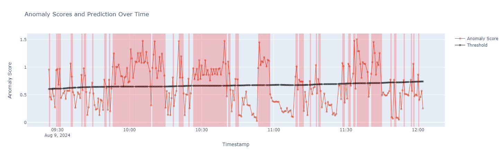

# Front-end options

## Jupyter notebook

A notebook for analysis, visualization and interpretation of the results is available at: [ADBox Result Visualizer Notebook](/siem_mtad_gat/frontend/viznotebook/result_visualizer.ipynb).

## Detector Dashboard in Wazuh

Thanks to the [ADBox and Wazuh integration](./detector_data_stream.md), it is now possible to create a dedicated detector dashboard directly inside Wazuh. This allows us to monitor the anomaly detection and to compare with alerts using a single interface.
To produce a [detector dashboard](./dashboard_tutorial.md), follow the tutorial.

