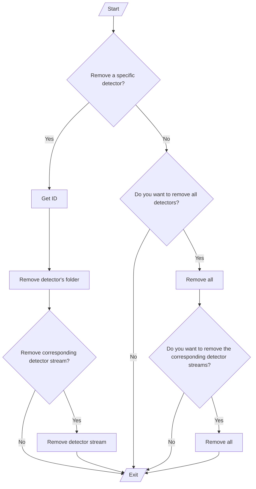

# Data cleaning

Once a detector is created, numerous files are created as explained [here](/docs/manual/detector_data_structure.md), more so if the data shipping is enabled [detector data streams](/docs/manual/detector_data_stream.md) and templates are created too.

At some point, this data may not be useful anymore. Hence, we offer an interactive procedure for removing them:

```sh
sudo poetry run python siem_mtad_gat/data_cleaner.py
```

The option to remove all actually removes all detectors except those listed in `KEEP_DETECTORS` in [`siem_mtad_gat/settings.py`](/siem_mtad_gat/settings.py).

### Data cleaner flow

