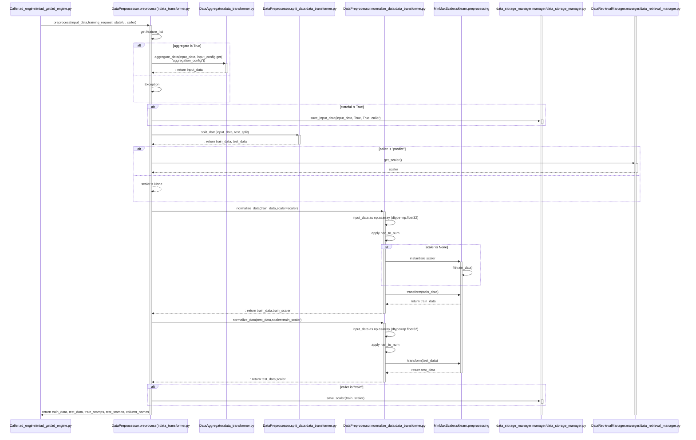

# Data transformation

Row data ingested from Wazuh, or any other source must be cleaned and prepared to be fed to the machine learning model.

This is automatically done by the [Training pipeline](./engine.md#training-pipeline) and the [Prediction pipeline](./engine.md#prediction-pipeline).

Data undergo to three main kind of transformation:
- data type adjustment
- aggregation
- preprocessing

### DataTypeTransformer

The DataTypeTransformer processes raw data into a format suitable for analysis or training through machine learning algorithms. The transformation applied is done according to a predefined back-end configuration file.

### DataAggregator

The DataAggregator extracts and aggregates features from time-series data based granularity and aggregation methods specified in by the current [use case](./use_case.md). It method may be call as part of the preprocessing.

### DataPreprocessor

The DataPreprocessor operates all the transformations that are strictly part of the ML preprocessing, including feature extraction and possibly aggregation, as specified in by the current [use case](./use_case.md).

Below the sequence diagram of preprocessing main method.

