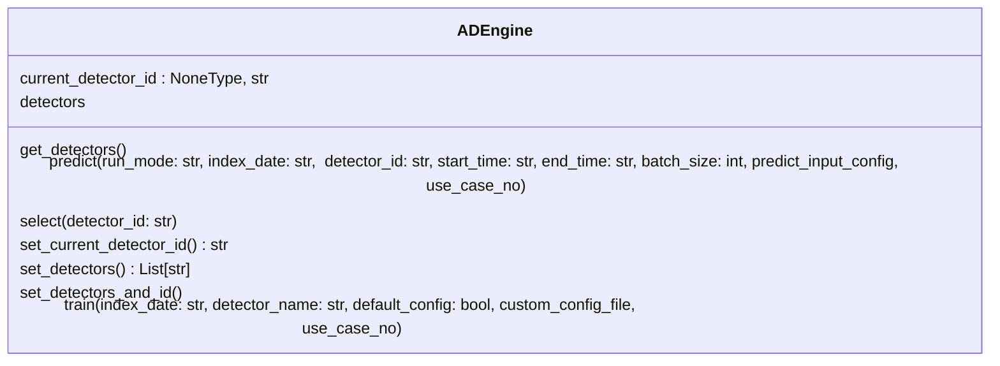
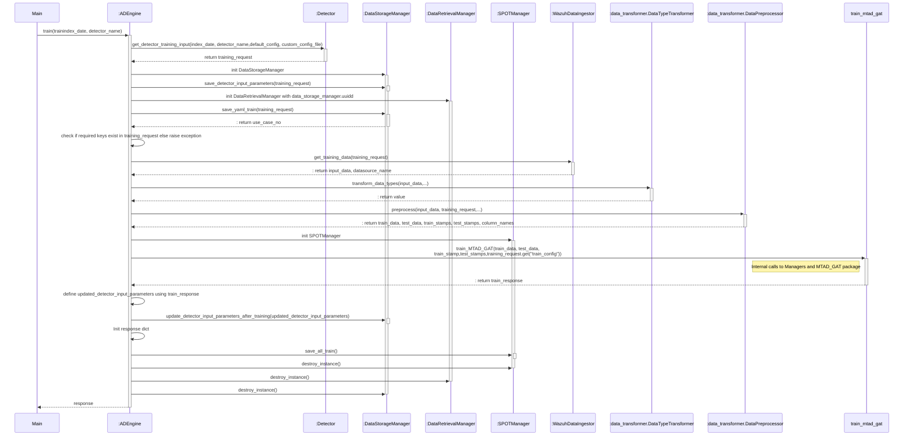

# Anomaly detection engine

The anomaly detection engine is the core component of ADBox. In fact, for every available anomaly detection method it orchestrates the interaction between the bulk functions of every algorithm, the data ingestion, data storage, user output, etc. In other words, the Engine determines the sequence of action to be performed to successfully go through the detection pipeline.

For every available anomaly detection method, it includes:

- **Detector Manager**: This is essentially a parser and transformer, which transforms use-case input to data consumable by various detection pipeline. It manages the list od available detectors.

- **Engine**: The ADEngine class method maintains the status of the current detector, which is the detector to be used if nothing else specifies and the list of available detectors. Moreover, it exposes the actions that are available for the end user, triggering the corresponding pipelines. Moreover, it defines the default behavior of ADBox if no info are provided.

The list of available actions includes:

- get the list of available detectors and their info
- set the default (current) detector
- start the training pipeline for a new detector
- start the prediction pipeline for an existing detector




Currently, ADBox engine supports on the [MTAD-GAT](./mtad_gat.md) method for anomaly detection.  


## MTAD-GAT pipelines


Ideally a detector **detector** is the object that it is used to perform detection. In the specific case of anomaly detection via [MTAD-GAT](./mtad_gat.md) algorithm, it must include for example a trained ML, along with all the configuration used, and POT object. 
In ADBox implementation detector is realize as a collection of files stored under an unique id, which is also the name of subfolder of `siem_mtad_gat/assets/detector_models` containing such files. All the outcomes generated by a pipeline associate with a certain detector are stored in the corresponding folder. For details see [Detector data structure](./detector_data_structure.md).


```sh
├── a77c773c-9e6f-4700-92f2-53c0e682f290
│   ├── input
│   │   ├── detector_input_parameters.json
│   │   └── training_config.json
│   ├── prediction
│   │   ├── uc-16_predicted_anomalies_data-1_2024-08-12_13-48-42.json
│   │   └── uc-16_predicted_data-1_2024-08-12_13-48-42.json
│   └── training
│       ├── losses_train_data.json
│       ├── model.pt
│       ├── scaler.pkl
│       ├── spot
│       │   ├── spot_feature-0.pkl
│       │   ├── spot_feature-1.pkl
│       │   ├── spot_feature-2.pkl
│       │   ├── spot_feature-3.pkl
│       │   ├── spot_feature-4.pkl
│       │   └── spot_feature-global.pkl
│       ├── test_output.pkl
│       ├── train_losses.png
│       ├── train_output.pkl
│       └── validation_losses.png
```

Below we describe the train and predict pipelines. 

### Training Pipeline

The main goal of the train pipeline is to create a new detector. 

See parameters in [Use Case Guide](./use_case.md),

The train pipeline:

1. Parse the used case and use-case input to get training request.
2. initialize the *managers*, persistent object during the pipeline to which specific tasks are delegated:
    - data storage,
    - data retrievable,
    - management of POT object for dynamic threshold control.
3. Wazuh data ingestion according to uc input (if the connection to Wazuh is not available, stored data are used).
4. Transformation of ingested data, including preprocessing.
5. Training of MTAD-GAT model. This include a testing on subset of data (30%).
6. Produce the train response.

Running the training pipeline should produce `input` and `training` folders under the id of the model.




#### Train function input explanation

 **train:** The train method trains a detector to be used for detection using the default or given arguments. It takes the following inputs:

  1. **index_date:** This is the date string that the detector will use to fetch from the consequent Wazuh index. The input format is the same as the date formats for Wazuh indices i.e., 'YYYY-MM-DD' and could also contain and asterisk (\*) at any position for example to fetch the data for the month of July 2024, the input can be "2024-07-\*".  If no date is provided, or "default" is given, then it will use the default index_date which would be the index date for the current month. So by default, the detector will train on all the data from the current month. 
  2. **detector_name:** This is the display name for the detector. If no name is provided or "default" is given, then it will name the detector using the default naming format i.e., 'detector_<current timestamp>'. 
  3. **default_config:** This is a boolean input value, to specify if the detector should use the default training inputs from the `/assets/default_configs/default_detector_input_config.json` file. By default it is True, if specified False, then a custom input config needs to be provided for training.  
  4. **custom_config:** If the default_config is set to False, then the custom input config needs to be provided from a yaml file. ADBox will read the configs from this file and train a detector using those values. Keep in mind that the custom input config should have the key names same as the default input config. Otherwise it will still take the default values. 

## Prediction Pipeline

The main goal of the train pipeline is to use a detector to find anomalies in a selected time-frame.

Notice that, at prediction the parameters of the detector like window size, granularity, features aggregation methods, etc. cannot be selected, as they are inherent property of the detector. 

See parameters in the [use case guide](./use_case.md).


The prediction pipeline:


1. Parse the used case and use-case input to get prediction request, including detector id and runmode.
2. initialize the *managers*, persistent object during the pipeline to which specific tasks are delegated:
    - data storage,
    - data retrieval,
    - management of POT object for dynamic threshold control.
3. Depending on the runmode and the uc prediction parameters, run one or multiple times the following actions:
    1. Wazuh data ingestion.
    2. Transformation of ingested data, including preprocessing.
    3. Apply MTAD-GAT model for prediction. 
    4. Produce the predict response.

Running the training pipeline should files in `prediction` folder under the id of the model.


#### Predict function input explanation

**predict:** The predict method performs anomaly detection using the trained detectors with default or specified parameters. The predict function of `ADEngine` takes the following inputs:  

1. **run_mode:** This value specifies the detection run mode. And it could take three values. 
		- **HISTORICAL:** performs detection on historical data. 
		- **BATCH:** performs detection on data in batches (in a real-time loop). 
		- **REALTIME:** performs detection on (almost )real-time data. 
		If no value is provided or "default" is specified, it will run using the default run mode which is set to HISTORICAL. 
2. **index_date:** This is the date string that the detector will use to fetch from the consequent Wazuh index. The input format is the same as the date formats for Wazuh indices i.e., 'YYYY-MM-DD' and could also contain and asterisk (\*) at any position for example to fetch the data for the month of July 2024, the input can be "2024-07-\*".  If no date is provided, or "default" is given, then it will use the default index_date which would be the index date for the current day. So by default, the detector will preform detection on all the data from the current day.  
3. **detector_id:** This is the detector id for the detector selected for detection. If no id is given, or "default" is specified, it will detect using the most recently trained detector. 
4. **start_time:** This is the start time for detection. It should be a timestamp string in 'YYYY-MM-DDTHH:MM:SSZ' format. If not provided, or "default" is specified, it will be set to starting timestamp of the current date. 
5. **end_time:** This is the end time for detection. It should be a timestamp string in 'YYYY-MM-DDTHH:MM:SSZ' format. If not provided, or "default" is specified, it will be set to current timestamp of the current date.  
	*Note that for BATCH and REALTIME mode, the start and end time are not required.*
6. **batch_size:** This specifies the batch size for the BATCH run mode. It should be given as an integer. If not provided, it will use a default batch size, which is set to 10. *Note that the batch size is not required for the other two batch modes (HISTORICAL and REALTIME).*