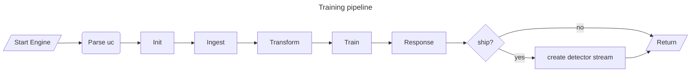
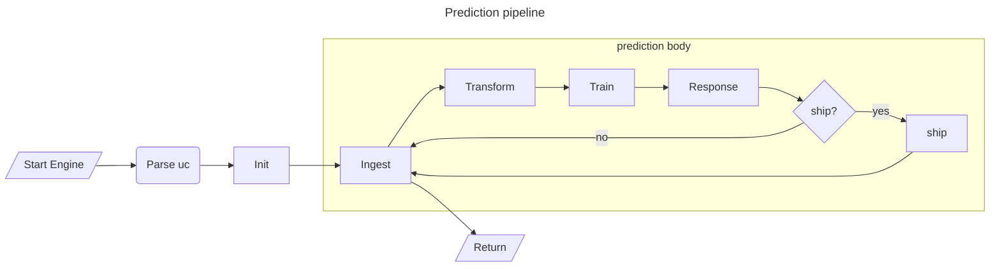
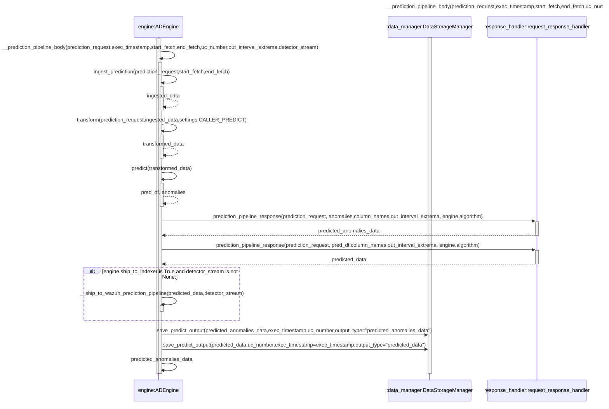

# Anomaly detection engine

The anomaly detection engine is the core component of ADBox. In fact, for every available anomaly detection method it orchestrates the interaction between the bulk functions of every algorithm, the data ingestion, data storage, user output, etc. In other words, the engine determines the sequence of actions to be performed to successfully go through the detection pipeline.

 The *ADEngine class* method maintains the status of the current detector, which is the detector to be used if nothing else is specified and the list of available detectors. Moreover, it exposes the actions that are available for the end user, triggering the corresponding pipelines. Moreover, it defines the default behavior of ADBox if no relevant information is provided to that effect.

The list of available actions includes:

- getting the list of available detectors and their information
- setting the default (current) detector
- starting the training pipeline for a new detector
- starting the prediction pipeline for an existing detector

Currently, the ADBox engine supports the [MTAD-GAT](/docs/manual/mtad_gat.md) algorithm for anomaly detection.

Instructions are given to the engine as [use cases](/docs/manual/use_case.md). The engine can parse and transform use case input into data consumable by various detection pipelines, by calling the [`DetectorsConfigManager`](/siem_mtad_gat/config_manager/config_manager.py).

By default if the key words for training and prediction are not provided in the use case, the corresponding request is set to `None` and the output of the pipeline will be empty.

## Engine state

The engine state is maintained via its attributes. Normally, these attributes are set at initiation time using default values, however they can be automatically changed by the pipelines. For example, at the end of the training pipeline the `current_detector_id` is set to that of detector that was just trained.


|  Attribute   | Description     |  Type   | Default |
| --- | --- | --- | --- |
| `algorithm `    | algorithm used by the detection pipelines. Currently only [MTAD-GAT](/docs/manual/mtad_gat.md) is available.    |   `str`  |  `MTAD-GAT`   |
| `current_detector_id`    |  `uuid` of the detector to be used by the pipelines.   |   `str`   |  Last trained ID   |
|  `default_config_path`    |  The path to the default detector configuration. See [default behavior and use case parsing](/docs/manual/use_case.md#default-behavior-and-use-case-parsing).   |  `str`    |  [`DEFAULT_DETECTOR_INPUT_CONFIG`](/siem_mtad_gat/assets/default_configs/default_detector_input_config.json)   |
| `detectors`    |  List of detector IDs available locally   |   `List[str]`   |    |
|  `ship_to_indexer`   |  If `True`, data shipping to Wazuh is enabled. See [Wazuh-ADBox integration](/docs/manual/detector_data_stream.md)   |  `bool`   |   `False`   |
|  `transform_columns_path` | the path to the config file for ingested data type transformation. See [Data transformation](/docs/manual/data_transformation.md) .  |  `str`    |   [`WAZUH_COLUMNS_PATH`](/siem_mtad_gat/assets/wazuh/wazuh_columns.json)  |
|  `test_env`   | If set `True`, the engine gathers assets (e.g., uc) from the test environment. |  `bool` | `False`|


## Detection pipelines

A **detector** is the object that is used to perform detection. In the specific case of anomaly detection via [MTAD-GAT](/docs/manual/mtad_gat.md) algorithm, it must include for example a trained ML, along with all the configuration used, and POT object. 
In ADBox implementation detector is realize as a collection of files stored under an unique id, which is also the name of subfolder of `siem_mtad_gat/assets/detector_models` containing such files. All the outcomes generated by a pipeline associate with a certain detector are stored in the corresponding folder. For details see [Detector data structure](/docs/manual/detector_data_structure.md).


```sh
├── a77c773c-9e6f-4700-92f2-53c0e682f290
│   ├── input
│   │   ├── detector_input_parameters.json
│   │   └── training_config.json
│   ├── prediction
│   │   ├── uc-16_predicted_anomalies_data-1_2024-08-12_13-48-42.json
│   │   └── uc-16_predicted_data-1_2024-08-12_13-48-42.json
│   └── training
│       ├── losses_train_data.json
│       ├── model.pt
│       ├── scaler.pkl
│       ├── spot
│       │   ├── spot_feature-0.pkl
│       │   ├── spot_feature-1.pkl
│       │   ├── spot_feature-2.pkl
│       │   ├── spot_feature-3.pkl
│       │   ├── spot_feature-4.pkl
│       │   └── spot_feature-global.pkl
│       ├── test_output.pkl
│       ├── train_losses.png
│       ├── train_output.pkl
│       └── validation_losses.png
```

Below we describe the train and predict pipelines. 

### Training Pipeline

The main goal of the train pipeline is to create a new detector. 

See parameters in [Use-case Guide](/docs/manual/use_case.md),

The train pipeline:

0. Parse uc and get train request (in fact, we assume the request has been generated using [`get_training_requests_from_uc`](/siem_mtad_gat/ad_engine/mtad_gat/ad_engine.py) method).
1. Read training request.
2. Initialize the *managers*, persistent object during the pipeline to which specific tasks are delegated:
    - data storage,
    - data retrievable,
    - management of POT object for dynamic threshold control.
3. Ingest data from Wazuh according to use-case (if the connection to Wazuh is not available, stored data are used).
4. Transforming ingested data; this includes preprocessing.
5. Train ML model. This includes the testing on a subset of data (30%).
6. Produce the train response.
7. (optional) Create a [detector data stream](/docs/manual/detector_data_stream.md#detector-data-streams).

Running the training pipeline should produce `input` and `training` folders under the id of the model.



```mermaid
---
title: Training pipeline
---
flowchart LR
  s[/Start Engine/]  --> P(Parse uc)
  P --> Init 
  Init--> Ingest
   Ingest --> Transform 
  Transform --> Train
  Train --> Response
  Response --> B{ship?}
 B -->|no| D[/Return/]
 B -->|yes| C[create detector stream]
 C -->  D
```

See also the [**training pipeline sequence diagram**](/docs/manual/engine-traninig-pipeline.md).


## Prediction Pipeline

The main goal of the prediction pipeline is to use a detector to find anomalies in a selected time-frame.

Note that, at prediction time, detector parameters such as window size, granularity, features aggregation methods, etc. cannot be selected as they are inherent properties of the detector. 

See parameters in the [use-case guide](/docs/manual/use_case.md).

The prediction pipeline:

0. Parse the use case and use-case input to get the prediction request, including detector ID and run mode (in fact, we assume the request has been generated using the []`get_prediction_requests_from_uc`](/siem_mtad_gat/ad_engine/mtad_gat/ad_engine.py) method).
1. Read the prediction request into memory.
2. Initialize the *managers*, persistent object during the pipeline to which specific tasks are delegated:
    - data storage,
    - data retrieval,
    - management of POT object for dynamic threshold control.
3. Depending on the run mode and the use case prediction parameters, run one or multiple times the following actions (*prediction body*):
    1. Wazuh data ingestion
    2. Transformation of ingested data, including preprocessing
    3. Apply MTAD-GAT model for prediction
    4. Produce the prediction response
    5. (optional) Ship data to detector data stream



```mermaid
---
title: Prediction pipeline
---
flowchart LR
  s[/Start Engine/] --> P(Parse uc)
  P --> Init 
  Init--> Ingest
  subgraph prediction body
  Ingest --> Transform 
  Transform --> Train
  Train --> Response
  Response --> B{ship?}
  B -->|no| Ingest
  B -->|yes| C[ship]
  C -->  Ingest
  end
  Ingest --> r[/Return/] 
```
### Prediction pipeline body

#### Predict body method's input explanation

1. **prediction_request:**  This contains the arguments parsed form the use case plus the parameters of the chosen detectors (automatically added).
2. **execution timestamp:** The timestamp indicating when the pipeline started.  
3. **uc_number:** use case number.
4. **start_fetch:** This is the start time for fetching the data, a timestamp string in 'YYYY-MM-DDTHH:MM:SSZ' format. This should be computed by `TimeManager`.
5. **end_fetch:** This is the end time for fetching the data. This should be computed by `TimeManager`.
6. **out_interval extrema:** This is the timestamps's pair indicating the first timestamp in the output and the timestamp where detections ends. 


```mermaid

sequenceDiagram

    Title __prediction_pipeline_body(prediction_request,exec_timestamp,start_fetch,end_fetch,uc_number,out_interval_extrema,detector_stream)

    participant p1 as engine:ADEngine
    participant p2 as :data_manager.DataStorageManager
    participant rr as response_handler:request_response_handler
    
    activate p2
    activate p1
    p1 ->>+ p1: __prediction_pipeline_body(prediction_request,exec_timestamp,start_fetch,end_fetch,uc_number,out_interval_extrema,detector_stream)

	p1 ->>+ p1:  ingest_prediction(prediction_request,start_fetch,end_fetch)
	p1 -->>- p1:  ingested_data

	p1 ->>+ p1:  transform(prediction_request,ingested_data,settings.CALLER_PREDICT)
	p1 -->>- p1:  transformed_data
    
	p1 ->>+ p1:  predict(transformed_data)
	p1 -->>- p1: pred_df, anomalies

	p1 ->> +rr:  prediction_pipeline_response(prediction_request, anomalies,column_names,out_interval_extrema, engine.algorithm)
	rr -->>- p1 : predicted_anomalies_data
	p1 ->> +rr:  prediction_pipeline_response(prediction_request, pred_df,column_names,out_interval_extrema, engine.algorithm)
	rr -->>- p1 : predicted_data

    alt engine.ship_to_indexer is True and detector_stream is not None:
        p1 ->>+ p1: __ship_to_wazuh_prediction_pipeline(predicted_data,detector_stream)
        deactivate p1
    end
	p1 ->> p2:  save_predict_output(predicted_anomalies_data,exec_timestamp,uc_number,output_type="predicted_anomalies_data")
	p1 ->> p2:  save_predict_output(predicted_data,uc_number,exec_timestamp=exec_timestamp,output_type="predicted_data")

    p1 ->> -p1: predicted_anomalies_data 

    deactivate p1
    deactivate p2
    
```
 
### Stop online prediction 

For online prediction run modes, i.e., real time and batch mode, the predict body runs in a loop. To stop the prediction, you can simply issue an interrupt using `ctrl-C`, which will simply interrupt the loop and close the running managers.

## ADEngine as a library

The AD engine can be imported and used from other modules.

For example, suppose we compiled `uc_15.yaml` and stored it in the drivers folder; the training pipeline can be started as follows:

```python
engine=ADEngine()
train_request=engine.get_training_requests_from_uc(uc_number=15) # parse request and update configs
response_train=engine.training_pipeline(training_request=train_request)
```

If the training request is `None`, the response will be  `None` as well.

Similarly, the output of `engine.prediction_pipeline` is a generator, whose behavior depends on the run mode.

```python
engine=ADEngine()
pred_request=engine.get_prediction_requests_from_uc(uc_number=args.usecase)
engine.run_prediction_pipeline(prediction_request=pred_request,uc_number=args.usecase)
```
