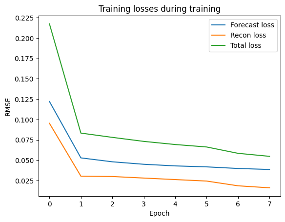
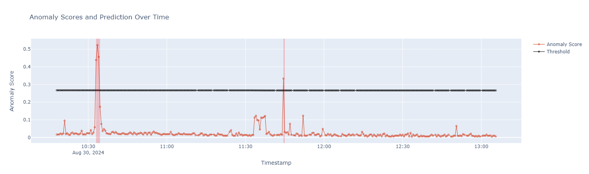
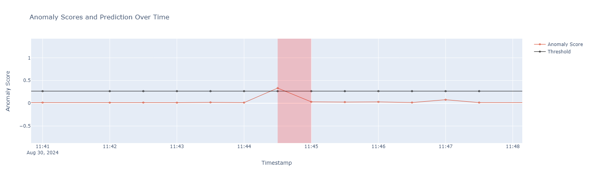
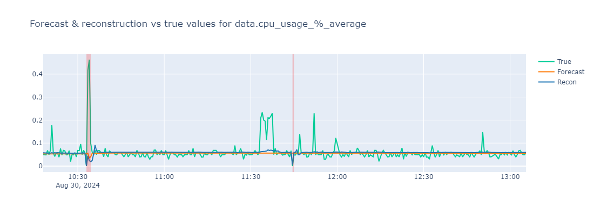
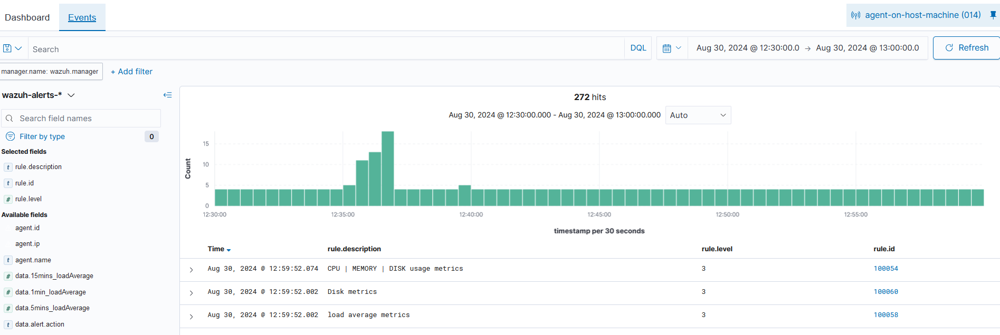

# An example

In this section, we present an example illustrating the usage of ADBox, adopting the end user point of view.

## My system
I have deployed all the components as explained in the [guide for IDPS and SIEM integrated deployment](../../deployment/guide_sids.md) and the
[ADBox user manual installation page](./installation.md). Moreover, I have enabled [Linux resource monitoring](./linux_resource.md).

## My use case

I want a detector which correlates resource usage and rules statistics. Once created, I want this detector to keep running on new data.

Therefore, I prepare a dedicated [use case file](./use_case.md).

Namely,

- I have to identify the features of the [multivariate time-series](./time_series.md) that I want to perform detection on. To do so, I analyze the event logs of my system. 

- For every feature, I choose a suitable aggregation method for the *granularity* I wish to use.

- For example, I would like a new point every 30 seconds (**lowest advised granularity**). Every point has 3 dimensions representing the average CPU percent usage, average memory percent usage and the total `firedtimes` rule statistics parameter.

I have to decide:

- how I wish to handle missing values,
- the detector name,
- the data that is to be used to train my detector,
- the detection interval (window size), and
- the number of epochs for training.

For example, I want anomalies to be flagged over intervals of 3 minutes, so the window size should be 8. Then, I also want to use all my data of the current month that is already available to train the detector.

For the prediction, I want almost real-time results but I would like to fetch data in batches. For example, I want to get points every 6 minutes, then in batches of 12 points.

I encode this in [`siem_mtad_gat/assets/drivers/uc-9.yaml`](../../siem_mtad_gat/assets/drivers/uc_9.yaml)

```YAML
training:
  aggregation: true
  aggregation_config:
    features:
      data.cpu_usage_%:
      - average
      data.memory_usage_%:
      - average
      rule.firedtimes:
      - count
    fill_na_method: Zero
    granularity: 30s
    padding_value: 0
  categorical_features: false
  columns:
  - data.cpu_usage_%
  - data.memory_usage_%
  - rule.firedtimes
  display_name: detector_example_3min
  index_date: '2024-08-*'
  train_config:
    epochs: 8
    window_size: 6

prediction: 
    run_mode: BATCH
    batch_size: 12
```
### Running the pipeline

I run adbox

```sh
./adbox.sh -u 9
```
and stop it after a few hours.

This produces a detector with id `2d36a80a-c47a-4eb4-bb3e-5b2bfb90dc9` and the associated folder [`siem_mtad_gat/assets/detector_models/2d36a80a-c47a-4eb4-bb3e-5b2bfb90dc9`](../../siem_mtad_gat/assets/detector_models/2d36a80a-c47a-4eb4-bb3e-5b2bfb90dc95/).

```sh
2d36a80a-c47a-4eb4-bb3e-5b2bfb90dc9
├── input
│   ├── detector_input_parameters.json
│   └── training_config.json
├── prediction
│   ├── uc-9_predicted_anomalies_data-1_2024-08-30_10-24-15.json
│   └── uc-9_predicted_data-1_2024-08-30_10-24-15.json
└── training
    ├── losses_train_data.json
    ├── model.pt
    ├── scaler.pkl
    ├── spot
    │   ├── spot_feature-0.pkl
    │   ├── spot_feature-1.pkl
    │   ├── spot_feature-2.pkl
    │   └── spot_feature-global.pkl
    ├── test_output.pkl
    ├── train_losses.png
    ├── train_output.pkl
    └── validation_losses.png

4 directories, 15 files
```

## Detection analysis

Using the [ADBox Result Visualizer Notebook](./../../siem_mtad_gat/frontend/viznotebook/result_visualizer.ipynb), I can plot the results and analyze them. Here, I collect a few observations.

### Training

The training losses are rather good for 8 epochs, while the same cannot be said about the validation losses. I could try the same setting, while training the detector for more epochs.




### Prediction

I ran the batch prediction from`2024-08-30T10:18:04Z` to `2024-08-30T13:05:30Z` UTC time.

**Global overview**



During this time period, 5 anomalous windows were flagged, 4 consecutive and 1 alone. Let's call them A1 and A2, respectively.




**Feature overview**

Looking at the feature statistics, we can see these two anomalies expressing two different cases:

- anomalies in A1 can be also considered anomalies at the feature level.
- the anomaly in A2 is anomalous **only** at a global level. 




**Wazuh Dashboard**

Looking at the Wazuh Dashboard, we can observe a high number of events in proximity of A1:




### Mapping anomalies to real events

We traced the two anomalies to two real events that had happened in the corresponding detections intervals:

- A1 matches with the running of `apt update` and `apt upgrade` on the host machine.
- A2 matches with a reboot.

### Remarks

In both cases, the actions that (most probably) generated the anomalies had been carried out by a system administrator. In case not, while A1 would have been noticed by looking at single features and/or Wazuh; A2 would have not been as obvious to track.