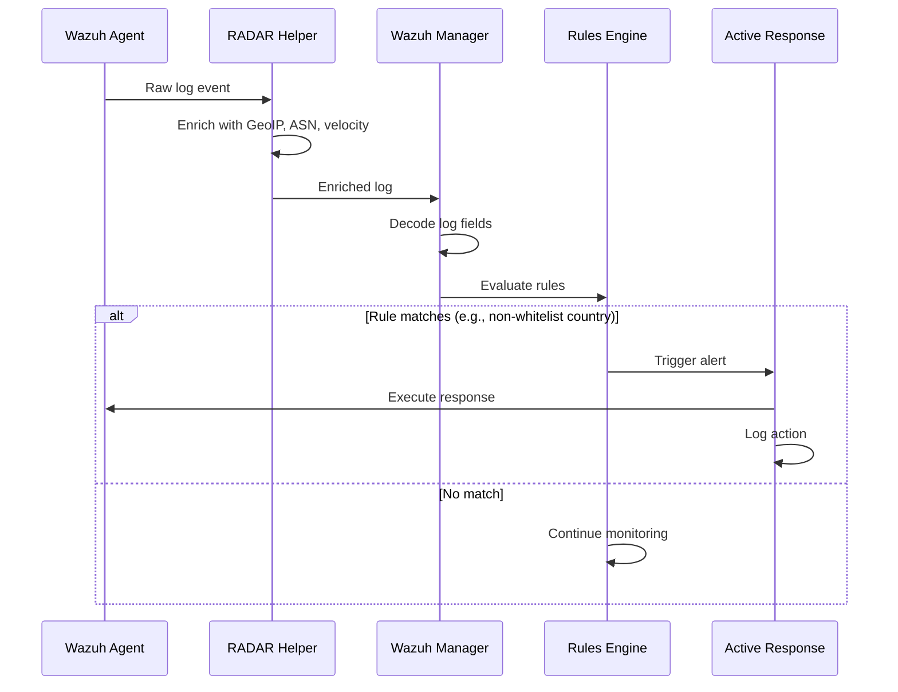
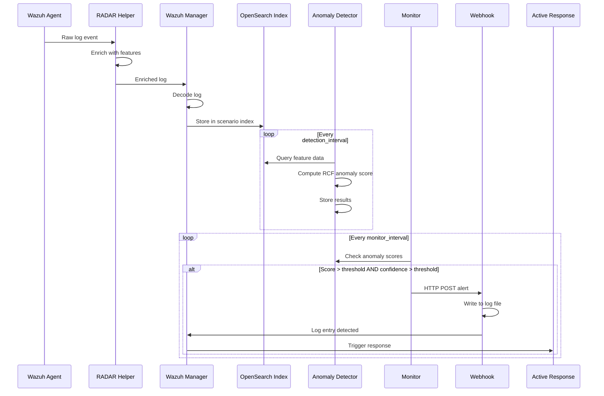

# RADAR Architecture Documentation

## Introduction

RADAR (Risk-aware Anomaly Detection-based Automated Response) is a security orchestration subsystem within IDPS-ESCAPE that integrates anomaly detection with automated response capabilities. The architecture combines signature-based detection with machine learning-based anomaly detection using Random Cut Forest (RCF) algorithms, orchestrating automated security responses through SOAR playbooks.

### Key Capabilities

- **Dual detection approaches**: Signature-based and behavior-based (ML) anomaly detection
- **Automated Response**: SOAR playbooks for immediate threat mitigation
- **Flexible deployment**: Support for local and remote manager/agent configurations
- **Scenario-based**: Pre-configured detection scenarios (insider threat, DDoS, suspicious login, etc.)
- **Extensible**: Modular design for adding new scenarios and response actions

### Core Technologies

- **Wazuh**: Security monitoring platform (manager, agents, indexer)
- **Opensearch**: Data storage and anomaly detection (with AD plugin)
- **Random Cut Forest (RCF)**: AWS implementation for stream-based anomaly detection
- **Ansible**: Infrastructure automation and configuration management
- **Docker**: Containerized deployment and orchestration

## Design Principles

### Modularity and extensibility

RADAR is designed with a modular architecture where each scenario can be independently developed, deployed, and maintained. New scenarios can be added by creating the necessary components (decoders, rules, active responses, detectors) without modifying the core framework.

### Idempotency and repeatability

Through Ansible automation, RADAR ensures that deployments are idempotent—running the same playbook multiple times produces the same result. This allows for safe re-deployment and updates without side effects.

### Separation of concerns

The architecture separates:
- **Data Collection** (Wazuh Agents)
- **Data Enrichment** (RADAR Helper)
- **Detection Logic** (Rules and Anomaly Detectors)
- **Response Execution** (Active Response modules)
- **Orchestration** (RADAR Controller)

This separation enables independent scaling, testing, and evolution of each layer.

### Hybrid Detection Strategy

RADAR implements a defense-in-depth approach combining:
1. **Signature-based detection**: Fast, deterministic rule matching for known threats
2. **Behavior-based detection**: ML model detecting novel or sophisticated attacks

This hybrid approach provides resilience against adversarial interference and reduces false positives.

### Configuration-Driven Deployment

All scenario specifications (index patterns, features, thresholds, detector parameters) are centralized in `config.yaml`, enabling declarative infrastructure and reducing manual configuration errors.

## System Architecture

### High-Level Component Overview

RADAR consists of six primary components working together in an orchestrated pipeline:

| Component | Role | Key Functions |
|-----------|------|---------------|
| **Wazuh Agents** | Endpoint monitoring | Log collection, enrichment, response execution |
| **RADAR Helper** | Data enrichment | Scenario-specific log enhancement |
| **Wazuh Manager** | Central control | Log processing, rule evaluation, response coordination |
| **Opensearch/Wazuh Indexer** | Data platform | Storage, indexing, anomaly detection (RCF models) |
| **Webhook Endpoint** | Alert routing | Notification handling, log writing |
| **RADAR Controller** | Orchestration | Deployment automation, scenario management |

### Component Diagram


*Figure 1: RADAR component architecture showing the six primary components and their interactions*

## Module Structure

### Wazuh Agent Module

The Wazuh Agent module runs on monitored endpoints and serves as the data collection and response execution layer.

#### Logs Collection
- **System logs**: Authentication events, system calls, process execution
- **Network traffic logs**: Connection events, traffic patterns
- **File monitoring**: File integrity monitoring, access events
- **Custom logs**: Application-specific logs per scenario

#### RADAR Helper
The RADAR Helper is a scenario-specific enrichment component that augments raw logs with contextual information before transmission to the manager.

**Purpose**: Enrich logs with scenario-relevant data that aids detection

**Functions**:
- Extracts country, city and ASN information
- Calculates velocity and country changes
- Identifies the access outcome

**Implementation**: Python script deployed to agent endpoints

#### Active Response
- **Notification**: Email notification
- **FlowIntel case**: Creation of FlowIntel case
- **Logging**: All actions logged for audit trail

### Wazuh Manager Module

The Wazuh Manager is the Wazuh central control plane, it processes incoming logs and orchestrates responses.

#### Decoders
**Purpose**: Parse and normalize log data into structured fields

**Format**: XML-based decoder definitions

**Function**: Extract relevant fields from enriched logs for rule matching

#### Rules
**Purpose**: Define detection logic for security events

**Function**: Evaluate decoded logs, match with conditions and trigger alerts


#### Active Response
**Purpose**: Act on incidents and anomalies

**Function**:
- Receive alerts from rules
- Notify to email
- Dispatch response commands to agents
- Risk calculation
- IoCs extraction and context collection
- Create FlowIntel case

#### Monitors
**Purpose**: Continuously evaluate anomaly detector outputs and trigger webhooks

**Configuration**: Threshold-based evaluation (anomaly score > threshold and confidence > threshold)

**Function**: 
- Poll detector results at configured intervals
- Evaluate anomaly score and confidence against thresholds
- Trigger webhook notifications when conditions met

#### Webhook Notifications
**Purpose**: Send anomaly alerts to webhook endpoint for processing

**Protocol**: HTTP POST with JSON payload


### Opensearch Module

Opensearch provides the data platform for storage, search, and ML-based anomaly detection.

#### Indexer (Wazuh Indexer)
**Purpose**: Centralized data storage and retrieval

**Technology**: Opensearch with Wazuh indexer integration

**Key Functions**:
- Store processed logs from Wazuh Manager
- Provide search and aggregation capabilities
- Serve as data source for anomaly detectors
- Index management (rotation, retention policies)

**Index Patterns**: Scenario-specific (e.g., `wazuh-alerts-4.x-*`, `custom-suspicious-login-*`)

#### Anomaly Detectors
**Purpose**: Machine learning-based behavioral anomaly detection

**Algorithm**: Robust Random Cut Forest (RRCF)

**Key Features**:
- **Streaming detection**: Real-time anomaly scoring on data streams
- **High-cardinality detection**: Per-entity baselines via slicing
- **UEBA models**: Separate baselines per user/device to avoid statistical masking
- **Shingle size**: Temporal sequence consideration for pattern detection


**Detection Process**:
1. Query index data at configured intervals
2. Extract feature values per entity (if slicing enabled)
3. Compute anomaly scores using RCF algorithm
4. Store results with timestamps and scores
5. Monitor evaluates scores against thresholds

### Webhook Endpoint Module

The Webhook Endpoint receives anomaly notifications and bridges Opensearch monitors to Wazuh's rule engine.

#### HTTP Webhook Service
**Purpose**: Receive and process anomaly alerts from Opensearch monitors

**Implementation**: Custom HTTP service (Python/Flask)

**Endpoint**: `POST /notify`

**Function**:
1. Receive webhook POST request with anomaly data
2. Parse and validate notification payload
3. Format alert for Wazuh rule processing
4. Write alert to monitored log file (e.g., `/var/log/ad_alerts.log`)
5. Wazuh Manager detects new log entry and triggers rules


### RADAR Controller/Orchestrator Module

The orchestration layer automates deployment, configuration, and lifecycle management.

#### Key Scripts

**build-radar.sh**
- **Purpose**: Infrastructure deployment and initial configuration
- **Functions**:
  - Deploy Wazuh core stack (manager, indexer, dashboard)
  - Deploy Wazuh agents (local containers optionally)
  - Run Ansible playbooks for scenario configuration
  - Build `radar-cli` Docker container
- **Usage**: `./build-radar.sh <scenario> --agent <local|remote> --manager <local|remote> --manager_exists <true|false>`

**run-radar.sh**
- **Purpose**: Anomaly Detector creation and operational readiness
- **Functions**:
  - Ingest scenario dataset/events to Opensearch
  - Create/start anomaly detector
  - Configure and enable monitor with webhook
- **Usage**: `./run-radar.sh <scenario>`

**stop-radar.sh**
- **Purpose**: Cleanup and teardown
- **Functions**:
  - Stop containers and `radar-helper` service
  - Purge data (optional)
- **Usage**: `./stop-radar.sh --manager <local|remote> --agent <local|remote> [--purge] [--disable-wazuh-agent]`

#### Core components

##### Anomaly Detector module

The `anomaly_detector/` folder contains Python modules that interface with the OpenSearch Anomaly Detection plugin API. These scripts are executed inside the `radar-cli` Docker container during `run-radar.sh`.

**detector.py**

Creates and starts OpenSearch anomaly detectors based on scenario configuration.

**Key functions:**
- `find_detector_id()`: Searches for existing detector by name
- `detector_spec()`: Builds detector specification from `config.yaml` scenario parameters
- `create_detector()`: Creates a new detector via OpenSearch AD API
- `start_detector()`: Starts the detector to begin anomaly detection

**Detector specification includes:**
- `indices`: Index pattern to monitor (e.g., `wazuh-ad-log-volume-*`)
- `feature_attributes`: Aggregation queries defining what to measure (from `config.yaml`)
- `category_field`: Field for high-cardinality detection (e.g., per-user baselines)
- `shingle_size`: Window size for RCF algorithm
- `detection_interval`: How often to run detection

**Usage:** `python detector.py <scenario_name>` → outputs detector ID

**monitor.py**

Creates OpenSearch monitors that evaluate detector results and trigger webhooks when anomalies exceed thresholds.

**Key functions:**
- `find_monitor_id()`: Searches for existing monitor by name
- `monitor_payload()`: Builds monitor specification with trigger conditions
- `create_monitor()`: Creates monitor via OpenSearch Alerting API

**Monitor configuration includes:**
- Query on detector's result index for recent anomalies
- Detection evaluation interval (defaults to `detector_interval` if `monitor_interval` not specified in `config.yaml`)
- Trigger condition checking `anomaly_grade > threshold` AND `confidence > threshold`
- Webhook action to notify on triggered anomalies

**Note:** The `monitor_interval` parameter is optional in scenario configurations. If not specified, the monitor uses the same interval as the detector (`detector_interval`). See `monitor.py` implementation: `int(scn.get("monitor_interval", scn.get("detector_interval", 5)))`.

**Usage:** `python monitor.py <scenario_name> <detector_id>` → outputs monitor ID

**webhook.py**

Manages OpenSearch notification destinations (webhooks) for monitor alerts.

**Key functions:**
- `notif_find_id()`: Searches for existing webhook destination
- `notif_create()`: Creates new webhook notification config
- `ensure_webhook()`: Idempotently ensures webhook exists

**Usage:** Called internally by `monitor.py` to ensure webhook destination exists before creating monitor.

##### RADAR Helper

The RADAR Helper is a log enrichment service that runs on Wazuh agents. It tails authentication logs, enriches them with geographic and behavioral context, and writes to a separate log file for Wazuh to ingest.

**radar-helper.py**

A multi-threaded Python daemon that processes authentication logs in real-time.

**Core classes:**
- `BaseLogWatcher`: Abstract base class implementing `tail -F` style log following with rotation handling
- `AuthLogWatcher`: Processes `/var/log/auth.log`, enriches SSH events with RADAR fields
- `UserState`: Per-user state tracking (last location, ASN history, timestamps)

**Enrichment fields added to each log line:**

| Field | Description |
|-------|-------------|
| `outcome` | `success` or `failure` |
| `asn` | Autonomous System Number from MaxMind |
| `asn_placeholder_flag` | `true` if ASN lookup failed |
| `country` | ISO country code |
| `region` | State/province name |
| `city` | City name |
| `geo_velocity_kmh` | Calculated travel speed since last login |
| `country_change_i` | `1` if country changed from previous login |
| `asn_novelty_i` | `1` if this ASN is new for this user (90-day window) |

**Key algorithms:**
- `haversine_km()`: Calculates great-circle distance between two coordinates
- `geo_lookup()`: Queries MaxMind GeoLite2 databases for IP geolocation
- `drop_old()`: Maintains 90-day sliding window for ASN novelty detection
- Velocity calculation: `distance / time_delta`, capped at 2000 km/h

**Dependencies:**
- MaxMind GeoLite2 databases: `/usr/share/GeoIP/GeoLite2-City.mmdb` and `GeoLite2-ASN.mmdb`
- Python `maxminddb` library

**Output:** Writes enriched logs to `/var/log/suspicious_login.log`

##### Configuration Files

**config.yaml**
- Scenario specifications (index patterns, features, thresholds)
- Detector parameters (shingle size, interval, category fields)
- Monitor configuration (evaluation frequency, webhook settings)

**scenarios/active_responses/ar.yaml**
- Risk-aware active response configuration per scenario
- Defines rule IDs for AD and signature-based detection
- Configures risk scoring weights (w_ad, w_sig, w_cti)
- Sets risk thresholds and tier boundaries
- Specifies mitigation actions and case creation settings
- Location specified by `AR_RISK_CONFIG` environment variable in `.env`

**inventory.yaml**
- Ansible host definitions for remote deployments
- Host groups: `wazuh_manager_ssh`, `wazuh_agents_ssh`
- Connection parameters (IP, user, SSH keys)

**.env**
- Environment variables for API access
- Opensearch URL and credentials
- Wazuh API URL and credentials
- Webhook endpoint URL
- SSL certificate paths
- SMTP configuration for notifications
- FlowIntel/SATRAP integration settings (FLOWINTEL_BASE_URL, FLOWINTEL_API_KEY, etc.)
- Active response configuration path (AR_RISK_CONFIG, AR_LOG_FILE)

**volumes.yml**
- Defines host bind-mounts for the Wazuh manager container. This file is critical for Ansible to locate configuration files on the host filesystem.
- Update this file to match your existing Wazuh installation's volume paths. The Ansible playbook reads this file to determine where to deploy artifacts.

##### Docker Compose Files

RADAR uses multiple Docker Compose files to provide modular, composable container orchestration. These files can be combined using Docker Compose's `-f` flag to build different deployment configurations.

**docker-compose.core.yml**

Defines the core Wazuh stack:

| Service | Image | Ports | Purpose |
|---------|-------|-------|---------|
| `wazuh.indexer` | `wazuh/wazuh-indexer:4.14.1` | 9200 | OpenSearch-based data storage and anomaly detection engine |
| `wazuh.manager` | `wazuh/wazuh-manager:4.14.1` | 1514, 1515, 514/udp, 55000 | Central log processing, rule evaluation, agent management |
| `wazuh.dashboard` | Custom build | 443→5601 | Web UI for Wazuh and OpenSearch (includes AD plugin UI) |

Key configuration:
- Health checks ensure services are ready before dependent services start
- SSL certificates mounted from `./config/wazuh_indexer_ssl_certs/`

> It does not build if own Wazuh already exists (`--manager-exists true`)

**docker-compose.agents.yml**

Defines containerized Wazuh agents for local/demo deployments:

| Service | Container | Purpose |
|---------|-----------|---------|
| `agent.insider` | `agent.insider` | Insider threat scenario agent |
| `agent.ddos` | `agent.ddos` | DDoS detection agent (exposes port 8800) |
| `agent.malcom` | `agent.malcom` | Malware communication detection agent |
| `agent.suspicious` | `agent.suspicious` | Suspicious login agent (Keycloak on port 8080) |
| `agent.geoip` | `agent.geoip` | GeoIP detection agent |
| `agent.logvolume` | `agent.logvolume` | Log volume monitoring agent |

Each agent:
- Builds from scenario-specific Dockerfile (e.g., `scenarios/dockerfiles/Dockerfile.suspicious_login_agent`)
- Mounts local internal options configuration
- Runs in TTY mode for interactive debugging

> These agent containers are for lab usage. It does not build if own agent exists, which are defined in `inventory.yaml` under `wazuh_agents_ssh` and `build-radar.sh` is run with key `--agent remote`. 

**docker-compose.webhook.yml**

Defines the webhook endpoint service for ML-based detection:

| Service | Container | Ports | Purpose |
|---------|-----------|-------|---------|
| `webhook` | `ad-webhook` | 8080 | Receives anomaly alerts from OpenSearch monitors |

Key configuration:
- Build arguments from `.env`: `WAZUH_AGENT_VERSION`, `WAZUH_MANAGER_ADDRESS`
- Health check on port 8080
- Persistent log volume (`wazuh-webhook-logs`)
- Includes embedded Wazuh agent for alert forwarding to manager
 
**Dockerfile.radar-cli**

Defines the `radar-cli` container used by `run-radar.sh`:

- Base: `python:3.12-slim`
- Contains: `detector.py`, `monitor.py`, `webhook.py`, `config.yaml`
- Includes scenario-specific ingest scripts (`wazuh_ingest.py`)
- Dependencies: `requests`, `PyYAML`


##### Supporting Tools

**radar-cli**
- Python-based CLI container
- Interacts with Opensearch API for detector/monitor management
- Scripts: `detector.py`, `monitor.py`, `webhook.py`, `wazuh_ingest.py`

**Docker Compose**
- Container orchestration for Wazuh stack
- Volume mounts for configuration and data persistence

**Ansible**
- Automated configuration management
- Idempotent playbook execution
- Encrypted credential storage (Ansible Vault)

**Flowintel**
- RADAR can create cases/tasks and push investigation context via `pyflowintel` client
- Configuration via `FLOWINTEL_*` environment variables in `.env`
- Deployment guide - [DECIPHER deployment (Flowintel setup)](https://github.com/AbstractionsLab/satrap-dl/tree/main/deployment)


## Data Flow

### Overall Data Flow pipeline

```
Wazuh Agent (Logs) → RADAR Helper (Enrichment) → Wazuh Manager (Decode) → 
    ↓
[Signature-Based Path]
    Wazuh Manager (Rules) → Active Response
    
[Behavior-Based Path]
    Wazuh Indexer → Anomaly Detector → Monitor → Webhook → 
    Wazuh Manager (Rules) → Active Response
```

### Signature-Based Detection Flow



**Step 1: Log Collection and Enrichment**
1. Wazuh Agent monitors endpoint and collects raw logs
2. RADAR Helper enriches logs with contextual data
3. Enriched logs sent to Wazuh Manager

**Step 2: Parsing**
4. Manager receives enriched logs
5. Decoders parse logs into structured fields
6. Extracted fields made available to rule engine

**Step 3: Rule Matching**
7. Rules evaluate decoded fields against conditions
8. Pattern matching, thresholds, and correlations applied
9. Matching rules generate alerts with severity levels

**Step 4: Active Response**
10. Alerts trigger active response based on severity
11. Manager sends response command to agent
12. Agent executes action (block, notify, isolate)
13. Action logged to `active-responses.log`

### Behavior-Based Detection Flow



**Step 1: Log Collection and Enrichment**

1. Wazuh Agent monitors endpoint and collects raw logs
2. RADAR Helper enriches logs with scenario-specific features
3. Enriched logs sent to Wazuh Manager

**Step 2: Indexing**

4. Manager processes logs through decoders
5. Logs forwarded to Wazuh Indexer (OpenSearch)
6. Data stored in scenario-specific indices

**Step 3: Anomaly Detection**

7. Anomaly Detector queries index at configured intervals
8. Extracts feature values
9. RCF algorithm computes anomaly scores
10. Scores stored with entity identifiers and timestamps

**Step 4: Monitoring and Alerting**

11. Monitor polls detector results
12. Evaluates anomaly score and confidence against threshold
13. When score exceeds threshold, sends webhook notification

**Step 5: Webhook Processing**

14. Webhook endpoint receives POST request
15. Parses anomaly data
16. Formats alert message
17. Writes alert to monitored log file

**Step 6: Rule Triggering**

18. Wazuh Manager detects new log entry
19. Decoder parses webhook alert
20. Rule matches on anomaly alert pattern

**Step 7: Active Response**

22. Alert triggers active response based on anomaly severity
23. Manager executes action
25. Action logged for audit

## Configuration System

### Centralized Configuration (config.yaml)

The `config.yaml` file serves as the single source of truth for all scenario configurations.

**Key Sections**:
- **indices**: OpenSearch index patterns for data source
- **time_field**: Timestamp field for temporal analysis
- **category_field**: Entity field for per-entity baselines (UEBA)
- **features**: Fields to extract and analyze, with aggregation methods
- **detector**: RCF parameters (shingle size, detection interval)
- **monitor**: Alerting thresholds and severity levels
- **webhook**: Notification endpoint configuration


### Risk-Aware Active Response Configuration

The `ar.yaml` file configures the risk-based active response system for each scenario. This file is located at the path specified by the `AR_RISK_CONFIG` environment variable in `.env` (default: `ar.yaml` in the Wazuh manager's active response directory).

**Key Configuration Parameters**:

| Parameter | Description | Example Values |
|-----------|-------------|----------------|
| `ad.rule_ids` | Rule IDs from ML-based anomaly detection | `["100021", "100309"]` |
| `signature.rule_ids` | Rule IDs from signature-based detection | `["210012", "210013"]` |
| `w_ad` | Weight for anomaly detection in risk score (0.0-1.0) | `0.3` for 30% weight |
| `w_sig` | Weight for signature-based detection in risk score (0.0-1.0) | `0.4` for 40% weight |
| `w_cti` | Weight for cyber threat intelligence in risk score (0.0-1.0) | `0.3` for 30% weight |
| `delta_ad_minutes` | Time window for AD alerts correlation (minutes) | `10` |
| `delta_signature_minutes` | Time window for signature alerts correlation (minutes) | `1` |
| `signature_impact` | Impact score for signature detections (0.0-1.0) | `0.7` |
| `signature_likelihood` | Likelihood score for signature detections (0.0-1.0) or weighted rules | `0.8` or rule-specific weights |
| `risk_threshold` | Minimum risk score to trigger response (0.0-1.0) | `0.51` |
| `tiers.tier1_max` | Maximum risk score for Tier 1 (low risk) | `0.33` |
| `tiers.tier2_max` | Maximum risk score for Tier 2 (medium risk) | `0.66` |
| `mitigations` | List of active response actions to execute | `["firewall-drop", "lock_user_linux"]` |
| `create_case` | Whether to create a case in FlowIntel | `true` or `false` |
| `allow_mitigation` | Whether to execute automated mitigations | `true` or `false` |


### Environment Variables (.env)

Connection details and credentials stored securely:

```
OS_URL=https://OS_IP:9200
OS_USER=admin
OS_PASS=SecretPassword
WAZUH_API_URL=https://WAZUH_IP:55000
WAZUH_AGENT_VERSION=4.14.1-1
WEBHOOK_URL=http://WEBHOOK_IP:8080/notify
AR_RISK_CONFIG=/var/ossec/active-response/bin/ar.yaml
AR_LOG_FILE=/var/ossec/logs/active-responses.log
FLOWINTEL_BASE_URL=http://FLOWINTEL_IP:7006/api
FLOWINTEL_API_KEY=API_KEY
```

### Ansible Inventory (inventory.yaml)

Remote host definitions for distributed deployments:

```yaml
all:
  children:
    wazuh_manager_ssh:
      hosts:
        manager-node:
          ansible_host: 192.168.5.10
          ansible_user: linuxuser
    
    wazuh_agents_ssh:
      hosts:
        agent-node-1:
          ansible_host: 192.168.5.20
          ansible_user: linuxuser
        agent-node-2:
          ansible_host: 192.168.5.21
          ansible_user: linuxuser
```

### Ansible Vault (host_vars/)

Encrypted credentials for remote access:

```bash
# Create vault for host
ansible-vault create host_vars/edge.vm.yml

# Content (encrypted):
ansible_become_password: sudo_password_here
```

## Scenario-Based Execution

### Available Scenarios

RADAR provides pre-configured scenarios for common security use cases:

#### Signature-Based Scenarios (Ready for Production)
1. **Non-whitelist GeoIP Detection**
   - Detects logins from non-approved countries
   - Response: user notification

2. **Suspicious Login (Signature)**
   - Detects brute force, impossible travel patterns
   - Response: user notification

#### Behavior-Based Scenarios (ML/RCF)

**Production-Ready (v0.5+)**

3. **Log Volume Growth Detection**
   - Detects unusual spikes in log generation
   - Use case: DDoS, malware outbreak detection
   - Response: user notification

**Demo/Development (Requires Adaptation)**
These are currently under `radar/archives` folder.

4. **Insider Threat**
   - Detects anomalous user behavior (data exfiltration, privilege abuse)
   - Response: user lock, logging

5. **Suspicious Login (Behavior)**
   - Learns user login patterns, detects deviations
   - Response: user block, logging, firewall drop

6. **DDoS Detection**
   - Identifies distributed denial of service patterns
   - Response: firewall drop, rate limiting, logging

7. **C2 Malware Communication**
   - Detects command-and-control traffic patterns
   - Response: firewall drop, process termination, logging