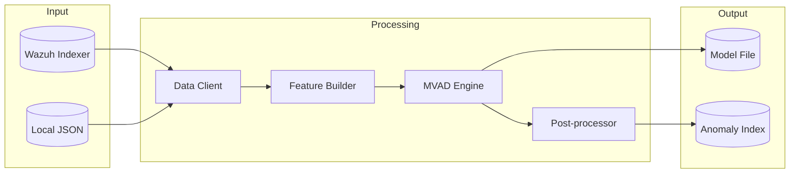
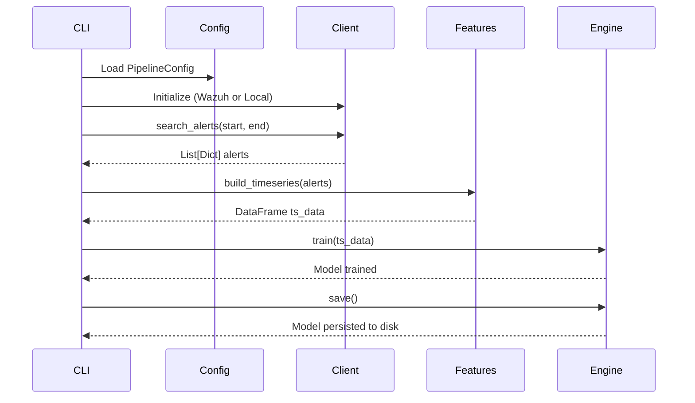
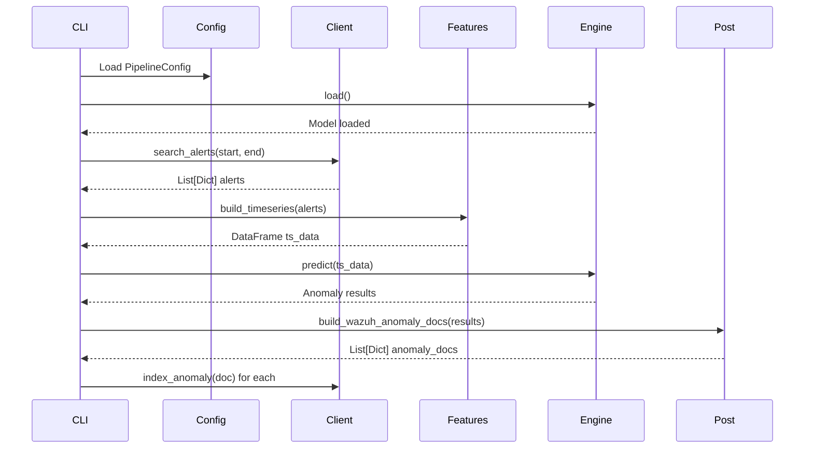
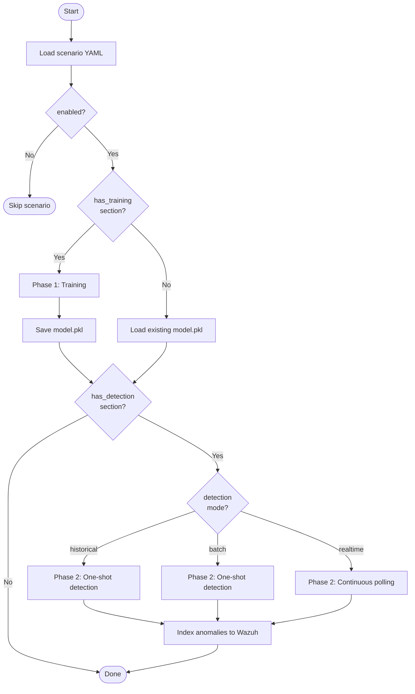

# SONAR architecture guide

This document provides a comprehensive overview of SONAR's (SIEM-Oriented Neural Anomaly Recognition) software architecture, design principles, and implementation patterns. It serves as the authoritative reference for understanding and extending the system.

## Table of contents

1. [Introduction](#introduction)
2. [Design principles](#design-principles)
3. [System architecture](#system-architecture)
4. [Module structure](#module-structure)
5. [Data flow](#data-flow)
6. [Configuration system](#configuration-system)
7. [Scenario-based execution](#scenario-based-execution)
8. [Extension points](#extension-points)
9. [Diagrams](#diagrams)

---

## Introduction

### Purpose

SONAR (SIEM-Oriented Neural Anomaly Recognition) is a multivariate time-series anomaly detection subsystem for IDPS-ESCAPE. It analyzes Wazuh security alerts to identify unusual patterns that may indicate security threats.

### Key capabilities

- **Multivariate anomaly detection**: Analyzes multiple features simultaneously using Microsoft's MVAD algorithm
- **Wazuh integration**: Native integration with Wazuh/OpenSearch for alert ingestion and result indexing
- **Flexible execution**: YAML-based scenarios supporting training-only, detection-only, or combined workflows
- **Debug mode**: Local testing without Wazuh infrastructure using JSON test data
- **Production-ready**: Optimized for CPU execution with minimal resource requirements

### Technology stack

| Component | Technology |
|-----------|------------|
| Anomaly detection | [time-series-anomaly-detector](https://pypi.org/project/time-series-anomaly-detector/) (Microsoft MVAD) |
| Data processing | pandas, NumPy |
| Alert storage | OpenSearch (Wazuh Indexer) |
| Configuration | YAML, Python dataclasses |
| CLI | argparse |
| Package management | Poetry |

---

## Design principles

### 1. Separation of concerns

Each module has a single, well-defined responsibility:

```
Data Ingestion → Feature Engineering → Model Training/Prediction → Post-processing → Result Storage
```

This separation enables:
- Independent testing of each component
- Easy replacement of individual modules
- Clear interfaces between layers

### 2. Configuration-driven behavior

All operational parameters are externalized to configuration:
- **PipelineConfig**: Runtime configuration for all components
- **UseCase scenarios**: YAML files defining complete workflows
- No hardcoded values in business logic

### 3. Interface compatibility

The `LocalDataProvider` implements the same interface as `WazuhIndexerClient`, enabling:
- Transparent switching between live and debug modes
- No code changes required for testing
- Dependency injection pattern
- Support for multiple data formats (JSON array, single object, OpenSearch API response)

### 4. Defensive programming

All external interactions include:
- Input validation with meaningful error messages
- Graceful handling of missing or malformed data
- Comprehensive logging at appropriate levels

### 5. Stateless operations

Each operation (training, detection) is self-contained:
- Models are persisted to disk after training
- Detection loads the model fresh each time
- No in-memory state between CLI invocations

---

## System architecture

### High-level overview

```
┌─────────────────────────────────────────────────────────────────┐
│                        CLI Layer (cli.py)                       │
│         Commands: train | detect | scenario | check             │
├─────────────────────────────────────────────────────────────────┤
│                   Configuration Layer                           │
│         config.py (dataclasses) | scenario.py (YAML)           │
├─────────────────────────────────────────────────────────────────┤
│                    Data Ingestion Layer                         │
│      WazuhIndexerClient | LocalDataProvider (debug mode)        │
├─────────────────────────────────────────────────────────────────┤
│                  Feature Engineering Layer                      │
│                    WazuhFeatureBuilder                          │
│      Timestamp parsing | Bucketing | Aggregation | Encoding     │
├─────────────────────────────────────────────────────────────────┤
│                      ML Engine Layer                            │
│                     MVADModelEngine                             │
│           Train | Predict | Save | Load operations              │
├─────────────────────────────────────────────────────────────────┤
│                   Post-processing Layer                         │
│                    MVADPostProcessor                            │
│         Anomaly document generation for Wazuh indexing          │
├─────────────────────────────────────────────────────────────────┤
│                    Storage Layer                                │
│              Wazuh Indexer (OpenSearch REST API)                │
│         wazuh-alerts-* (read) | wazuh-anomalies-mvad (write)   │
└─────────────────────────────────────────────────────────────────┘
```

### Component interaction



---

## Module structure

### Core modules

| Module | File | Purpose | Key classes/functions |
|--------|------|---------|----------------------|
| **Configuration** | `config.py` | Dataclass definitions for all settings | `PipelineConfig`, `WazuhIndexerConfig`, `MVADConfig`, `FeatureConfig`, `DebugConfig` |
| **Scenarios** | `scenario.py` | YAML-based workflow definitions | `UseCase`, `TrainingScenario`, `DetectionScenario` |
| **Data ingestion** | `wazuh_client.py` | OpenSearch REST API client | `WazuhIndexerClient` |
| **Debug provider** | `local_data_provider.py` | Local JSON file loader | `LocalDataProvider` |
| **Feature engineering** | `features.py` | Time-series construction | `WazuhFeatureBuilder` |
| **ML engine** | `engine.py` | MVAD model wrapper | `MVADModelEngine` |
| **Post-processing** | `pipeline.py` | Result document generation | `MVADPostProcessor` |
| **Data shipping** | `shipper/wazuh_data_shipper.py` | Data stream management for anomalies | `WazuhDataShipper`, `TemplateHandler` |
| **CLI** | `cli.py` | Command-line interface | `main()`, `cmd_train()`, `cmd_detect()`, `cmd_scenario()` |

### Module dependencies

```
cli.py
├── config.py
├── scenario.py
├── wazuh_client.py OR local_data_provider.py
├── features.py
├── engine.py
├── pipeline.py
└── shipper/wazuh_data_shipper.py (optional, when --ship flag used)

engine.py
├── config.py
└── time-series-anomaly-detector (external)

features.py
├── config.py
└── pandas

wazuh_client.py
├── config.py
└── requests

pipeline.py
└── config.py

shipper/wazuh_data_shipper.py
├── config.py
├── opensearchpy
└── shipper/wazuh_base_template.py
```

### Shipping module (optional add-on)

The `shipper` module provides **production-grade data streaming** for anomaly results:

**Purpose:** Create and manage dedicated OpenSearch data streams for SONAR anomaly results, enabling:
- Real-time monitoring with scenario-specific indexing
- Integration with RADAR automated response system
- Data lifecycle management with rollover policies

**Components:**

| File | Purpose |
|------|---------|
| `shipper/__init__.py` | Abstract `DataShipper` base class |
| `shipper/wazuh_base_template.py` | Index template definitions for SONAR streams |
| `shipper/wazuh_data_shipper.py` | `WazuhDataShipper` implementation with template management |

**When used:**
- CLI invoked with `--ship` flag during training or detection
- Training: Creates data stream template for scenario
- Detection: Ships anomalies to scenario-specific stream

**Template hierarchy:**
1. **Base template**: Common fields for all SONAR anomalies
2. **Algorithm template**: MVAD-specific fields
3. **Scenario template**: Feature-specific fields for each trained model

**See:** [data-shipping-guide.md](./data-shipping-guide.md) for complete usage guide.

---

## Data flow

### Training workflow



### Detection workflow



### Data transformation pipeline

```
Raw Wazuh Alerts (JSON)
    │
    ▼
┌─────────────────────────────────────┐
│ Parse timestamps (ISO 8601)         │
│ Extract numeric fields (rule.level) │
│ Extract categorical fields          │
└─────────────────────────────────────┘
    │
    ▼
┌─────────────────────────────────────┐
│ Bucket by time interval (5 min)     │
│ Aggregate: mean, count, sum         │
│ One-hot encode categories (top-k)   │
└─────────────────────────────────────┘
    │
    ▼
pandas DataFrame (time-indexed, numeric columns)
    │
    ▼
┌─────────────────────────────────────┐
│ MVAD sliding window analysis        │
│ Multivariate anomaly scoring        │
└─────────────────────────────────────┘
    │
    ▼
Anomaly Results (scores, timestamps, is_anomaly flags)
    │
    ▼
┌─────────────────────────────────────┐
│ Generate Wazuh-compatible documents │
│ Add metadata (scenario, threshold)  │
└─────────────────────────────────────┘
    │
    ▼
Indexed to wazuh-anomalies-mvad
```

---

## Configuration system

### Configuration hierarchy

```
PipelineConfig (root)
├── wazuh: WazuhIndexerConfig
│   ├── base_url: str
---

## Configuration system

### Unified configuration approach

SONAR separates infrastructure configuration from detection logic:

**Config files** (`default_config.yaml`, `resource_monitoring_config.yaml`):
- Wazuh connection settings
- Debug mode configuration
- Model storage paths
- Default feature extraction parameters

**Scenario files** (`scenarios/*.yaml`):
- Training parameters (lookback, features, sliding window)
- Detection parameters (mode, threshold, lookback)
- Query filters (scenario-specific)

### Configuration hierarchy

```
PipelineConfig
├── wazuh: WazuhIndexerConfig
│   ├── base_url: str
│   ├── username: str
│   ├── password: str
│   ├── verify_ssl: bool
│   ├── alerts_index_pattern: str
│   └── anomalies_index: str
├── mvad: MVADConfig
│   ├── sliding_window: int
│   ├── device: str (cpu|cuda)
│   └── extra_params: Dict
├── features: FeatureConfig
│   ├── numeric_fields: List[str]
│   ├── bucket_minutes: int
│   ├── categorical_fields: List[str]
│   ├── categorical_top_k: int
│   └── derived_features: bool
├── debug: DebugConfig
│   ├── enabled: bool
│   ├── data_dir: str
│   ├── training_data_file: str
│   └── detection_data_file: str
├── shipping: ShippingConfig
│   ├── enabled: bool
│   ├── install_templates: bool
│   └── scenario_id: Optional[str]
└── model_path: str
```

### Configuration loading

1. **Default**: `default_config.yaml` (auto-loaded if no --config specified)
2. **Custom**: Specified via `--config` CLI argument
3. **Scenario**: Merged from scenario YAML (overrides config defaults)
4. **CLI args**: Override specific values (e.g., `--lookback-hours`)

### Example infrastructure configuration

```yaml
# default_config.yaml
wazuh:
  base_url: "https://localhost:9200"
  username: "admin"
  password: "admin"
  verify_ssl: false
  alerts_index_pattern: "wazuh-alerts-*"
  anomalies_index: "wazuh-anomalies-mvad"

mvad:
  sliding_window: 200
  device: "cpu"
  extra_params: {}

features:
  numeric_fields: ["rule.level"]
  bucket_minutes: 5
  categorical_fields: []
  categorical_top_k: 10
  derived_features: true

debug:
  enabled: false
  data_dir: "./test_data/synthetic_alerts"
  training_data_file: "normal_baseline.json"
  detection_data_file: "with_anomalies.json"

model_path: "./model/mvad_model.pkl"
```

### Example scenario configuration

```yaml
# scenarios/brute_force_detection.yaml
name: "Brute Force Detection"
description: "Detect authentication attack patterns"
enabled: true
model_name: "brute_force_baseline_v1"  # Optional: custom model name

# Optional: Filter specific alerts before processing
query_filter:
  bool:
    should:
      - match: {"rule.groups": "authentication"}

training:
  lookback_hours: 168
  numeric_fields: ["rule.level"]
  categorical_fields: ["agent.id", "rule.groups"]
  bucket_minutes: 5
  sliding_window: 200
  device: "cpu"

detection:
  mode: "historical"
  lookback_minutes: 60
  threshold: 0.7
  min_consecutive: 2
```

---

## Scenario-based execution

### Scenario structure

```yaml
name: "Scenario Name"
description: "Description of the use case"
enabled: true

# Optional: Filter specific alerts
query_filter:
  bool:
    should: [...]

training:                    # Optional section
  lookback_hours: 24
  numeric_fields: ["rule.level"]
  categorical_fields: []
  bucket_minutes: 5
  sliding_window: 200
  device: "cpu"

detection:                   # Optional section
  mode: "batch"              # historical | batch | realtime
  lookback_minutes: 10
  threshold: 0.7
  min_consecutive: 2
```

### Flexible execution modes

| Scenario sections | Execution behavior | Use case |
|-------------------|-------------------|----------|
| `training` + `detection` | Train model → detect anomalies | Full workflow |
| `training` only | Train and save model (no detection) | Baseline establishment |
| `detection` only | Load existing model → detect | Ad-hoc investigation |

### Detection modes

| Mode | Behavior | Use case |
|------|----------|----------|
| **historical** | One-shot on recent data | Ad-hoc investigation |
| **batch** | One-shot after training | Baseline + immediate detection |
| **realtime** | Continuous polling loop | Production monitoring |

### Execution flow



### Column alignment

SONAR automatically handles feature mismatches between training and detection:

```python
# engine.py - MVADModelEngine
def predict(self, ts_data: pd.DataFrame) -> Any:
    # Store training columns during training
    self.training_columns = ts_clean.columns.tolist()
    
    # During detection: align columns automatically
    if hasattr(self, 'training_columns'):
        # Add missing columns (fill with 0)
        for col in self.training_columns:
            if col not in ts_clean.columns:
                ts_clean[col] = 0.0
        
        # Remove extra columns
        ts_clean = ts_clean[self.training_columns]
        
        # Reorder to match training
        ts_clean = ts_clean[self.training_columns]
```

This ensures:
- Different categorical values between train/detect are handled
- No manual intervention required
- Backward compatibility with old models

---

## Extension points

### Adding new feature types

1. **Modify `FeatureConfig`** in [config.py](../../../sonar/config.py):
   ```python
   @dataclass
   class FeatureConfig:
       # Existing fields...
       new_feature_fields: Sequence[str] = field(default_factory=list)
   ```

2. **Update `WazuhFeatureBuilder`** in [features.py](../../../sonar/features.py):
   ```python
   def _extract_single_alert_features(self, alert: Dict) -> Dict:
       features = {}
       # Existing extraction...
       
       # Add new feature extraction
       for field_path in self.cfg.new_feature_fields:
           value = self._get_nested_field(alert, field_path)
           features[f"new_{field_path}"] = process_value(value)
       
       return features
   ```

### Adding new detection modes

1. **Update `DetectionScenario`** in [scenario.py](../../../sonar/scenario.py):
   ```python
   mode: Literal["historical", "batch", "realtime", "new_mode"] = "historical"
   ```

2. **Add handler in `cli.py`**:
   ```python
   def _execute_detection_phase(use_case, engine, client, fb, args):
       if use_case.detection.mode == "new_mode":
           return _run_new_mode_detection(...)
   ```

### Adding new data sources

Create a new provider implementing the same interface as `WazuhIndexerClient`:

```python
class NewDataProvider:
    def search_alerts(self, start: datetime, end: datetime, 
                      query: Optional[Dict] = None) -> List[Dict]:
        """Return alerts matching the time range and optional query."""
        pass
    
    def check_connection(self) -> bool:
        """Return True if data source is accessible."""
        pass
    
    def index_anomaly(self, doc: Dict) -> str:
        """Index an anomaly document, return document ID."""
        pass
```

Example: [local_data_provider.py](../../../sonar/local_data_provider.py) for debug mode.

### Adding new CLI commands

```python
def cmd_new_command(args, cfg: PipelineConfig) -> int:
    """Implementation of new command."""
    # Your logic here
    return 0  # Success

def main():
    parser = argparse.ArgumentParser()
    subparsers = parser.add_subparsers()
    
    # Add new command
    new_parser = subparsers.add_parser("new_command", help="Description")
    new_parser.add_argument("--option", help="Option description")
    new_parser.set_defaults(func=cmd_new_command)
```

---

## Data shipping architecture

### Overview

SONAR's data shipping feature enables integration with RADAR (automated response system) by publishing anomaly results to dedicated Wazuh data streams. This is an optional add-on feature for production deployments.

### ShippingConfig

The `ShippingConfig` dataclass controls data shipping behavior:

```python
@dataclass
class ShippingConfig:
    """Configuration for data shipping to Wazuh data streams."""
    
    enabled: bool = False
    """Enable data shipping (ship anomalies to dedicated data streams)."""
    
    install_templates: bool = True
    """Install base templates on first run (disable if already installed)."""
    
    scenario_id: str = None
    """Optional custom scenario ID (auto-generated from model_path if None)."""
```

### Data stream creation workflow

**During training with shipping enabled:**

1. **Configuration check**: `_should_ship(cfg, args)` determines if shipping should be enabled
   - Requires: CLI `--ship` flag OR `shipping.enabled=true` in config
   - Disabled automatically in debug mode
2. **Feature extraction**: Training completes normally and extracts feature columns
3. **Stream creation**: `_create_scenario_stream(cfg, ts_data, scenario_name)` is called
   - Generates unique scenario ID from model path hash or uses custom ID
   - Creates OpenSearch index templates with proper field mappings
   - Registers component templates for MVAD-specific fields
   - Creates data stream: `sonar_anomalies_mvad_{scenario_id}`

**Template hierarchy:**

```
Base Template (sonar_stream_template)
└── MVAD Algorithm Template (sonar_stream_template_mvad)
    └── Scenario-Specific Template (sonar_detector_mvad_{scenario_id})
        └── Component: scenario features (feature_rule_level, etc.)
```

### Anomaly shipping workflow

**During detection with shipping enabled:**

1. **Anomaly detection**: MVAD engine identifies anomalies as normal
2. **Post-processing**: `MVADPostProcessor.build_wazuh_anomaly_docs()` creates anomaly documents
3. **Shipping decision**: `_should_ship(cfg, args)` checks configuration
4. **Streaming**: `_ship_anomalies(cfg, client, anomaly_docs)` is called
   - Determines target stream: `sonar_anomalies_mvad_{scenario_id}`
   - Ships each document via `WazuhDataShipper.ship_single()`
   - Logs success/failure for each document
5. **Fallback**: If shipping fails, falls back to standard anomaly index

### Integration with RADAR

**Data flow: SONAR → Data Stream → RADAR**

```
┌─────────────────────┐
│  SONAR Detection    │
│  (detect anomalies) │
└──────────┬──────────┘
           │
           │ Ships anomalies
           ↓
┌─────────────────────────────────────┐
│    Wazuh Indexer (OpenSearch)       │
│                                     │
│  Data Stream:                       │
│  sonar_anomalies_mvad_{scenario_id} │
│                                     │
│  Documents:                         │
│  - is_anomaly: true                 │
│  - anomaly_score: 0.95              │
│  - threshold: 0.85                  │
│  - scenario_name: "Brute Force"     │
│  - feature_values: {...}            │
└──────────┬──────────────────────────┘
           │
           │ RADAR monitors stream
           ↓
┌─────────────────────┐
│  RADAR              │
│  (automated         │
│   response)         │
└─────────────────────┘
```

**RADAR configuration example:**

```yaml
# RADAR monitors specific SONAR data streams
monitors:
  - name: "SONAR Brute Force Detector"
    data_stream: "sonar_anomalies_mvad_12ab34cd"
    threshold: 0.85
    action: "block_ip"
    playbook: "ansible/playbooks/block_malicious_ip.yml"
```

### Decision tree: Shipping vs standard indexing

```
Detection completes
        │
        ├─ shipping.enabled=true AND --ship flag? ────► No ──► Standard indexing
        │                                                        to wazuh-anomalies-mvad
        └─ Yes
            │
            ├─ Debug mode? ───────────────────────────► Yes ─► Standard indexing
            │                                                    (no shipping in debug)
            └─ No
                │
                └─ Ship to sonar_anomalies_mvad_{scenario_id}
                    │
                    ├─ Success ──────────────► Logged and indexed
                    │
                    └─ Failure ──────────────► Fall back to standard indexing
```

### Key components

| Module | Role |
|--------|------|
| `cli.py` | `_should_ship()`, `_create_scenario_stream()`, `_ship_anomalies()` helper functions |
| `shipper/wazuh_data_shipper.py` | `WazuhDataShipper` class for index template management and document shipping |
| `shipper/wazuh_base_template.py` | Base template definitions for MVAD data streams |
| `config.py` | `ShippingConfig` dataclass |
| `scenario.py` | Scenario YAML support for `shipping` section |

### Configuration methods

**1. Via scenario YAML:**

```yaml
shipping:
  enabled: true
  install_templates: true
  scenario_id: "brute_force_v2"
```

**2. Via CLI flag (overrides config):**

```bash
poetry run sonar train --scenario my_scenario.yaml --ship
poetry run sonar detect --scenario my_scenario.yaml --ship
```

### Benefits

- **Scenario isolation**: Each trained model gets its own data stream
- **Template-based indexing**: Automatic field typing and validation
- **RADAR integration**: Enables automated incident response
- **Production monitoring**: Dedicated streams for real-time alerting

For complete usage guide, see [data-shipping-guide.md](./data-shipping-guide.md).

---

## Diagrams

For detailed UML diagrams including:
- Complete class diagram with all relationships
- Component diagram showing module interactions
- Sequence diagrams for training, detection, and scenario workflows
- State diagram for scenario execution
- Deployment diagram for production setup

See [uml-diagrams.md](./uml-diagrams.md).

---

## Related documentation

| Document | Description |
|----------|-------------|
| [README.md](./README.md) | Documentation index and quick reference |
| [setup-guide.md](./setup-guide.md) | Installation, configuration, and usage |
| [scenario-guide.md](./scenario-guide.md) | Complete scenario system guide |
| [troubleshooting.md](./troubleshooting.md) | Error solutions and diagnostics |
| [uml-diagrams.md](./uml-diagrams.md) | Visual system design diagrams |
