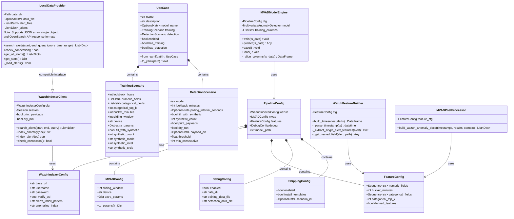
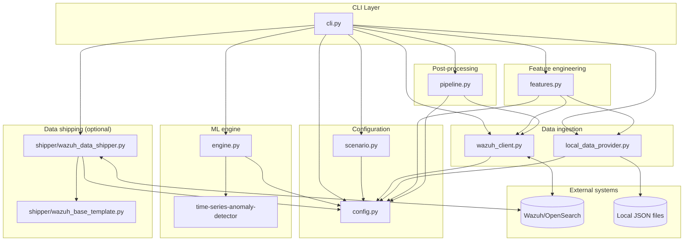
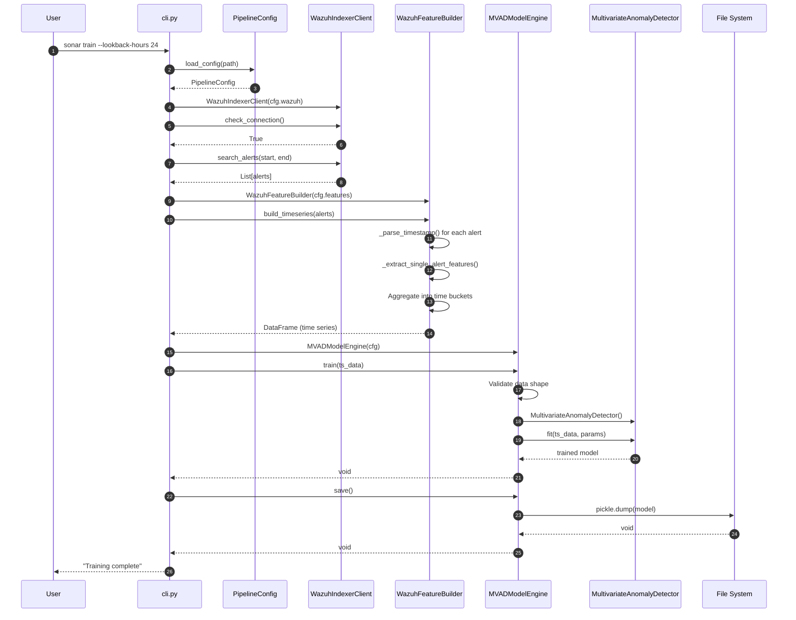
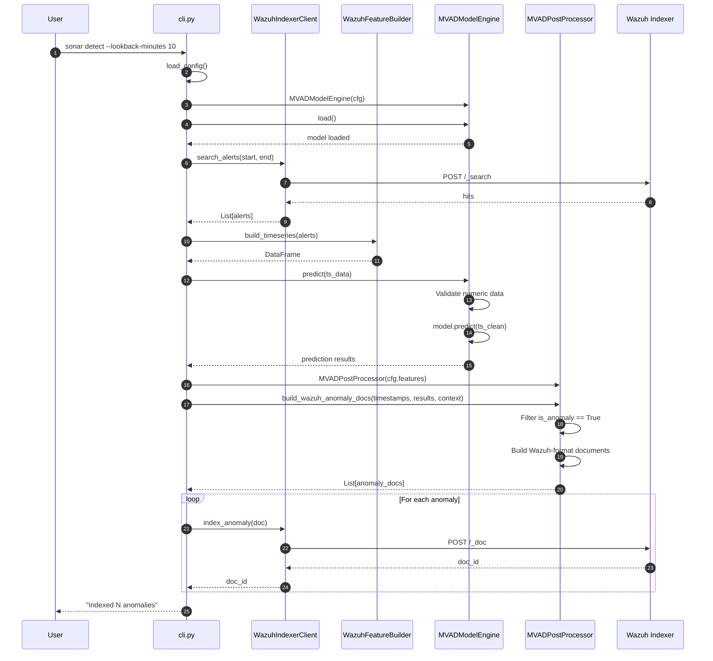
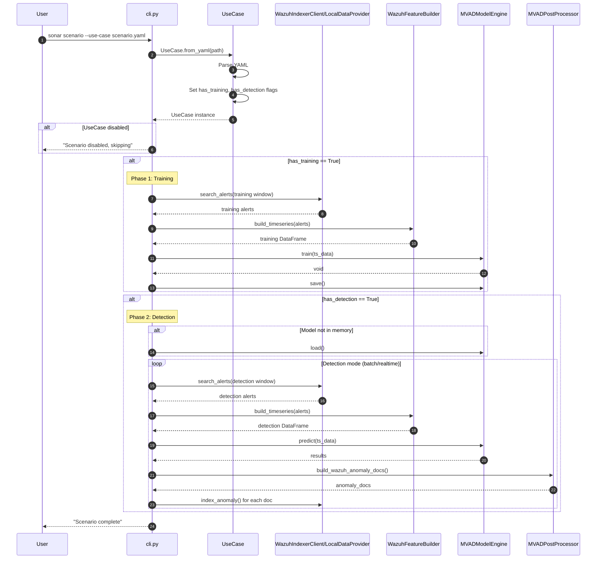
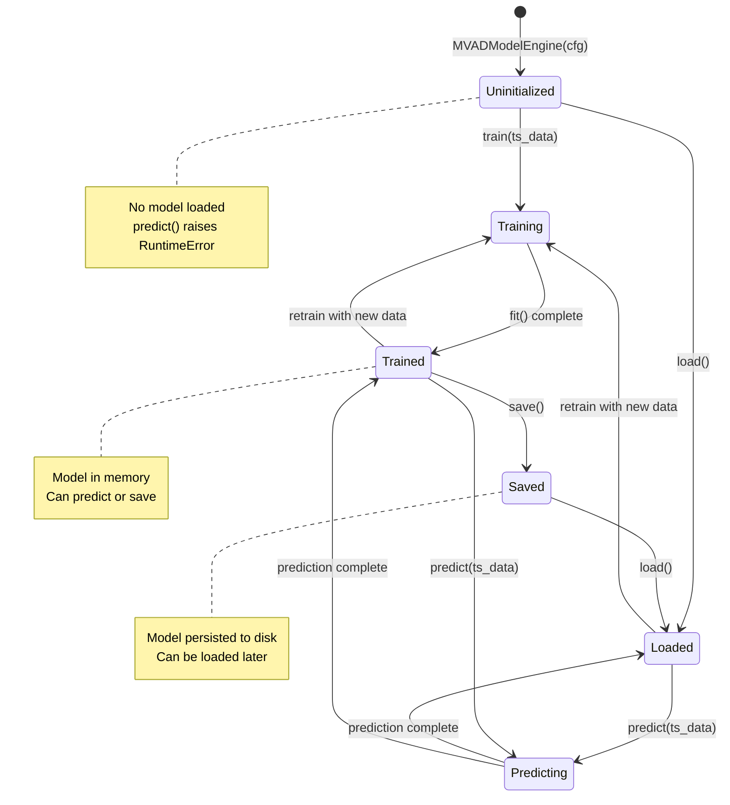
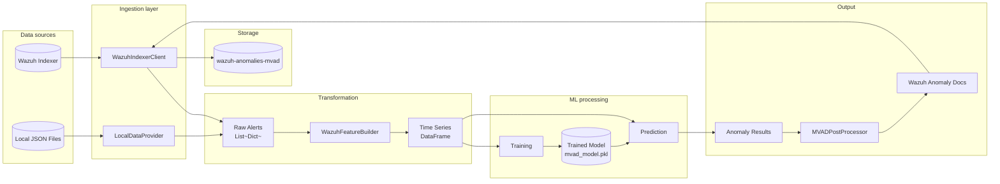
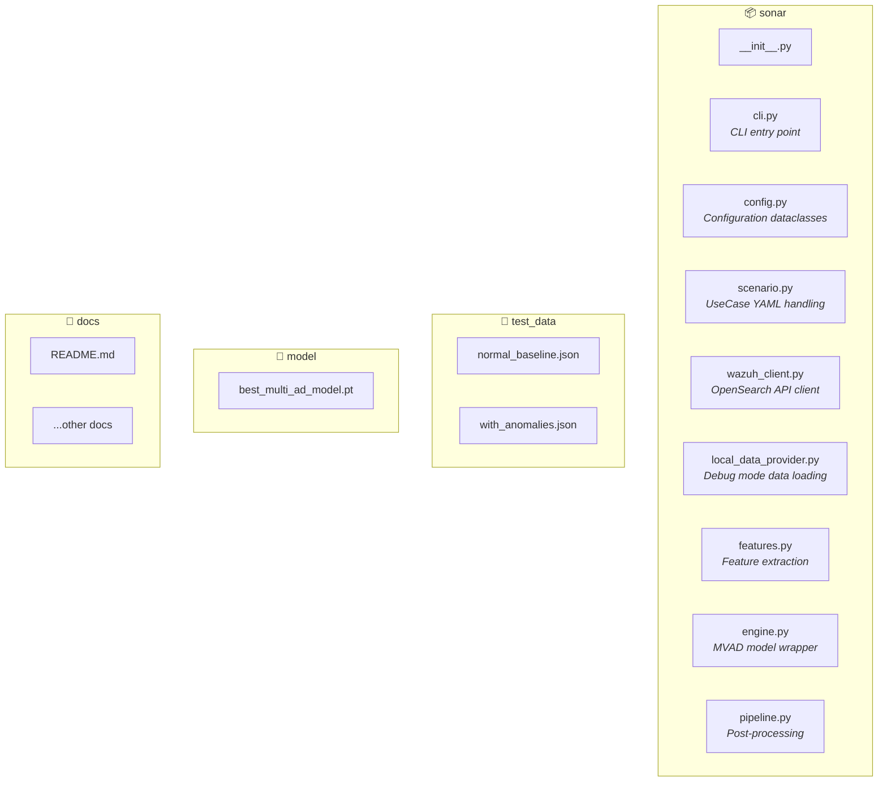
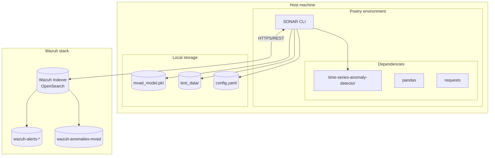

# SONAR UML diagrams

This document contains UML diagrams describing the software design of SONAR (SIEM-Oriented Neural Anomaly Recognition), rendered in Mermaid format for GitHub/GitLab compatibility.

## Latest design features (February 2026)

- **Unified scenario format**: Config files (infrastructure) separated from scenario files (detection logic)
- **Automatic column alignment**: Feature mismatches between training and detection handled automatically
- **Debug mode**: Local data provider with configurable test data files
- **Flexible execution**: Training-only, detection-only, or combined workflows
- **Default configuration**: `default_config.yaml` automatically loaded when no `--config` specified

## Table of contents

1. [Class diagram](#class-diagram)
2. [Component diagram](#component-diagram)
3. [Sequence diagrams](#sequence-diagrams)
   - [Training workflow](#training-workflow)
   - [Detection workflow](#detection-workflow)
   - [Scenario execution](#scenario-execution)
4. [State diagram](#state-diagram)
5. [Data flow diagram](#data-flow-diagram)

---

## Class diagram

The core classes and their relationships in SONAR:

---

## Component diagram

High-level component architecture showing the main modules and their dependencies:

---

## Sequence diagrams

### Training workflow

Complete training workflow from CLI invocation to model persistence:

### Detection workflow

Detection workflow showing anomaly detection and result indexing:

### Scenario execution

Complete scenario execution with flexible phase detection:

---

## State diagram

Model lifecycle states in MVADModelEngine:

---

## Data flow diagram

End-to-end data transformation pipeline:

---

## Package structure

---

## Deployment view

---

## Notes

- All diagrams are in [Mermaid](https://mermaid.js.org/) format
- GitHub and GitLab render Mermaid diagrams natively in markdown
- For local rendering, use VS Code with Mermaid extension or [Mermaid Live Editor](https://mermaid.live/)
