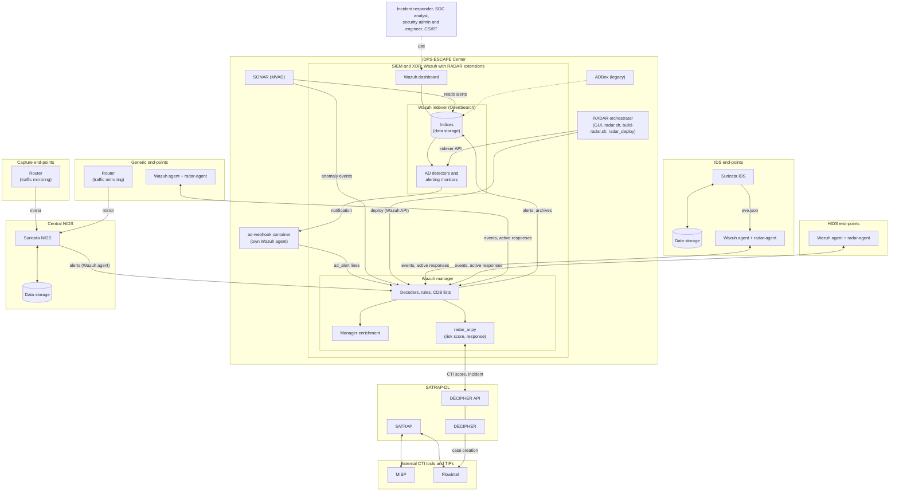

# IDPS-ESCAPE context

The diagram below illustrates the overall context of the IDPS-ESCAPE system.

```mermaid
flowchart TB
  USERS["Incident responder, SOC analyst,<br/>security admin and engineer, CSIRT"]

  subgraph cti["External CTI tools and TIPs"]
    MISP["MISP"]
    FLOW["Flowintel"]
  end

  subgraph satrap["SATRAP-DL"]
    SAT["SATRAP"]
    DEC["DECIPHER"]
    DECAPI["DECIPHER API"]
  end

  subgraph center["IDPS-ESCAPE Center"]
    subgraph siem["SIEM and XDR: Wazuh with RADAR extensions"]
      DASH["Wazuh dashboard"]
      subgraph mgr["Wazuh manager"]
        RULES["Decoders, rules, CDB lists"]
        ENR["Manager enrichment"]
        RAR["radar_ar.py<br/>(risk score, response)"]
      end
      subgraph idx["Wazuh indexer (OpenSearch)"]
        STORE[("Indices<br/>(data storage)")]
        MON["AD detectors and<br/>alerting monitors"]
      end
    end
    WH["ad-webhook container<br/>(own Wazuh agent)"]
    ORCH["RADAR orchestrator<br/>(GUI, radar.sh, build-radar.sh, radar_deploy)"]
    SONAR["SONAR (MVAD)"]
    ADBOX["ADBox (legacy)"]
  end

  subgraph nids["Central NIDS"]
    NIDS["Suricata NIDS"]
    NSTORE[("Data storage")]
  end

  subgraph capep["Capture end-points"]
    RTR1["Router<br/>(traffic mirroring)"]
  end

  subgraph genep["Generic end-points"]
    RTR2["Router<br/>(traffic mirroring)"]
    GAG["Wazuh agent + radar-agent"]
  end

  subgraph idsep["IDS end-points"]
    IDS["Suricata IDS"]
    ISTORE[("Data storage")]
    IAG["Wazuh agent + radar-agent"]
  end

  subgraph hidsep["HIDS end-points"]
    HAG["Wazuh agent + radar-agent"]
  end

  USERS -.->|use| DASH
  DASH --- STORE
  SAT <--> MISP
  SAT <--> FLOW
  DECAPI --- DEC
  DEC -->|case creation| FLOW
  RAR <-->|"CTI score, incident"| DECAPI
  RULES --> ENR
  RULES --> RAR
  RULES -->|"alerts, archives"| STORE
  STORE --> MON
  MON -->|notification| WH
  WH -->|ad_alert lines| RULES
  SONAR -->|reads alerts| STORE
  SONAR -->|anomaly events| RULES
  ADBOX -.-> STORE
  ORCH -->|"deploy (Wazuh API)"| RULES
  ORCH -->|"indexer API"| MON
  RTR1 -->|mirror| NIDS
  RTR2 -->|mirror| NIDS
  NIDS <--> NSTORE
  NIDS -->|"alerts (Wazuh agent)"| RULES
  IDS <--> ISTORE
  IDS -->|eve.json| IAG
  IAG <-->|"events, active responses"| RULES
  HAG <-->|"events, active responses"| RULES
  GAG <-->|"events, active responses"| RULES
```
{width="80%"}