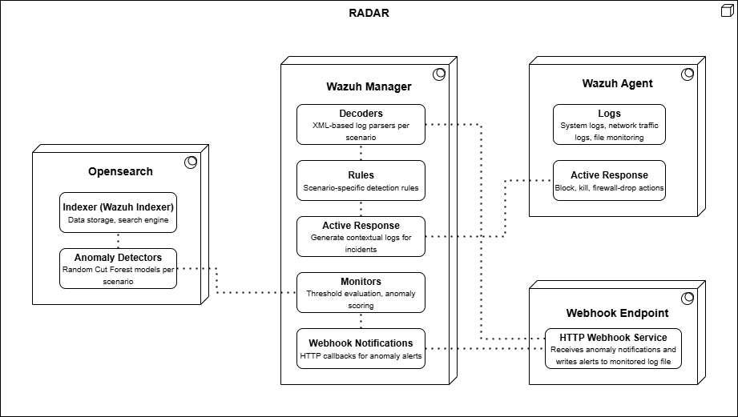

# RADAR architecture

RADAR (Risk-aware Anomaly Detection-based Automated Response) is a security orchestration subsystem within IDPS-ESCAPE that combines signature-based detection with anomaly detection, and drives both into a single risk-scored, tiered automated response.

## Core technologies

- **Wazuh**: security monitoring platform providing the manager, agents, and event pipeline.
- **OpenSearch**: data storage and the Anomaly Detection plugin (Random Cut Forest) used by the ML-based scenarios.
- **Docker / Docker Compose**: containerised deployment of the manager, indexer, dashboard and webhook.

## Design principles

**Modularity.** Each detection use case is packaged as a self-contained scenario — decoders, rules, agent configuration, active-response bindings, and risk parameters — that can be deployed independently of the others and coexists with them on the same manager. A new scenario is added without modifying the core framework (SWD-034, SWD-027).

**Idempotency.** Deployment goes through the Wazuh REST API and idempotent Docker operations (SWD-042), so re-running the same deployment step produces the same end state rather than accumulating configuration.

**Separation of concerns.** The architecture separates data collection (Wazuh agents), data enrichment (manager-side, for the scenarios that need it — SWD-030), detection logic (rules and anomaly detectors — SWD-026, SWD-028, SWD-034), response execution (SWD-027), and orchestration (SWD-042, SWD-041).

**Hybrid detection.** Signature-based rules give fast, deterministic matching for known patterns without a training period; anomaly detection gives behavioural coverage for patterns no rule anticipates. A scenario may use either or both; the risk engine (HARC-012) combines whichever sources a scenario configures.

**Configuration-driven deployment.** Scenario parameters — index patterns, features, thresholds, detector settings — are centralised in `config.yaml`; risk weights, tiers, and mitigations in `ar.yaml`. Neither requires a code change to retune (SWD-032).

## System architecture

RADAR consists of five components working together in an orchestrated pipeline:

| Component | Role | Key functions |
|-----------|------|----------------|
| Wazuh agents | Endpoint monitoring | Log collection, active-response execution |
| Wazuh manager | Central control | Log processing, manager-side enrichment, rule evaluation, active-response dispatch |
| OpenSearch / Wazuh indexer | Data platform | Storage, indexing, anomaly detection (RCF models) |
| Webhook endpoint | Alert routing | Bridges an OpenSearch monitor's HTTP notification back into a Wazuh-ingestible log line |
| RADAR scripts / GUI | Orchestration | Deployment automation, scenario and agent lifecycle management |

{: width="70%"}

## Module structure

**Wazuh agent.** Collects logs and executes dispatched active-response commands. Agents forward logs unmodified; enrichment, where a scenario needs it, happens centrally on the manager, not on the endpoint (SWD-030) — see the rationale there for why this replaced an earlier per-agent design.

**Wazuh manager.** The central control plane: manager-side enrichment (SWD-030) for scenarios that need it, decoders and rules (SWD-034), active-response dispatch and risk scoring (SWD-026, SWD-027), and OpenSearch monitor-driven alerting via the webhook (below).

**OpenSearch / Wazuh indexer.** Storage and search for processed logs, and the Anomaly Detection plugin used by ML-based scenarios (SWD-028). Detector and monitor lifecycle for a scenario is managed by `run-radar.sh` and the `anomaly_detector/` Python modules it runs inside the `radar-cli` container.

**Webhook endpoint.** A small HTTP service (`webhook/`) that receives an OpenSearch monitor's POST notification and writes it as a log line the Wazuh manager can decode and evaluate like any other event, closing the loop from anomaly detection back into the rule engine and, from there, into active response. Brought up idempotently by `build-radar.sh` alongside the rest of the stack.

**Deployment control plane.** The entry-point scripts (`radar.sh`, `build-radar.sh`, `run-radar.sh`, `health-radar.sh`, `stop-radar.sh`, `bootstrap-agent.sh`), the `radar_deploy/` manager-side backbone, and the `wazuh_api/` Wazuh REST API integration layer. Specified in full in SWD-042.

## Scenarios

Four scenarios ship in the current codebase:

| Scenario | Detection | Response |
|---|---|---|
| GeoIP detection | Signature | Notification, mitigation |
| Suspicious login | Signature (an anomaly-detection weight is configured in `ar.yaml` but no detector is currently wired to this scenario — see the RADAR code fix list) | Notification, mitigation |
| Scanning detection | Signature | Notification, mitigation (disabled by default) |
| Log volume growth | Anomaly detection | Notification, mitigation |

No other scenarios are present in this codebase. Earlier design material referenced additional demo scenarios (insider threat, DDoS detection, C2 malware communication) intended to show the anomaly-detection path against synthetic datasets; none of that material — code, configuration, or an archive of it — currently exists in the repository, and no such scenario can be deployed.