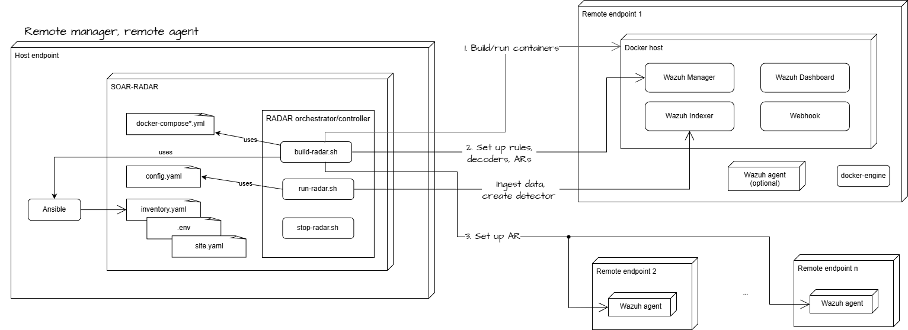

# RADAR deployment: Remote Agent and Remote Manager mode

The diagram below illustrates the RADAR build-time and run-time architecture for a deployment in which both the Wazuh Manager and the Wazuh agents are hosted on remote endpoints.

{: width="70%"}