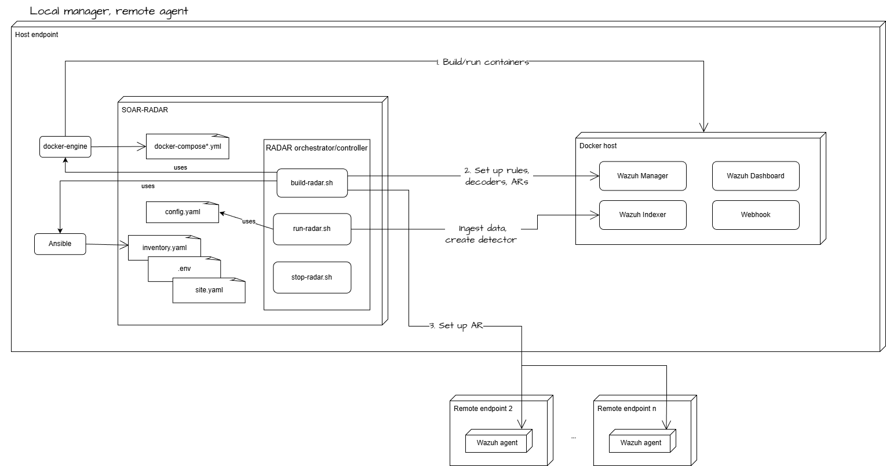

# RADAR deployment: Remote Agent and Local Manager mode

The diagram below illustrates the RADAR build-time and run-time architecture for a deployment in which the Wazuh Manager is hosted locally, while the Wazuh agent runs on a remote endpoint.

{: width="70%"}