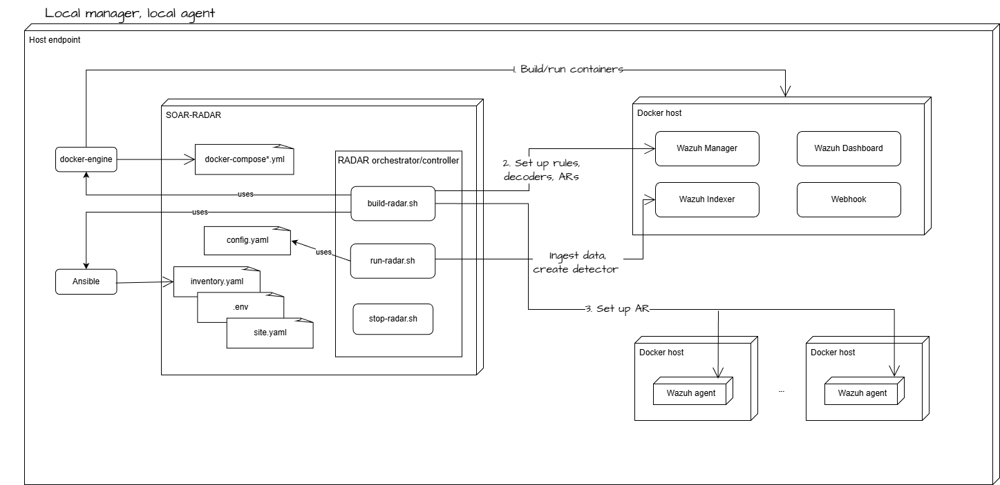

# RADAR deployment: Local Agent and Local Manager mode

The diagram below illustrates the RADAR build-time and run-time architecture for a deployment in which both the Wazuh Manager and the Wazuh agent are hosted locally using Docker containers.

{: width="70%"}