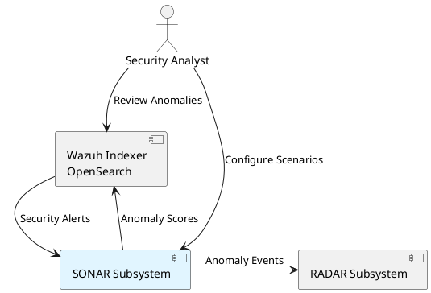

# SONAR subsystem context

The diagram below depicts the system context of the SONAR (SIEM-Oriented Neural Anomaly Recognition) subsystem within the IDPS-ESCAPE architecture.

SONAR is a multivariate anomaly detection engine that analyzes Wazuh security alerts to identify unusual patterns that may indicate security threats. It integrates with the Wazuh Indexer (OpenSearch) for data ingestion and result storage.

## System boundary

## Key interfaces

| Interface | Direction | Protocol | Purpose |
|-----------|-----------|----------|---------|
| Wazuh Indexer API | Inbound | HTTPS/REST | Alert retrieval, query execution |
| Wazuh Data Streams | Outbound | HTTPS/REST | Anomaly document indexing |
| RADAR Webhook | Outbound | HTTPS/REST | Real-time anomaly notifications |

## Related documentation

- Technical architecture: `docs/manual/sonar_docs/architecture.md`
- UML diagrams: `docs/manual/sonar_docs/uml-diagrams.md`