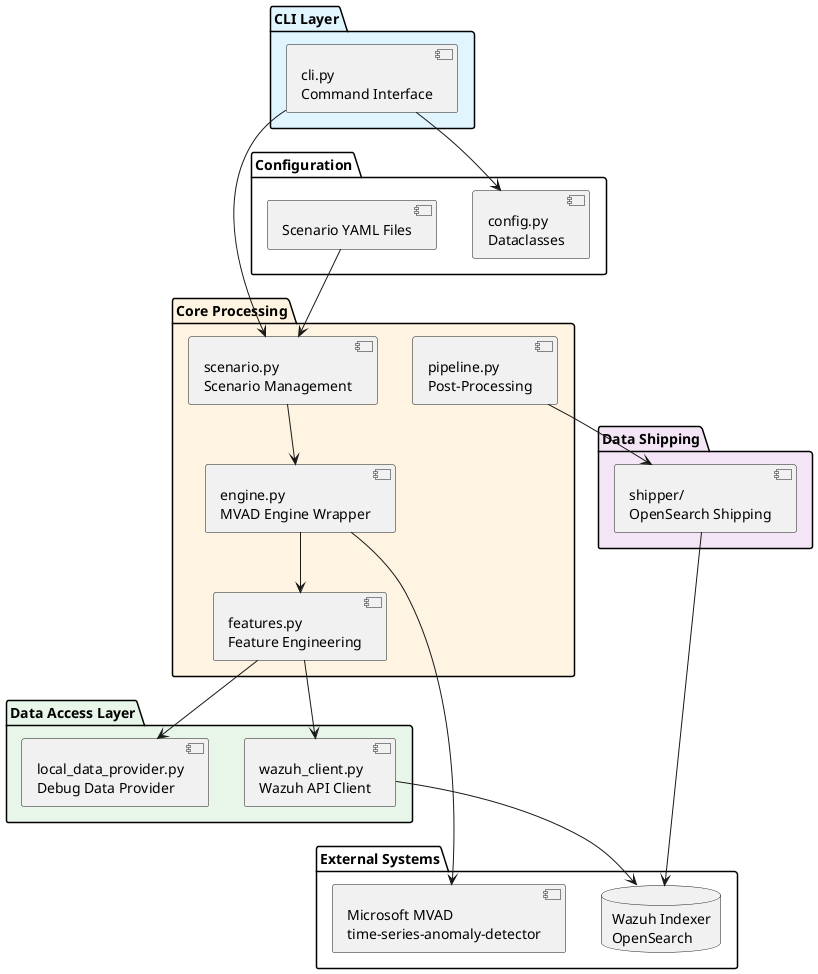

# SONAR component architecture

The diagram below depicts the high-level component architecture of the SONAR subsystem.

## Component diagram

## Component responsibilities

| Component | Responsibility |
|-----------|---------------|
| **cli.py** | Command-line interface, argument parsing, workflow orchestration |
| **scenario.py** | YAML scenario loading, validation, configuration merging |
| **engine.py** | MVAD engine lifecycle, training/detection execution |
| **pipeline.py** | Post-processing, anomaly document creation, result formatting |
| **features.py** | Feature extraction, time-series bucketing, data transformation |
| **wazuh_client.py** | Wazuh Indexer API communication, alert retrieval |
| **local_data_provider.py** | Debug mode data provider (JSON file loading) |
| **shipper/** | OpenSearch data stream management, bulk ingestion |
| **config.py** | Configuration dataclasses, type definitions |

## Related documentation

- Detailed architecture: `docs/manual/sonar_docs/architecture.md`
- Component diagram: `docs/manual/sonar_docs/uml-diagrams.md#component-diagram`