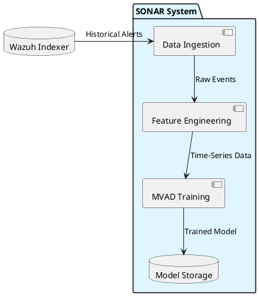
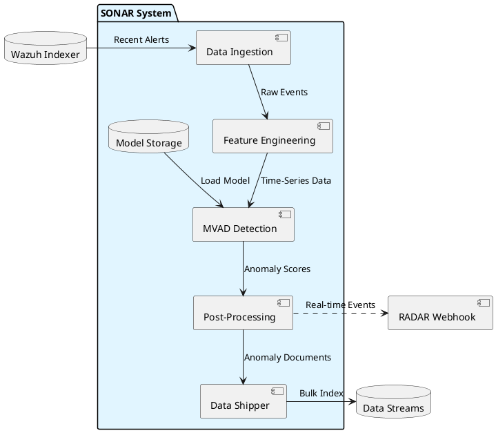

# SONAR data flow architecture

The diagram below illustrates the high-level data flow through the SONAR subsystem for training and detection operations.

## Training data flow

## Detection data flow

## Data transformations

| Stage | Input | Output | Transformation |
|-------|-------|--------|----------------|
| **Ingestion** | Wazuh alerts (JSON) | Raw event list | Filtering, time-range selection |
| **Feature Engineering** | Raw events | Time-series vectors | Bucketing, aggregation, encoding |
| **MVAD Processing** | Time-series vectors | Anomaly scores | Multivariate analysis |
| **Post-Processing** | Anomaly scores | Anomaly documents | Thresholding, enrichment, formatting |
| **Shipping** | Anomaly documents | Indexed records | Bulk ingestion to data streams |

## Related documentation

- Data flow diagram: `docs/manual/sonar_docs/uml-diagrams.md#data-flow-diagram`
- Architecture details: `docs/manual/sonar_docs/architecture.md#data-flow`