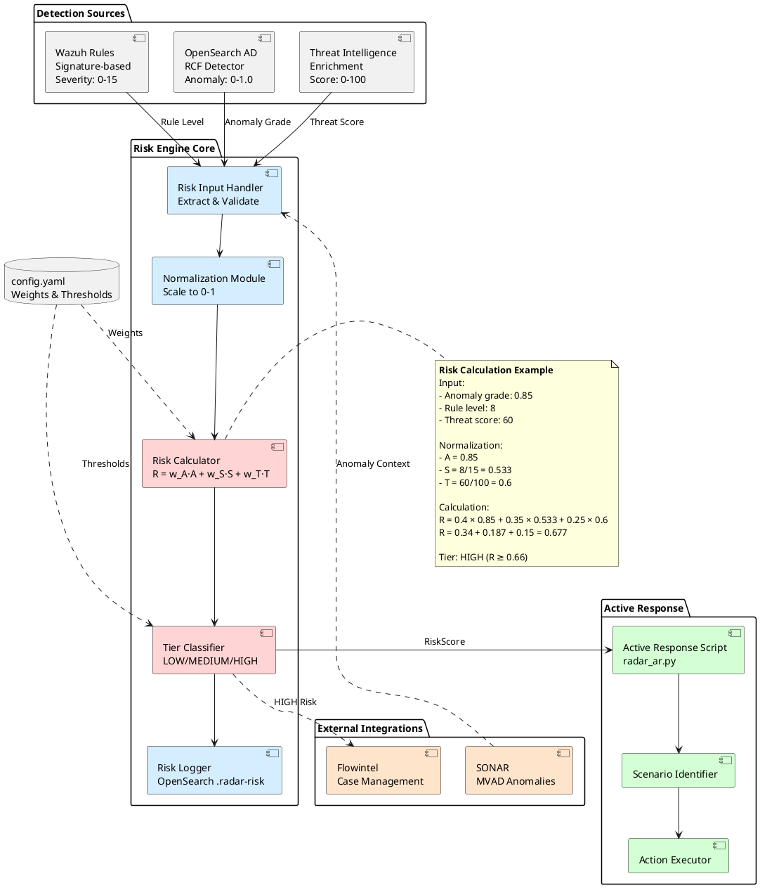

# RADAR risk engine architecture

The diagram below depicts the high-level architecture of the RADAR risk engine component, which calculates risk scores by combining anomaly detection outputs, signature-based detection data, and CTI (Cyber Threat Intelligence) indicators.

The risk engine receives three input streams:

- **Anomaly intensity (A)**: Computed from OpenSearch RCF detector outputs (anomaly grade × confidence) or SONAR MVAD results
- **Signature risk (S)**: Calculated from rule-based detection (likelihood × impact values from scenario configuration)
- **CTI score (T)**: Aggregated from threat intelligence indicators (IP blacklists, malicious hashes, domain reputation)

The weighted combination produces a normalized risk score $R \in [0,1]$, which drives tier-based response actions:

- Low tier (0.0-0.33): Email notification only
- Medium tier (0.33-0.66): Email + case creation + light mitigation
- High tier (0.66-1.0): Full response + strong containment actions

## Architecture Diagram

