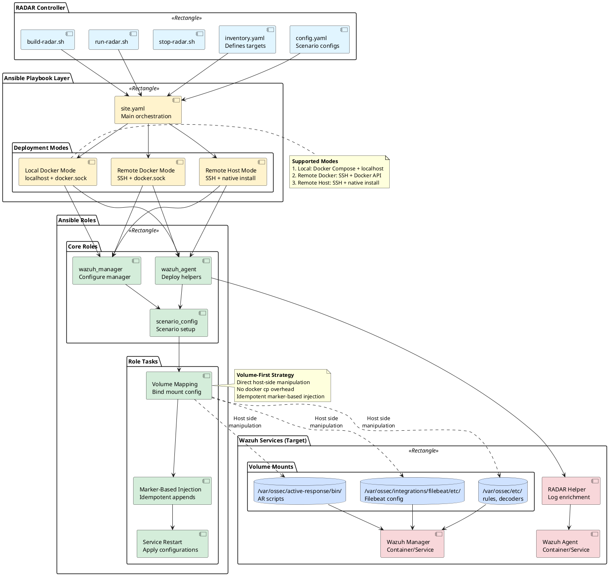

# RADAR Ansible automation architecture

The diagram below depicts the high-level architecture of RADAR's Ansible-based deployment automation system. The architecture enables flexible deployment across three modes: local Docker, remote Docker, and remote host installations.

Key architectural components:

- **RADAR Controller**: Orchestrates deployment via build-radar.sh and run-radar.sh scripts
- **Ansible Playbooks**: Define scenario-specific configuration and deployment workflows
- **Role Modules**: Modular roles for wazuh_manager, wazuh_agent, and scenario configurations
- **Volume-Based Strategy**: Direct host-side manipulation of bind-mounted Wazuh configuration directories, eliminating docker cp overhead

The volume-first approach maps Wazuh configuration directories (etc, active-response/bin, filebeat/etc) from host to container, enabling idempotent configuration updates without container rebuilds. Configuration injection uses marker-based appending for scenario isolation.

## Architecture Diagram

