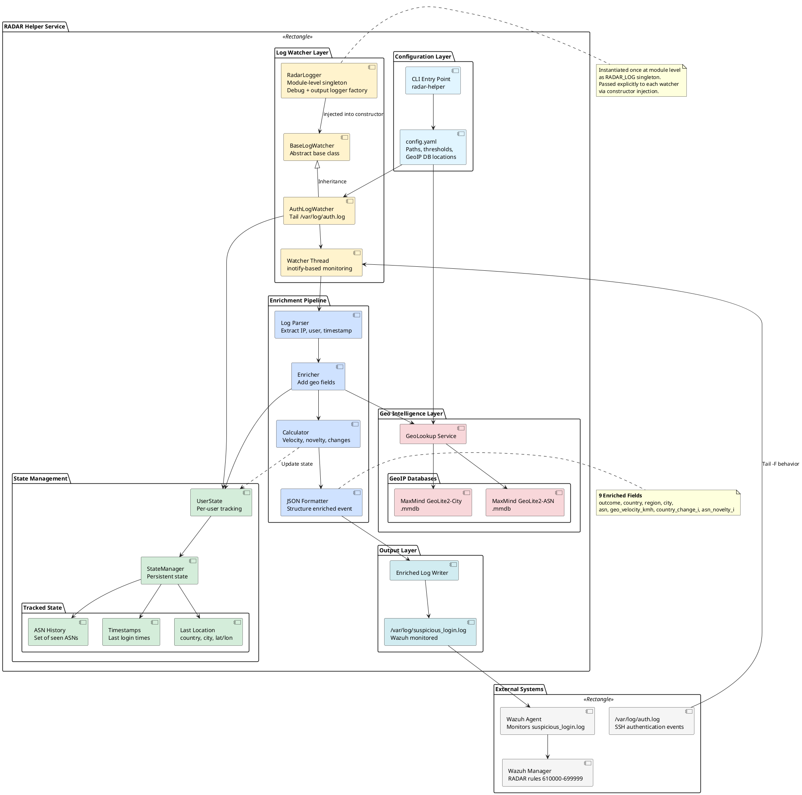

# RADAR helper architecture

The diagram below depicts the high-level architecture of the RADAR Helper component, a multi-threaded log enrichment service deployed on Wazuh agents.

The RADAR Helper monitors authentication logs in real-time and enriches them with geographic and behavioral context before Wazuh ingests them for analysis. This enrichment enables geographic-based detection scenarios (GeoIP detection, impossible travel) and behavioral anomaly detection (ASN novelty, velocity calculations).

Key architectural components:

- **RadarLogger**: Module-level singleton encapsulating all logger setup; provides a shared debug logger and a factory (`build_out_logger`) for per-watcher output loggers
- **BaseLogWatcher**: Abstract base class implementing tail-like log following with rotation handling
- **AuthLogWatcher**: Processes `/var/log/auth.log`, enriches SSH authentication events
- **UserState**: Per-user state tracking (last location, ASN history, timestamps for velocity calculation)
- **GeoLookup Service**: Interfaces with MaxMind GeoLite2 databases (City and ASN)
- **Enrichment Pipeline**: Adds 9 fields including country, region, city, ASN, geo_velocity_kmh, country_change_i, asn_novelty_i

Enriched logs are written to `/var/log/suspicious_login.log` where Wazuh monitors and applies detection rules.

## Architecture Diagram

