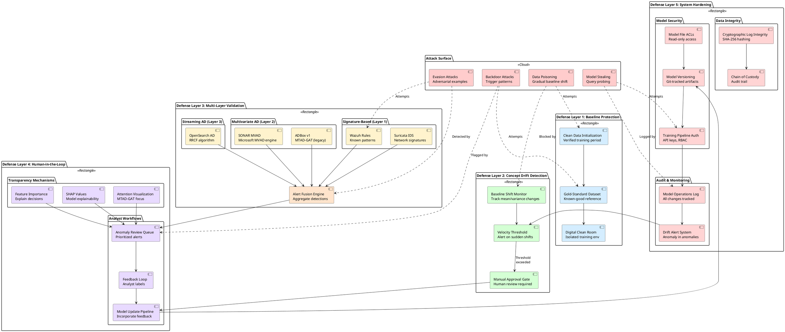

# RADAR adversarial ML defense architecture

The diagram below depicts the defense-in-depth architecture for protecting RADAR's anomaly detection systems against adversarial machine learning attacks.

The architecture implements multiple defensive layers:

**Layer 1: Baseline Protection**

- Clean data initialization from verified periods
- Gold-standard training dataset management
- Digital clean room exercises for pristine baselines

**Layer 2: Concept Drift Detection**

- Baseline shift velocity monitoring
- Automated alerts on sudden baseline changes
- Manual approval gates for model updates

**Layer 3: Multi-Layer Validation**

- Signature-based detection (Wazuh, Suricata)
- Multivariate AD (SONAR MVAD, ADBox MTAD-GAT)
- Streaming AD (OpenSearch RRCF)
- Cross-layer anomaly correlation

**Layer 4: Human-in-the-Loop (HITL)**

- Transparent model reasoning exposure
- Analyst review workflows
- Feedback loops for model improvement
- Alert fusion and enrichment

**Layer 5: System Hardening**

- Cryptographic log integrity (SHA-256 hashing)
- Model file access controls and versioning
- Training pipeline authentication
- Audit logging of all model operations

## Defense Architecture Diagram

