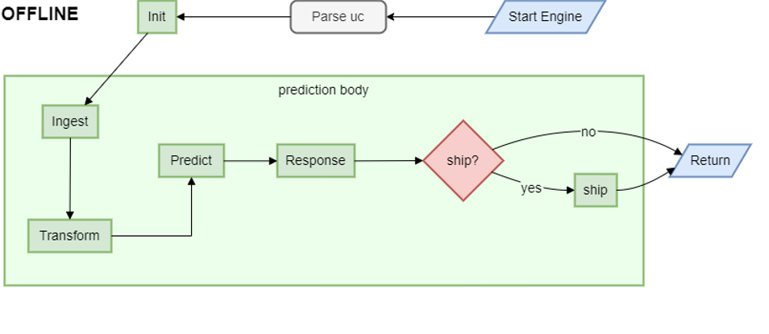

# ADBox historical data prediction pipeline flow

## Prediction pipeline flow diagram for historical (offline) run mode

The diagram summarizes the flow of the predict pipeline for historical (offline) runmode orchestrated by the ADBox Engine.

