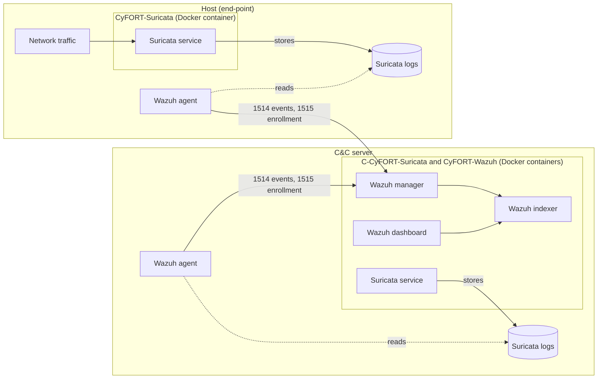

# IDPS-ESCAPE end-point integrated arch.

## IDPS-ESCAPE end-point integrated architecture diagram

The diagram illustrates the architecture of IDPS-ESCAPE end-point integrated model.

```mermaid
flowchart LR
  subgraph cc["C&C server"]
    subgraph ccd["C-CyFORT-Suricata and CyFORT-Wazuh (Docker containers)"]
      CSUR["Suricata service"]
      IDX["Wazuh indexer"]
      DASH["Wazuh dashboard"]
      MGR["Wazuh manager"]
    end
    CLOGS[("Suricata logs")]
    CAG["Wazuh agent"]
  end

  subgraph host["Host (end-point)"]
    subgraph hd["CyFORT-Suricata (Docker container)"]
      HSUR["Suricata service"]
    end
    HLOGS[("Suricata logs")]
    HAG["Wazuh agent"]
    TRAFFIC["Network traffic"]
  end

  CSUR -->|stores| CLOGS
  CAG -.->|reads| CLOGS
  CAG -->|"1514 events, 1515 enrollment"| MGR
  MGR --> IDX
  DASH --> IDX
  TRAFFIC --> HSUR
  HSUR -->|stores| HLOGS
  HAG -.->|reads| HLOGS
  HAG -->|"1514 events, 1515 enrollment"| MGR
```