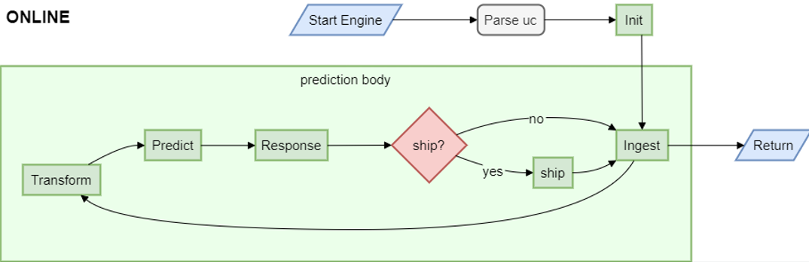

# ADBox batch and real-time prediction flow

## Batch and real-time ADBox run modes prediction flow diagrams

The diagram summarizes the flow of the prediction pipeline for online run modes orchestrated by the ADBox Engine.

Specifically,

- batch mode runs the loop every batch interval,

- real-time mode runs the loop every granularity interval.

