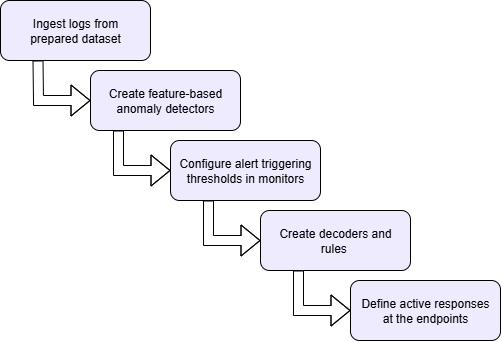

# RADAR logical flow

RADAR has two detection paths, which converge on the same active-response pipeline (LARC-026).

## Overall pipeline

```
Wazuh Agent (logs) -> Wazuh Manager (enrich, if applicable -> decode)
    |
    [Signature path]    Wazuh Manager (rules) -> Active Response
    |
    [Anomaly path]      Wazuh Indexer -> Anomaly Detector -> Monitor -> Webhook -> Wazuh Manager (rules) -> Active Response
```

Both paths terminate in the same place: a Wazuh rule firing an active-response command bound to `radar_ar.py` (SWD-027). The anomaly path exists to get an anomaly-detector result into that same rule-firing mechanism — it does not bypass it.

{: width="50%"}

## Signature-based detection flow

1. **Collection**: the Wazuh agent forwards a raw log line to the manager, unmodified.
2. **Enrichment** (only for scenarios that need it): the manager enriches the line — GeoIP, ASN, velocity — before it is decoded (SWD-030).
3. **Decoding**: decoders parse the (possibly enriched) line into structured fields.
4. **Rule matching**: rules evaluate the decoded fields; a match generates an alert at the rule's configured severity.
5. **Active response**: the alert's active-response binding invokes `radar_ar.py`, which scores the alert and dispatches the tier-appropriate response (SWD-027, SRS-061). The outcome is written to `/var/ossec/logs/active-responses.log`.

## Anomaly-based detection flow

1. **Collection and, where applicable, enrichment**: as above.
2. **Indexing**: the manager forwards decoded logs to the OpenSearch indexer, into the scenario's index.
3. **Detection**: on its configured interval, the anomaly detector queries the index, extracts feature values (per-entity, where a categorical field is configured), and computes an RCF anomaly score and confidence, storing both against the source entity and timestamp.
4. **Monitoring**: on its own interval, a monitor evaluates the latest detector result against the scenario's `anomaly_grade_threshold` and `confidence_threshold`. When both are exceeded, it sends an HTTP POST to the webhook.
5. **Webhook**: the webhook service parses the notification, formats it as a log line, and writes it to a file the Wazuh agent on the manager host itself monitors.
6. **Re-entry into the signature path**: the manager decodes and evaluates that log line exactly as it would any other event. From here the flow is identical to steps 4–5 of the signature-based flow above: a rule match triggers `radar_ar.py`, which scores and responds.