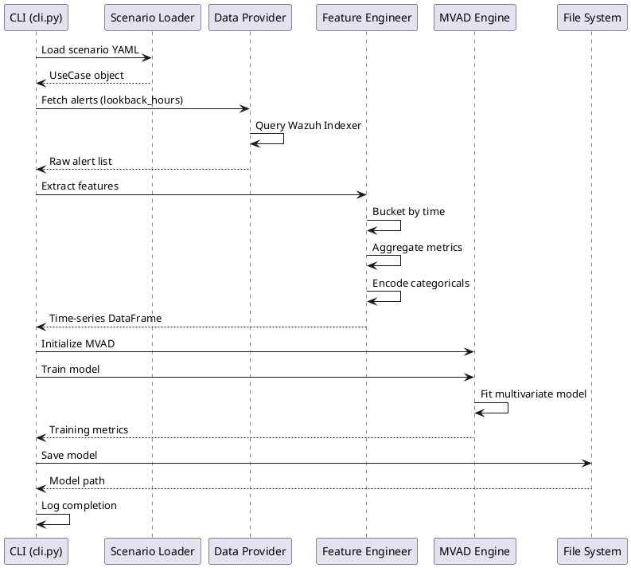

# SONAR training pipeline sequence

## Training workflow sequence diagram

The training pipeline retrieves historical alerts from Wazuh Indexer, extracts features, and trains the MVAD model.

## Key operations

| Component | Operation | Input | Output |
|-----------|-----------|-------|--------|
| **Scenario Loader** | Parse YAML | Scenario file path | UseCase object |
| **Data Provider** | Fetch alerts | Time range, filters | Raw alerts (JSON) |
| **Feature Engineer** | Extract features | Raw alerts | Time-series DataFrame |
| **MVAD Engine** | Train model | Time-series data | Trained model object |
| **File System** | Persist model | Model object | Model file path |

## Error handling

- **Insufficient data**: Warns if sample count < minimum threshold
- **Missing fields**: Uses default values or raises validation error
- **API failures**: Retries with exponential backoff
- **Model persistence**: Validates write permissions before training

## Related documentation

- Training sequence diagram: `docs/manual/sonar_docs/uml-diagrams.md#training-workflow`