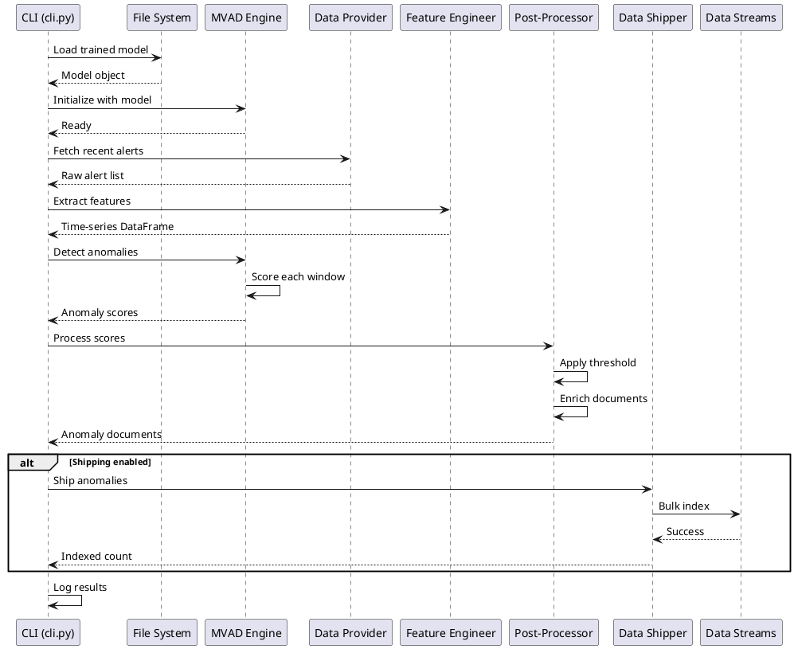

# SONAR detection pipeline sequence

## Detection workflow sequence diagram

The detection pipeline loads a trained model, processes recent alerts, and generates anomaly scores with optional shipping to data streams.

## Detection modes

| Mode | Behavior | Use Case |
|------|----------|----------|
| **historical** | Process fixed time range | Batch analysis, validation |
| **realtime** | Continuous monitoring | Production deployment |
| **batch** | Scheduled execution | Periodic scans |

## Post-processing steps

1. **Thresholding**: Filter scores above configured threshold
2. **Consecutive filtering**: Require N consecutive anomalies
3. **Enrichment**: Add metadata (timestamp, scenario ID, severity)
4. **Formatting**: Convert to OpenSearch document format

## Related documentation

- Detection sequence diagram: `docs/manual/sonar_docs/uml-diagrams.md#detection-workflow`