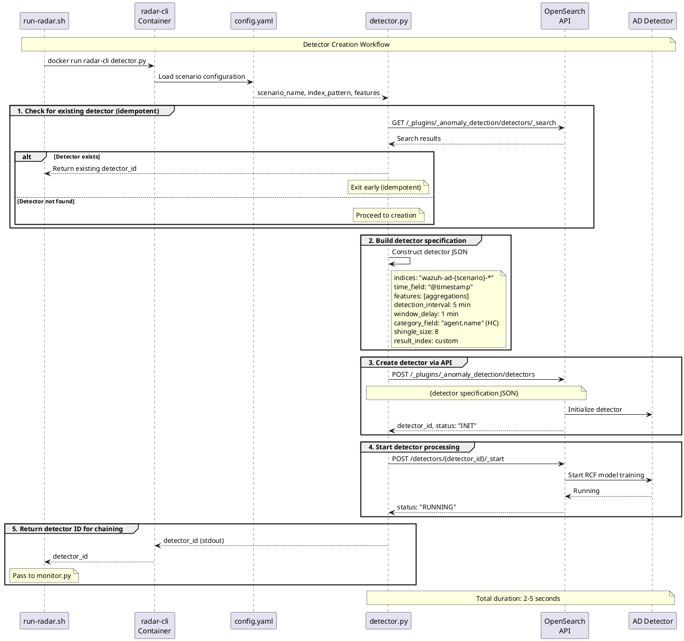

# RADAR detector creation workflow

The diagram below depicts the sequence of operations for creating and starting OpenSearch anomaly detectors via the `detector.py` module.

## Workflow stages

### 1. Configuration loading
- Read scenario definition from `config.yaml`
- Load environment variables from `.env` (OS_URL, OS_USER, OS_PASS, OS_VERIFY_SSL)
- Validate scenario exists in configuration

### 2. Detector existence check
- Query OpenSearch AD API: `GET /_plugins/_anomaly_detection/detectors/_search`
- Search by name pattern: `{scenario}_DETECTOR`
- If found, return existing detector ID (idempotent operation)

### 3. Detector specification building
Construct detector JSON specification including:

- **indices**: Index pattern to monitor (e.g., `wazuh-ad-log-volume-*`)
- **time_field**: Timestamp field for time-series analysis (`@timestamp`)
- **feature_attributes**: Aggregation queries from config (e.g., `max(data.log_bytes)`)
- **detection_interval**: How often to run detection (minutes)
- **window_delay**: Buffer time for late-arriving data (minutes)
- **category_field**: Field for high-cardinality detection (e.g., `agent.name` for per-endpoint baselines)
- **shingle_size**: Temporal sequence window size for RCF algorithm
- **result_index**: Custom index for storing detection results

### 4. Detector creation
- POST detector specification to OpenSearch AD plugin
- Endpoint: `POST /_plugins/_anomaly_detection/detectors`
- Receive detector ID in response

### 5. Detector activation
- Start the detector to begin analysis
- Endpoint: `POST /_plugins/_anomaly_detection/detectors/{detector_id}/_start`
- Detector begins processing data at configured intervals

### 6. Output
- Return detector ID to stdout for pipeline chaining
- Used by monitor.py in subsequent workflow stage

## Key functions

```python
find_detector_id(detector_name: str) -> str | None
detector_spec(scenario_config: dict) -> dict
create_detector(spec: dict) -> str
start_detector(detector_id: str) -> None
```

## Detector Creation Sequence



## Implementation reference

See [radar/anomaly_detector/detector.py](../../../radar/anomaly_detector/detector.py) for implementation details.