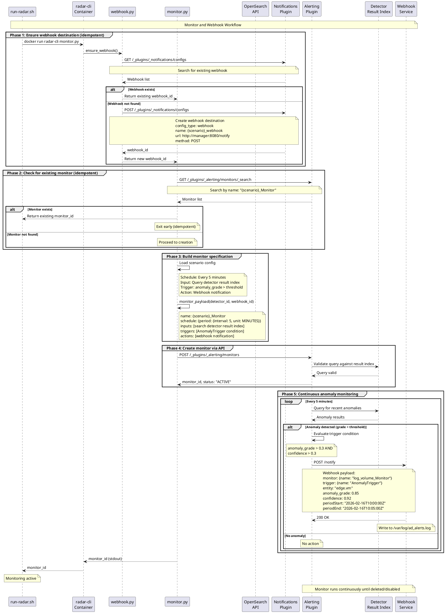

# RADAR monitor and webhook workflow

The diagram below depicts the sequence for creating OpenSearch monitors and webhook notification channels via `monitor.py` and `webhook.py` modules.

## Workflow overview

The monitor workflow ensures anomaly detection results trigger automated responses when thresholds are exceeded. Monitors continuously evaluate detector outputs and send structured notifications to a webhook endpoint, which integrates with Wazuh's rule engine.

## Workflow stages

### 1. Webhook destination setup
Execute `ensure_webhook()` from webhook.py:

- Query existing notification destinations: `GET /_plugins/_notifications/configs`
- Search for webhook by name pattern
- If not found, create new webhook destination:

    - Endpoint: `POST /_plugins/_notifications/configs`
    - Configuration: Custom webhook type, POST method, webhook URL from environment
    - Return webhook destination ID

### 2. Monitor existence check
- Query existing monitors: `GET /_plugins/_alerting/monitors/_search`
- Search by name pattern: `{scenario}_Monitor`
- If found, return existing monitor ID (idempotent operation)

### 3. Monitor specification building
Construct monitor JSON including:

- **Schedule**: Evaluation frequency (defaults to detector_interval if monitor_interval not specified)
- **Inputs**: Query detector's result index for recent anomalies
- **Triggers**: Condition evaluating anomaly scores
- **Actions**: Webhook notification when triggered

### 4. Trigger condition configuration
Default trigger logic:
```
anomaly_grade > threshold AND confidence > threshold
```

Where thresholds are defined in scenario configuration (typical values: 0.3-0.5 for balanced sensitivity/precision).

### 5. Webhook action specification
Notification payload includes:
```json
{
  "monitor": {"name": "{{ctx.monitor.name}}"},
  "trigger": {"name": "{{ctx.trigger.name}}"},
  "entity": "{{ctx.results.0.hits.hits.0._source.entity.0.value}}",
  "periodStart": "{{ctx.periodStart}}",
  "periodEnd": "{{ctx.periodEnd}}"
}
```

### 6. Monitor creation
- Create monitor via OpenSearch Alerting API
- Endpoint: `POST /_plugins/_alerting/monitors`
- Monitor begins evaluating detector results at configured intervals

### 7. Output
- Return monitor ID to stdout
- Monitor continuously watches detector and triggers webhook on anomalies

## Key functions

```python
# webhook.py
notif_find_id(webhook_name: str) -> str | None
notif_create(webhook_url: str) -> str
ensure_webhook() -> str

# monitor.py
find_monitor_id(monitor_name: str) -> str | None
monitor_payload(detector_id: str, webhook_id: str, config: dict) -> dict
create_monitor(payload: dict) -> str
```

## Integration flow

Monitor → Detector Results → Evaluate Threshold → Webhook POST → `/var/log/ad_alerts.log` → Wazuh Rules → Active Response

## Monitor and Webhook Sequence



## Implementation reference

See implementation details:

- [radar/anomaly_detector/monitor.py](../../../radar/anomaly_detector/monitor.py) - Monitor creation
- [radar/anomaly_detector/webhook.py](../../../radar/anomaly_detector/webhook.py) - Webhook management
- [radar/webhook/ad_alerts_webhook.py](../../../radar/webhook/ad_alerts_webhook.py) - Webhook service implementation