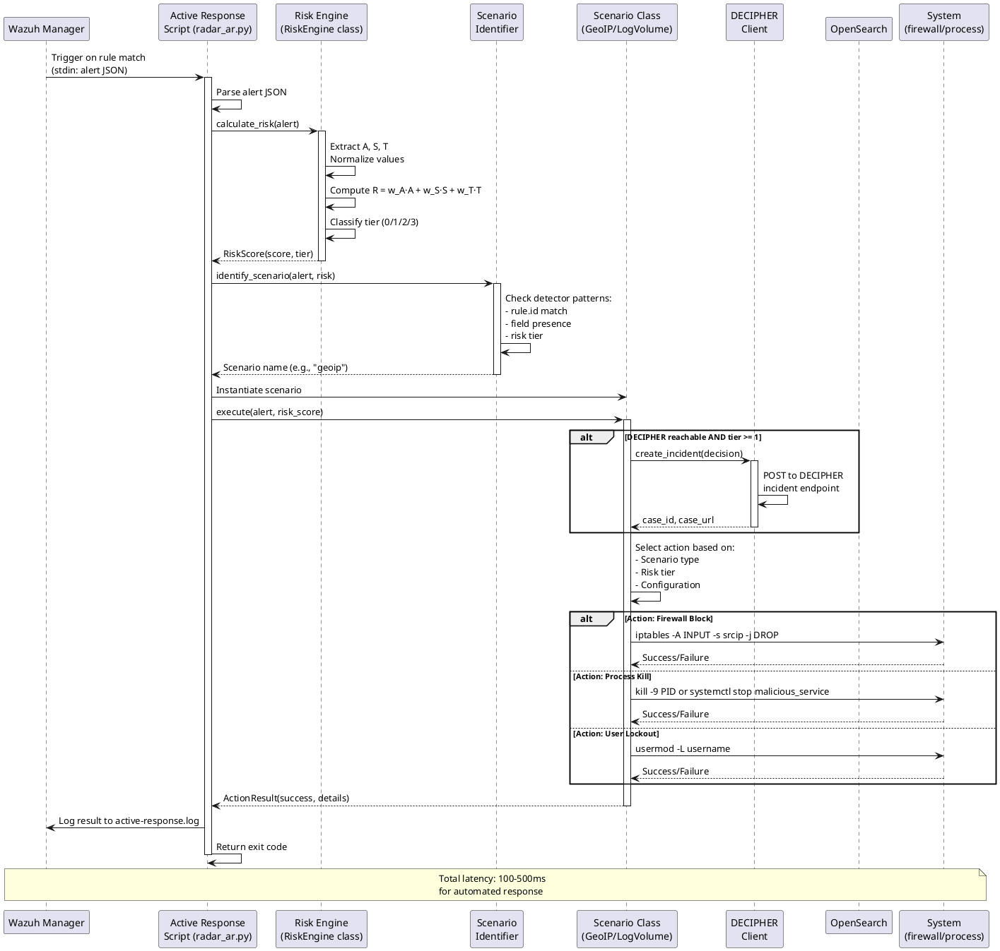

# RADAR active response decision pipeline

The diagram below depicts the comprehensive decision-making pipeline implemented in `radar_ar.py`, which orchestrates automated threat response based on risk-aware analysis.

This expands on LARC-016 (RADAR active response flow) with detailed implementation logic, scenario identification, context collection, and tiered action planning.

## Pipeline stages

### 1. Alert intake
- Read Wazuh alert JSON from stdin
- Parse alert structure: rule ID, level, groups, agent info, timestamp, data fields
- Validate alert completeness
- Log alert reception

### 2. Scenario identification
**ScenarioIdentifier** maps rule IDs to scenarios:

- Load `ar.yaml` configuration
- Iterate through scenario definitions
- Match alert rule ID to configured rule mappings
- Determine detection type: `signature` or `ad` (anomaly detection)
- Return scenario context: `{name, detection, alert, config}`

Exit if no scenario matches (no-op, log warning).

### 3. Scenario-specific behavior resolution
**BaseScenario** and subclasses determine:

**Time window resolution**:

- AD-based: Use `delta_ad_minutes` (default: 10) from config
- Signature-based: Use `delta_signature_minutes` (default: 1) from config
- Window: `[alert_timestamp - delta, alert_timestamp]`

**Effective agent resolution**:

- AD-based: Return None (query all agents for per-entity baselines)
- Signature-based: Return `alert.agent.name` (scope to triggering agent)

**AD score extraction**:

- Extract anomaly grade and confidence from alert data fields
- Handle scenario-specific field names

### 4. Context collection
Query OpenSearch for correlated events within time window:
```
Query specification:
  time_range: [alert_timestamp - window_delta, alert_timestamp]
  agent_filter: effective_agent (if signature-based) OR all agents (if AD-based)

Algorithm: Extract IOCs from alert and correlated events
  For each event:
    Extract IP addresses from: srcip, dstip, data.srcip, data.dstip
    Extract usernames from: srcuser, dstuser, data.srcuser, data.dstuser
    Extract hashes from: data.md5, data.sha256
    Extract domains from: data.url, data.hostname

  Return: deduplicated IOC collection
```

### 5. CTI enrichment (DECIPHER integration)
- Check DECIPHER health (cached for the remainder of this process; not retried, per SRS-061 §4(i))
- If healthy and the scenario has a mapped DECIPHER analyze endpoint: build the scenario-specific payload (`build_analyze_payload()`, including extracted IOCs) and call the analyze endpoint
- DECIPHER performs its own IOC lookups (e.g. via MISP) and returns a single normalized CTI score, `cti_score_T` ∈ [0,1], plus labels and confidence
- If DECIPHER is unreachable, or the scenario has no analyze endpoint mapped: `cti_score_T = 0.0`, logged as a WARNING
- No local aggregation of individual IOC indicators occurs in `radar_ar.py` — the score used by the risk engine (step 6) is exactly the value DECIPHER returned (or 0.0)

### 6. Risk calculation
Apply risk engine formula (see LARC-021):
```
Algorithm: Calculate composite risk score
  A ← anomaly_grade × confidence  // AD intensity
  S ← likelihood × impact         // Signature risk (from ar.yaml)
  T ← cti_score                   // CTI aggregation

  R ← w_A × A + w_S × S + w_T × T  // Weighted combination

  Where weights are loaded from scenario configuration
```

Weights loaded from scenario configuration in `ar.yaml`.

### 7. Decision ID generation
Create a unique identifier for audit correlation, per SRS-061 §6(i):
```
Algorithm: Generate deterministic decision ID
  components ← {alert_id, timestamp, rule_id, agent_id, scenario, detection, window, effective_agent}
  decision_id ← SHA256(JSON.dumps(components, sort_keys=True))   // full hex digest
```

The decision ID is used for audit-log correlation and as the DECIPHER incident reference — not for deduplication. `radar_ar.py` maintains no decision cache; re-delivery of the same alert is not itself suppressed by this script (SWD-027).

### 8. Tier assignment and action planning
Map risk score to tier using per-scenario boundaries from `ar.yaml`:

- **Tier 0** (R < tier1_min): No actions; audit log entry only
- **Tier 1** (tier1_min <= R < tier1_max): email + DECIPHER incident creation
- **Tier 2** (tier1_max <= R < tier2_max): Tier 1 actions + mitigations_tier2 (if allow_mitigation)
- **Tier 3** (R >= tier2_max): Tier 1 actions + mitigations_tier3 (if allow_mitigation)

DECIPHER incident creation (FlowIntel case) runs in `run()` before action planning, gated on `tier >= 1` and DECIPHER health check.

Apply configuration flag from `ar.yaml`:

- `allow_mitigation`: Enable mitigation execution at Tier 2 and Tier 3

Apply safety gates:

- Production environment check
- Whitelist verification
- Rate limiting (max actions per time window)

### 9. Action execution

**Email notification**:

- Format alert summary with risk score and tier
- Include IOCs and CTI hits
- Send via SMTP (credentials from .env)

**DECIPHER incident creation** (tier >= 1, if DECIPHER reachable):

- Call `DecipherClient.create_incident(decision)`
- DECIPHER creates FlowIntel case and returns `case_id` and `case_url`
- Case URL included in email notification

**Mitigation actions** (via Wazuh API):

- **Firewall drop**: `PUT /active-response?agents_list={agent_id}` with command `firewall_drop` and IP argument
- **Account disable**: Active response command to disable compromised user
- **Service termination**: termination of process connected to malicious IP or termination of malicious service

### 10. Audit logging
Write structured JSON to `/var/ossec/logs/active-responses.log`:
```json
{
  "timestamp": "...",
  "decision_id": "...",
  "scenario": "...",
  "rule_id": "...",
  "risk_score": 0.75,
  "tier": 2,
  "actions_planned": ["email", "case", "firewall_drop"],
  "actions_executed": ["email", "case", "firewall_drop"],
  "execution_results": {...},
  "iocs": [...],
  "cti_hits": [...]
}
```

### 11. Exit
Return exit code:

- `0`: Success (scenario processed)
- `1`: No scenario match or alert invalid
- `2`: Critical exception

## Error handling

- **Transient failures**: Retry with exponential backoff (OpenSearch, CTI queries)
- **Non-critical failures**: Log and continue (e.g., email send failure doesn't block case creation)
- **Critical failures**: Abort pipeline, log, return error code

## Configuration schema (ar.yaml)

```yaml
scenarios:
  geoip_detection:
    ad:
      rule_ids: []
    signature:
      rule_ids: ["100900", "100901"]
    w_ad: 0.0
    w_sig: 0.6
    w_cti: 0.4
    delta_signature_minutes: 1
    signature_impact: 0.6
    signature_likelihood: 0.8
    tiers:
      tier1_min: 0.0
      tier1_max: 0.33
      tier2_max: 0.66
    allow_mitigation: true
    mitigations_tier2:
      - firewall-drop
    mitigations_tier3:
      - firewall-drop
```

## Active Response Sequence



## Implementation reference

See [radar/scenarios/active_responses/radar_ar.py](../../../radar/scenarios/active_responses/radar_ar.py) for complete implementation.

## See also
- SWD-027 for the normative software design specification of this pipeline
- LARC-016 for simplified flow diagram