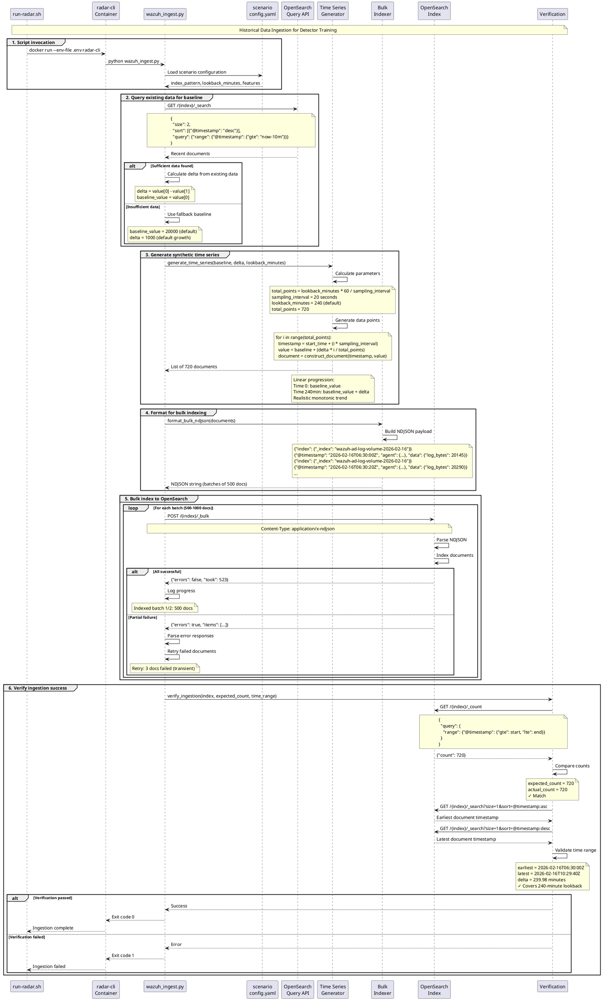

# RADAR data ingestion pipeline

The diagram below depicts the data ingestion workflow orchestrated by `run-radar.sh` and implemented by scenario-specific `wazuh_ingest.py` scripts.

## Pipeline purpose

Data ingestion generates synthetic time-series data for training OpenSearch RCF anomaly detectors. Each behavior-based scenario requires historical baseline data to establish normal patterns before real-time detection begins.

## Workflow stages

### 1. Script invocation
Execute from run-radar.sh:
```
Command: Execute scenario ingestion script in containerized environment
  Container: radar-cli:latest
  Environment: Load OS_URL, OS_USER, OS_PASS, OS_VERIFY_SSL from .env
  Volumes: Mount scenarios directory
  Script: /app/scenarios/ingest_scripts/{scenario}/wazuh_ingest.py
```

### 2. Baseline query (scenario-dependent)

**Log volume scenario**:

- Query last 10 minutes of existing data from `wazuh-ad-log-volume-*`
- Retrieve 2 most recent documents
- Calculate delta between log byte values
- Fallback: 20,000 bytes if insufficient data

**Suspicious login scenario**:

- Query user authentication patterns
- Analyze login frequency distribution
- Determine normal session intervals

### 3. Time series generation

**Log volume algorithm**:
```
Algorithm: Generate realistic time series baseline
  Input: baseline_value, delta, lookback_minutes, sampling_interval_seconds

  total_points ← (lookback_minutes × 60) / sampling_interval_seconds
  start_time ← current_time - lookback_minutes

  for i from 0 to total_points:
    timestamp ← start_time + (i × sampling_interval_seconds)
    value ← baseline_value + (delta × i / total_points)  // Linear progression

    document ← {
      "@timestamp": timestamp (ISO8601 format),
      "agent": {"name": agent_name, "id": agent_id},
      "data": {"log_path": path, "log_bytes": value},
      "predecoder": {"program_name": metric_name}
    }

    append document to bulk_data

  Output: bulk_data collection
```

Example generated data characteristics:

- **Default parameters**: 240 minutes lookback, 20-second sampling = 720 points
- **Monotonic trend**: Realistic growth from baseline to baseline+delta
- **Proper timestamps**: ISO8601 with consistent spacing
- **Scenario-specific fields**: Match detector configuration exactly

### 4. Bulk indexing

**OpenSearch Bulk API specification**:

- Endpoint: `POST /{index}/_bulk`
- Content-Type: `application/x-ndjson`
- Format: Newline-delimited JSON (NDJSON)

**Example NDJSON structure**:
```json
{"index": {"_index": "wazuh-ad-log-volume-2026-02-16"}}
{"@timestamp": "2026-02-16T10:00:00Z", "agent": {...}, "data": {...}}
{"index": {"_index": "wazuh-ad-log-volume-2026-02-16"}}
{"@timestamp": "2026-02-16T10:00:20Z", "agent": {...}, "data": {...}}
```

**Batch processing**:

- Default batch size: 500-1000 documents per bulk request
- Error handling: Retry on transient failures (network, temporary unavailability)
- Progress logging: Document count, timestamp range after each batch

### 5. Verification
```
Algorithm: Verify successful ingestion
  1. Query document count in target index for time range
  2. Compare actual_count with expected_count
  3. Verify earliest and latest timestamps match expected range
  4. Validate field mappings (numeric fields are numbers, not strings)

  if all checks pass:
    return SUCCESS
  else:
    return FAILURE with diagnostic information
```

### 6. Output
- Log ingestion summary: document count, time range, index name
- Return success/failure exit code
- Output used by run-radar.sh to proceed to detector creation

## Scenario-specific ingestion patterns

### Log volume
- **Index**: `wazuh-ad-log-volume-*`
- **Key field**: `data.log_bytes` (numeric)
- **Pattern**: Monotonic increase with realistic deltas
- **Volume**: 720 points over 240 minutes

### Suspicious login
- **Index**: `wazuh-archives-*` or custom index
- **Key fields**: `srcuser`, `srcip`, `@timestamp`, enriched RADAR fields
- **Pattern**: Normal login distribution with occasional geographic diversity
- **Volume**: Variable based on user count and session patterns

### Insider threat (archived)
- **Index**: `wazuh-archives-*`
- **Key fields**: File access patterns, data transfer volumes
- **Pattern**: Baseline file activity with gradual increase
- **Volume**: Per-user baselines

## Data quality considerations

- **Timestamp accuracy**: Proper ISO8601 format with timezone
- **Field types**: Numeric fields as numbers, not strings (critical for aggregations)
- **Index patterns**: Match detector configuration exactly
- **Agent consistency**: Use consistent agent.name for high-cardinality detection
- **Realistic patterns**: Avoid synthetic steps or unrealistic spikes that confuse training

## Error handling

- **Connection failures**: Retry with exponential backoff
- **Index creation**: Auto-create if not exists (OpenSearch default)
- **Mapping conflicts**: Log error, fail fast
- **Bulk API errors**: Parse response, retry failed documents

## Data Ingestion Sequence



## Implementation reference

Scenario-specific implementations:

- [radar/scenarios/ingest_scripts/log_volume/wazuh_ingest.py](../../../radar/scenarios/ingest_scripts/log_volume/wazuh_ingest.py) - Log volume implementation
- [radar/scenarios/ingest_scripts/suspicious_login/wazuh_ingest.py](../../../radar/scenarios/ingest_scripts/suspicious_login/wazuh_ingest.py) - Login behavioral implementation

## See also
- `/docs/manual/radar_docs/radar-run-ad.md` for workflow documentation