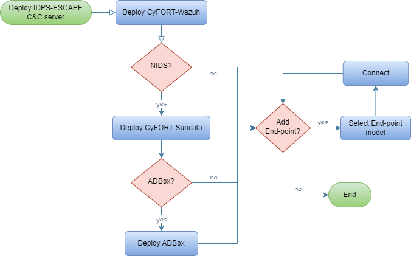

# Centralized C&C Deployment

As a system admin user,
I want to deploy and maintain a central subsystem, called command-and-control (C&C),
so that I can update user-exposed settings of subsystems tackling data collection, intrusion detection and prevention.

1. Set up host for C&C server.
2. Access as root.
3. Deploy C&C components following:

  

4. Configure components via respective software configuration management (SCM) mechanism.

### Rationale
To centralize and simplify IDPS components configuration management.

### Acceptance criteria
Successful validation according to the corresponding test case specification