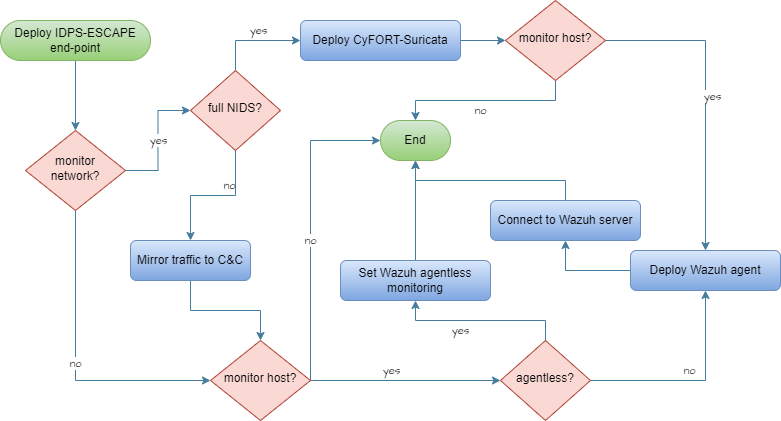

# Remote Endpoint Deployment

As a system admin user,
I want to deploy IDPS end-point monitoring solutions on a remote end-point by choosing from multiple configuration options so that I can monitor events on my system's edge/endpoints.

2. Access end-point as root.
3. Deploy end-point components following:

  

4. Connect local solution to C&C sub-system.

### Rationale
To adapt and improve performance

### Acceptance criteria
Successful validation according to the corresponding test case specification