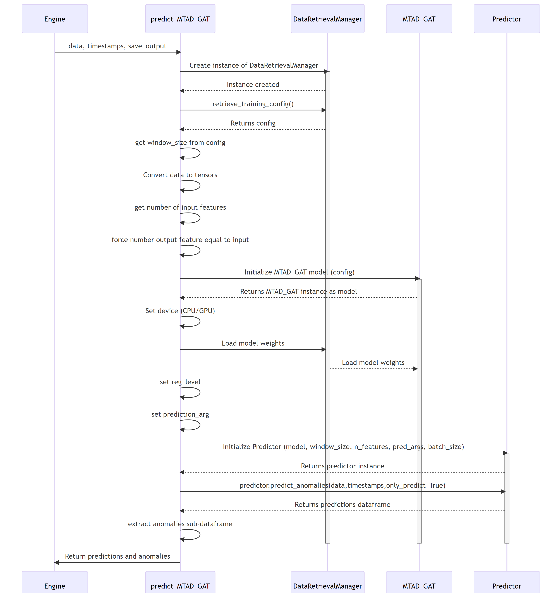

# MTAD-GAT prediction

## MTAD GAT prediction sequence diagram

The diagram depicts the sequence of operations run by the function `predict_MTAD_GAT` of the MTAD_GAT ML-subpackage of ADBOX.

{: width="80%"}