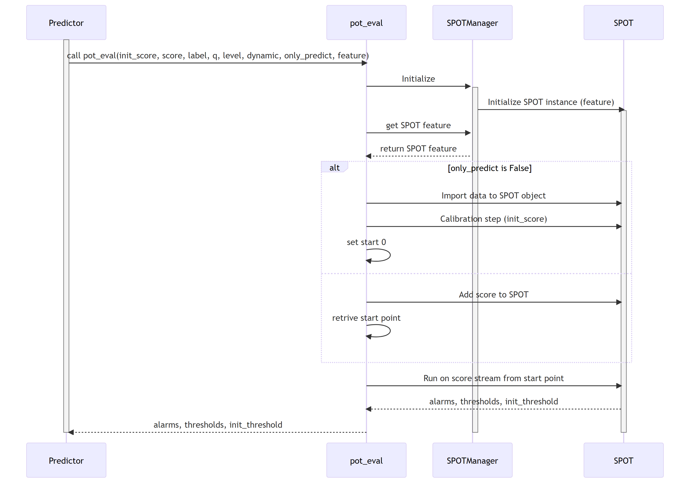

# Peak-over-threshold (POT)

## POT evaluation sequence diagram

The diagram depicts the sequence of operations run  by the function `pot_eval` of the MTAD_GAT subpackage of ADBox.

This function runs the dynamic POT (i.e., peak-over-threshold) evaluation.

{: width="80%"}