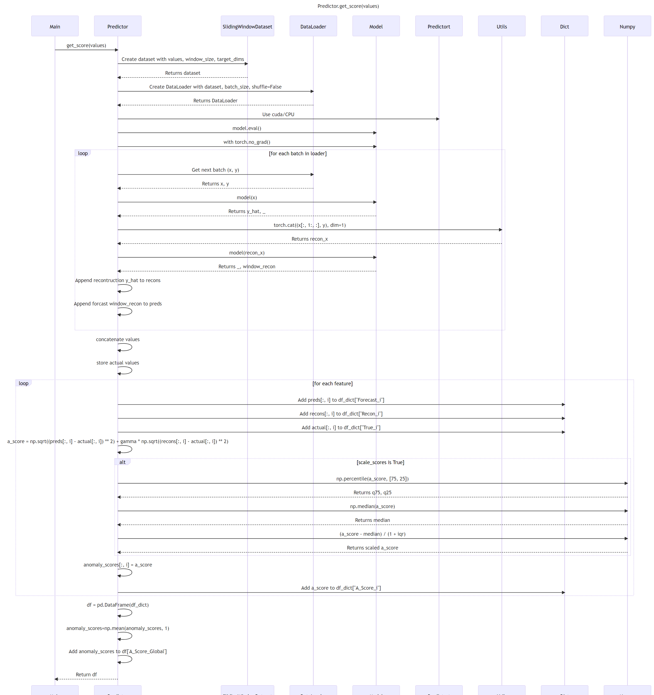

# ADBox Predictor score computation

## Predictor score computation sequence diagram

The diagram depicts the sequence of operations run by the function `get_score` method of the `Predictor` class in the MTAD GAT PyTorch subpackage of ADBox.

{: width="80%"}