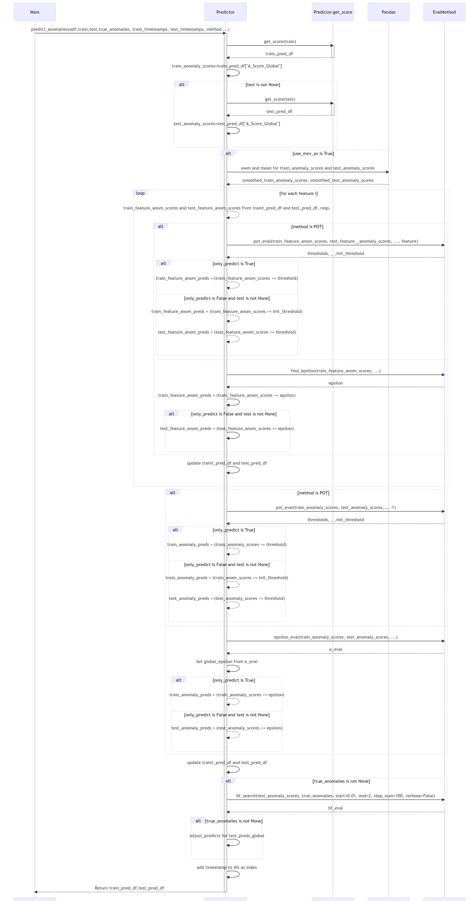

# ADBox MTAD-GAT anomaly prediction

## ADBox MTAD GAT anomaly prediction sequence diagram

The diagram depicts the sequence of operations run by the function `predict_anomalies` method of the `Predictor` class in the MTAD GAT PyTorch subpackage of ADBox.

{: width="80%"}