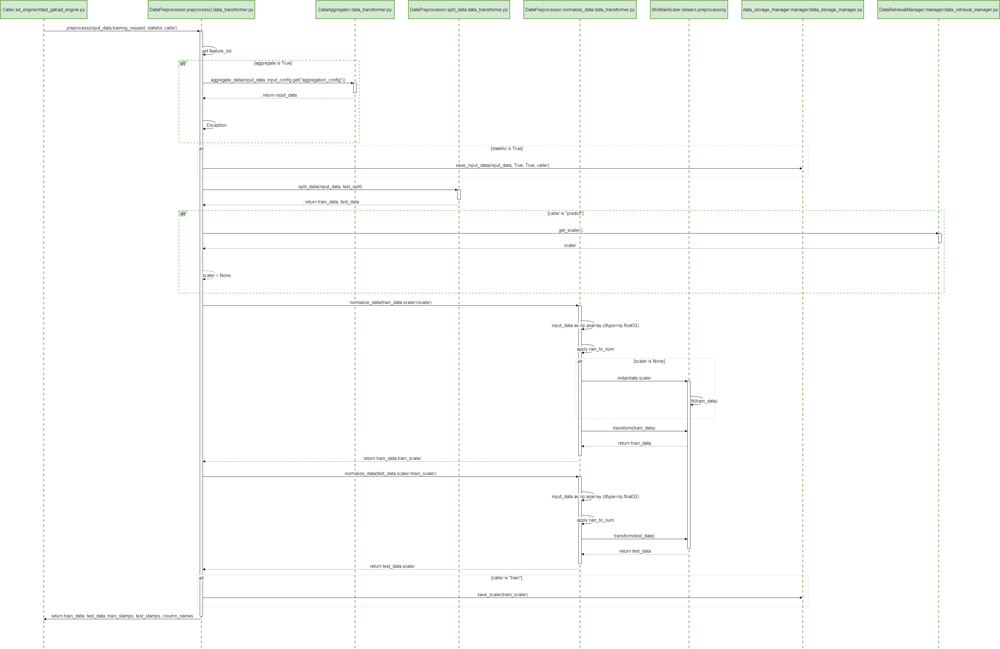

# ADBox preprocessing

## ADBox preprocessing sequence diagram

The diagram summarizes the sequence of actions of the method `Preprocessor.preprocessing` in the ADBox DataTransformer.

{: width="50%"}