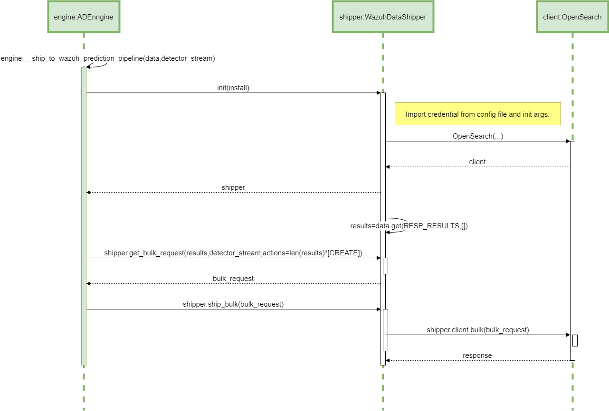

# ADBox shipping of prediction data

## Sequence diagram of ADBox shipping of prediction data

The diagram below depicts the sequence of actions orchestrated by the ADBox Engine when shipping is enabled within the prediction pipeline.

{: width="80%"}