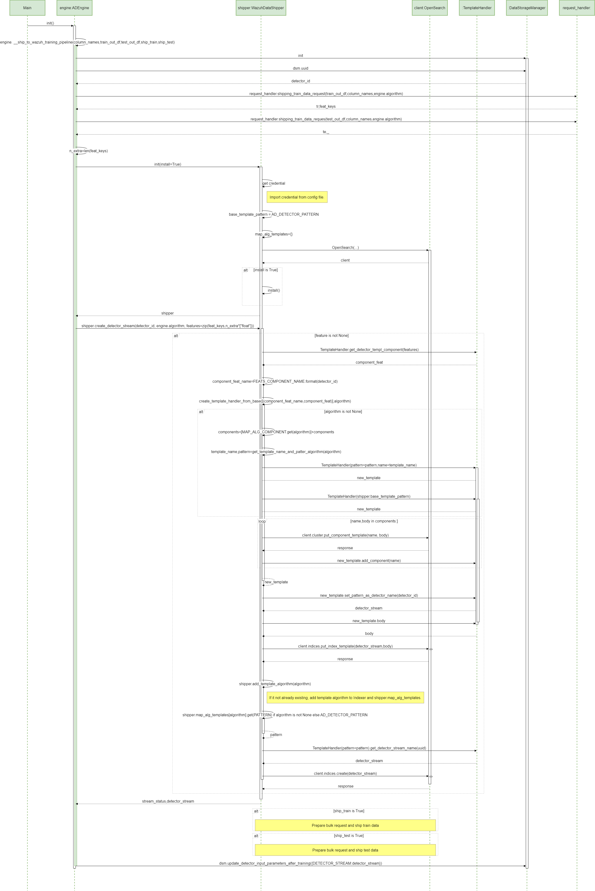

# ADBox creation of a detector stream

## Sequence diagram of ADBox creation of a detector stream

The diagram below depicts the sequence of actions orchestrated by the ADBox Engine when shipping is enabled within the training pipeline.
Specifically, the `__ship_to_wazuh_training_pipeline` method which
- creates a detector data stream amd the correspondig templates.
- and can ship the test and training data predictions.

{: width="80%"}