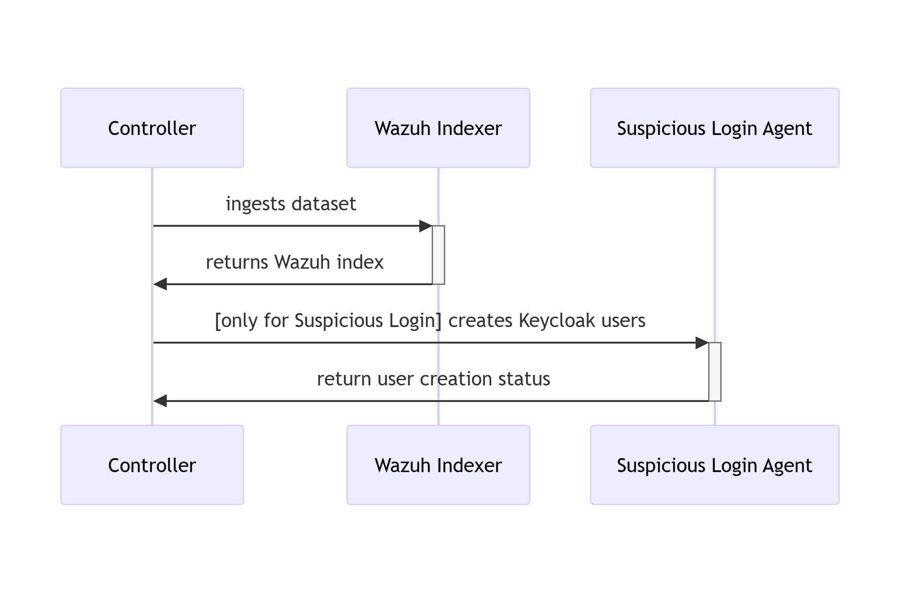

# RATF: ingestion phase

## Sequence diagram of data ingestion and user setup in RATF

The diagram below depicts the sequence of actions orchestrated by the RADAR Automated Test Framework in ingestion phase, which
- bulk ingests the corresponding dataset into Opensearch index.
- and for Suspicious Login scenario creates users in Single Sign-On system.

{: width="80%"}